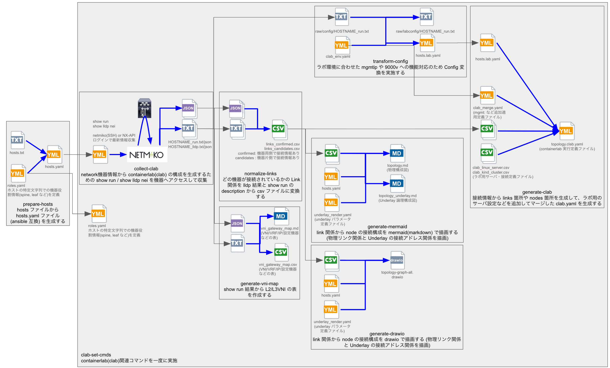
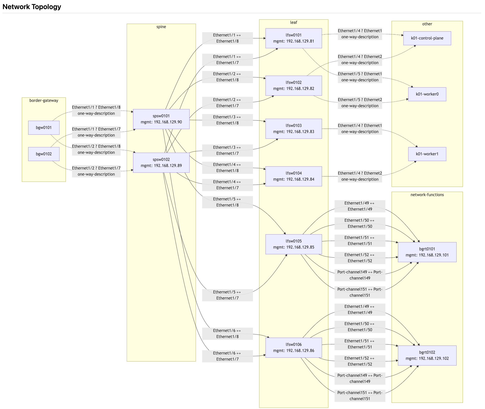
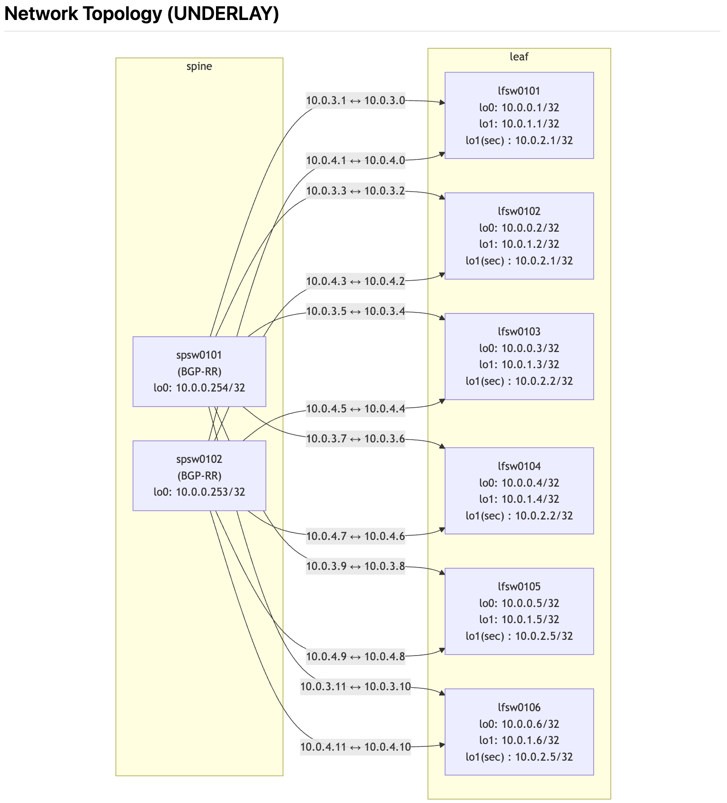

# alred

`alred` は、ネットワーク機器の情報収集、リンク情報の正規化、構成図や lab 用トポロジの生成を行う CLI ツールです。

個人ラボ向けに作成しているため、動作保証はしていません。
現時点では alpha 版として公開しており、機能や仕様は今後変更される可能性があります。

## できること

- ネットワーク機器から LLDP と `running-config` を収集する
- 収集データから接続情報を正規化し、リンク一覧を作成する
- containerlab 用の topology YAML と Mermaid 図を生成する
- 実機 config を containerlab / NX-OS 9000v 向けに変換する
- NX-OS の設定から VNI / VRF / Gateway の対応表を生成する
- VNI 差分から追加・削除・rollback 用の config を生成する
- 必要に応じて config を対象機器へ投入する
- インベントリ情報から Terraform 用の `main.tf` を生成する

## インストール

用途に応じて、次の 3 つの方法を使い分ける想定です。

1. 通常利用: GitHub Releases から PyInstaller で作成した binary を取得する
2. Python 環境が利用できる場合: `pip install git+https://...` でインストールする
3. 開発・検証用途: リポジトリを clone して `uv sync` で利用する

### 1. 通常利用: PyInstaller binary を使う

Python 環境や追加パッケージのインストールができない環境、特にエアギャップ環境向けには、GitHub Releases で配布する PyInstaller binary の利用を想定しています。

この方法では、通常は Python の追加セットアップは不要です。

基本的な流れ:

1. GitHub Releases から対象 OS 向け binary を取得する
2. 実行しやすいディレクトリに配置する
3. 実行権限を付与する
4. `PATH` の通ったディレクトリへ配置する、または `PATH` を追加する

配布ファイル名の例:

- `alred-linux-x86_64`
- `alred-linux-x86_64-glibc217`
- `alred-linux-x86_64-glibc228`
- `alred-linux-x86_64-glibc234`
- `alred-linux-aarch64`
- `alred-windows-x86_64.exe`

checksum ファイル名の例:

- `alred-linux-x86_64.sha256`
- `alred-linux-x86_64-glibc217.sha256`
- `alred-linux-x86_64-glibc228.sha256`
- `alred-linux-x86_64-glibc234.sha256`
- `alred-linux-aarch64.sha256`
- `alred-windows-x86_64.exe.sha256`

`curl` で取得する例:

```sh
curl -fL -o alred-linux-x86_64 \
  https://github.com/suzuyu/alred/releases/latest/download/alred-linux-x86_64
curl -fL -o alred-linux-x86_64.sha256 \
  https://github.com/suzuyu/alred/releases/latest/download/alred-linux-x86_64.sha256
```

特定 version を指定する場合の例:

```sh
curl -fL -o alred-linux-x86_64 \
  https://github.com/suzuyu/alred/releases/download/<tag>/alred-linux-x86_64
curl -fL -o alred-linux-x86_64.sha256 \
  https://github.com/suzuyu/alred/releases/download/<tag>/alred-linux-x86_64.sha256
```

例:

```sh
mkdir -p "$HOME/bin"
cp ./alred-linux-x86_64 "$HOME/bin/alred"
chmod +x "$HOME/bin/alred"
echo 'export PATH=$HOME/bin:$PATH' >> ~/.bashrc
source ~/.bashrc
alred --version
alred --help
```

checksum 確認例:

```sh
sha256sum -c alred-linux-x86_64.sha256
```

補足:

- エアギャップ環境へ持ち込む場合は、接続可能な環境で事前に binary と checksum を取得しておく運用を想定します
- OS やアーキテクチャに合った binary を選んでください
- Linux x86_64 では `glibc217` / `glibc228` / `glibc234` の variant を配布対象に合わせて選べます
- 配布者向けの build 手順は [BUILD.md](./BUILD.md) を参照してください

Linux x86_64 向け variant の選び方の目安:

| artifact | 想定する最小 glibc | 推奨する OS の例 |
| --- | --- | --- |
| `alred-linux-x86_64-glibc217` | 2.17 以上 | RHEL 7 / 8 / 9、Rocky Linux 8 / 9、AlmaLinux 8 / 9、Ubuntu 18.04 / 20.04 / 22.04 / 24.04 |
| `alred-linux-x86_64-glibc228` | 2.28 以上 | RHEL 8 / 9、Rocky Linux 8 / 9、AlmaLinux 8 / 9、Ubuntu 20.04 / 22.04 / 24.04 |
| `alred-linux-x86_64-glibc234` | 2.34 以上 | RHEL 9、Rocky Linux 9、AlmaLinux 9、Ubuntu 22.04 / 24.04 |

使い分けの目安:

- 配布先が混在していて迷う場合は、もっとも互換性が広い `glibc217` を選ぶのが無難です
- RHEL 8 系、Rocky 8 系、AlmaLinux 8 系が中心なら `glibc228` が選びやすいです
- RHEL 9 系、Rocky 9 系、AlmaLinux 9 系、Ubuntu 22.04 以降に限定できるなら `glibc234` を選べます

### 2. Python 環境が利用できる場合: `pip install`

この方法では Python 3.11 以上が必要です。

GitHub から直接取得できる場合は次の方法でも利用できます。

```sh
pip install "git+https://github.com/suzuyu/alred.git"
```

ブランチやタグを固定する場合:

```sh
pip install "git+https://github.com/suzuyu/alred.git@main"
```

確認:

```sh
alred --version
alred --help
```

### 3. 開発・検証用途: リポジトリをそのまま使う

開発やローカル検証では、Python 3.11 以上と `uv` が必要です。

まずリポジトリを clone します。

```sh
git clone https://github.com/suzuyu/alred.git
cd alred
```

その後、`uv sync` を実行します。

```sh
uv sync
```

その後は次のように実行できます。

```sh
uv run python alred.py --version
uv run python alred.py --help
```


## クイックスタート

まずは `clab-set-cmds` を使うのがおすすめです。  
このコマンドは、containerlab 向けの基本パイプラインをまとめて実行します。

実行内容:

- `collect-clab`
- `clab-transform-config`
- `collect-all`
- `normalize-links`
- `generate-clab`
- `generate-mermaid`
- `generate-mermaid --underlay`
- `generate-vni-map`

基本的な流れは次の通りです。

1. `.env` を用意する
2. `hosts.txt` を作成する
3. `hosts.yaml` を生成する
4. `clab-set-cmds` を実行する

`hosts.txt` は次のように作成します。

```text
192.168.129.81 lfsw0101 # nxos
192.168.129.82 lfsw0102 # nxos
192.168.129.90 spsw0101 # nxos
192.168.129.89 spsw0102 # nxos
```

形式は `<IP> <hostname> # <device_type>` です。

最小構成の例:

```sh
cp .env.example .env
cat > hosts.txt <<'HOSTS'
192.168.129.81 lfsw0101 # nxos
192.168.129.82 lfsw0102 # nxos
192.168.129.90 spsw0101 # nxos
192.168.129.89 spsw0102 # nxos
HOSTS
alred prepare-hosts --input hosts.txt --output hosts.yaml
alred --version
alred clab-set-cmds --hosts hosts.yaml
```

未インストールのローカル checkout から試す場合は、`alred ...` の代わりに `uv run python alred.py ...` を利用してください。

`clab_merge.yaml`、`clab_lab_profile.yaml`、`clab_linux_server.csv`、`clab_kind_cluster.csv` がカレントディレクトリに存在する場合は、自動で取り込まれます。

設定ファイルや入力形式の詳細は [CONFIG.md](./CONFIG.md) を参照してください。

## 設定準備

`clab-set-cmds` の実行前に、必要に応じて設定ファイルを用意します。

まず、サンプルファイルを一括生成できます。

```sh
alred generate-sample-config
```

未インストールのローカル checkout から試す場合:

```sh
uv run python alred.py generate-sample-config
```

これにより、`samples/` 配下へ各種サンプルファイルが生成されます。

最低限よく使うもの:

- `samples/hosts.example.txt`
- `samples/mappings.example.yaml`
- `samples/roles.example.yaml`
- `samples/description_rules.example.yaml`
- `samples/underlay_render.example.yaml`
- `samples/show_commands.example.txt`

最小構成で始める場合の目安:

1. `.env` を用意する
2. `hosts.txt` を作成する
3. 必要に応じて `mappings.yaml` を用意する
4. 必要に応じて `roles.yaml` を用意する
5. 必要に応じて `description_rules.yaml` を用意する
6. 必要に応じて `underlay_render.yaml` を用意する
7. 必要に応じて `show_commands.txt` を用意する

サンプルから作成する例:

```sh
cp -p samples/mappings.example.yaml mappings.yaml
cp -p samples/roles.example.yaml roles.yaml
cp -p samples/description_rules.example.yaml description_rules.yaml
cp -p samples/underlay_render.example.yaml underlay_render.yaml
cp -p samples/show_commands.example.txt show_commands.txt
```

`clab-set-cmds` だけを最短で試すなら、必須なのは通常 `.env` と `hosts.txt` です。  
ただし、実際には `mappings.yaml`、`roles.yaml`、`description_rules.yaml`、`underlay_render.yaml`、`show_commands.txt` を実施環境のルールに合わせて記載変更する必要があります。

containerlab 連携まで行う場合は、必要に応じて次も用意します。

- `clab_merge.yaml`
- `clab_lab_profile.yaml`
- `clab_linux_server.csv`
- `clab_kind_cluster.csv`

サンプルから作成する例:

```sh
cp -p samples/clab_kind_cluster.example.csv clab_kind_cluster.csv
cp -p samples/clab_linux_server.example.csv clab_linux_server.csv
cp -p samples/clab_merge.example.yaml clab_merge.yaml
```

各設定ファイルの書式や意味は [CONFIG.md](./CONFIG.md) を参照してください。

## 基本ワークフロー

### おすすめの流れ

通常は次の順で進めれば十分です。

1. `prepare-hosts`
2. `clab-set-cmds`

実施内容の概要図は以下の通りです。



`output/` には主に次のファイルが出力されます。

- `output/links_confirmed.csv`: LLDP や description から確定できた接続情報の一覧
- `output/links_candidates.csv`: 確定しきれなかった接続候補の一覧
- `output/topology.clab.yaml`: containerlab 用の topology YAML
- `output/topology-diagram.md`: Mermaid 形式の構成図
- `output/topology-diagram_underlay.md`: underlay 表示付きの Mermaid 構成図
- `output/vni_gateway_map.csv`: VNI / VRF / Gateway の対応表を CSV で出力したもの
- `output/vni_gateway_map.md`: VNI / VRF / Gateway の対応表を Markdown で出力したもの

`topology-diagram.md` の Mermaid での描画例は下記の通りです。



`topology-diagram_underlay.md` の Mermaid での描画例は下記の通りです。




### 手動で実行する場合

処理を個別に確認しながら進めたい場合は、次の順で実行します。

1. `prepare-hosts`
2. `collect`
3. `normalize-links`
4. 必要に応じて以下を実行する
   - `generate-clab`
   - `generate-mermaid`
   - `generate-tf`
   - `generate-vni-map`
   - `generate-vni-config`

よく使う既定動作:

- `--hosts` はローカルの `./hosts.yaml` があれば自動で利用します
- `--show-commands-file` はローカルの `./show_commands.txt` があれば自動で利用します

入力ファイルの書式や環境変数の詳細は [CONFIG.md](./CONFIG.md) を参照してください。

## 主要コマンド

binary + PATH を通した前提でのコマンドとしている。`uv` を使用する環境は、最初の `alred` を `uv run python alred.py` と置き換えて実施する。

### `prepare-hosts`

プレーンテキストの `hosts.txt` から `hosts.yaml` を生成します。

```sh
alred prepare-hosts --input hosts.txt --output hosts.yaml
```

### `clab-transform-config`

`hosts.yaml` と `raw/config/<hostname>_run.txt` を元に、lab 用の管理 IP と NX-OS 9000v 非対応の L2 sub-interface を変換します。

出力:

- `hosts.lab.yaml`
- `raw/labconfig/<hostname>_run.txt`

```sh
alred clab-transform-config \
  --hosts hosts.yaml \
  --clab-env clab_merge.yaml \
  --input raw
```

### `clab-set-cmds`

containerlab 向けの一連の処理をまとめて実行します。

```sh
alred clab-set-cmds --hosts hosts.yaml
```

`collect-all` の tar を展開済みで、実機アクセスを行わずに後続処理だけ実行したい場合:

```sh
alred clab-set-cmds --hosts hosts.yaml --without-collect
```

主なポイント:

- `collect-clab` から `generate-vni-map` までを順番に実行します
- `clab-transform-config` は `collect-clab` の直後、`generate-clab` より前に実行されます
- `--without-collect` を指定すると `collect-clab` をスキップし、展開済みの `raw/` を使って後続処理だけを実行できます
- `--transport auto` が既定です
- `--mappings`、`--roles`、`--description-rules` などの上書き指定ができます
- `clab` 用の補助ファイルは、存在すれば自動で取り込みます

### `generate-sample-config`

入力用のサンプルファイルを `samples/` 配下に一括生成します。

```sh
alred generate-sample-config
```

詳細なファイル一覧は [CONFIG.md](./CONFIG.md) を参照してください。

### `collect-clab`

`clab-set-cmds` の先頭で利用される基本収集コマンドです。  
show lldp と running-config を収集し、後続の正規化や描画処理で使うデータを準備します。

```sh
alred collect-clab --hosts hosts.yaml
```

例:

```sh
alred collect-clab --hosts hosts.yaml --output raw --workers 10
```

主なポイント:

- `--workers` (実行並列度) の既定値は `5`
- 収集結果は取得時に `old/<YYYYMMDDHHMMSS>/` へ保存し、トップレベルの固定名ファイルは最新ミラーとして更新します
- `collect-run-diff` は `<output>/show_run_diff/`、`collect-run-diff-cmd` は `<output>/show_run_diff_commands/` に保存します
- `--transport auto` / `nxapi` / `ssh` を切り替えられます

### `collect-all`

`collect-clab`、`collect-list`、`collect-run-diff`、`collect-run-diff-cmd` をまとめて順番に実行します。  
最後に `old/` を除く最新成果物を `collect-all-<YYYYMMDD-HHMMSS>.tar` として `<output>/` 配下へ出力します。tar を展開すると先頭に `<output>/` ディレクトリが復元され、`show_commands.txt`、`roles.yaml`、`hosts.yaml` が存在する場合はあわせて同梱されます。`collect-all-*.tar` も `ALRED_LOG_ROTATION` に従って古いものから自動削除されます。

```sh
alred collect-all --hosts hosts.yaml --show-commands-file show_commands.txt --output raw
```

主な用途:

- ベース収集、追加 show、差分確認を一度にまとめて取りたいとき
- 収集直後の最新成果物だけを tar で受け渡したいとき

### `collect-list`

追加の show コマンドだけを一括収集します。

```sh
alred collect-list --hosts hosts.yaml --show-commands-file show_commands.txt
```

例:

```sh
alred collect-list \
  --hosts hosts.yaml \
  --roles roles.yaml \
  --show-commands-file show_commands.txt \
  --show-hosts lfsw0101,lfsw0102
```

主な用途:

- 任意の show コマンド結果をまとめて採取したいとき
- `show_commands.txt` の内容を role ごとに振り分けたいとき
- 出力は `<output>/show_lists/<hostname>/` に保存され、`old/<YYYYMMDDHHMMSS>/` が履歴、`<hostname>_shows.log` が最新ミラーになります
- JSON sidecar も同じ `<output>/show_lists/<hostname>/` 配下で `old/<YYYYMMDDHHMMSS>/` と最新ミラーに分かれて保存されます

### `collect-run-config`

running-config だけを収集します。

```sh
alred collect-run-config --hosts hosts.yaml --output raw
```

主な用途:

- 設定バックアップを取得したいとき
- `generate-vni-config` の比較元を作りたいとき

### `collect-run-diff`

既存の running-config と比較して差分をまとめます。

```sh
alred collect-run-diff --hosts hosts.yaml --output raw
```

主な用途:

- 変更差分だけを確認したいとき
- 事前取得済み config と比較したいとき

### `collect-run-diff-cmd`

機器側の `show running-config diff` コマンド結果をまとめて取得します。

```sh
alred collect-run-diff-cmd --hosts hosts.yaml --output raw
```

主な用途:

- 機器の差分表示結果をそのまま集約したいとき
- `nxos` の `show running-config diff` をまとめて確認したいとき

補足:

- 現在は主に `nxos` 向けの用途を想定しています

`collect` は汎用ベースコマンドですが、通常の運用では上記の用途別サブコマンドを使う想定です。  
追加 show コマンド、差分取得、show-only の詳細は [CONFIG.md](./CONFIG.md) と `alred --help` を参照してください。

### `normalize-links`

収集済みデータから接続リストを正規化して生成します。

```sh
alred normalize-links --hosts hosts.yaml
```

例:

```sh
uv run python alred.py normalize-links \
  --hosts hosts.yaml \
  --input raw \
  --mappings mappings.yaml \
  --description-rules description_rules.yaml
```

補足:

- `normalize-links` では既定で SVI (`interface Vlan*`) の description を除外します
- SVI 由来の description もリンク候補に含めたい場合は `--include-svi` を指定してください
- `roles.yaml` が実行ディレクトリにあれば、role を使うコマンドは `--roles` 未指定でも既定でそれを利用します
- `description_rules.yaml` が実行ディレクトリにあれば、`normalize-links` は `--description-rules` 未指定でも既定でそれを利用します

### `generate-vni-map`

収集した config から VNI / VRF / Gateway の対応表を生成します。

```sh
alred generate-vni-map --input raw
```

### `generate-vni-config`

目標の VNI CSV と現在状態との差分から、NX-OS 向け config を生成します。

```sh
alred generate-vni-config \
  --vni-gateway-map output/vni_gateway_map.csv \
  --hosts hosts.yaml
```

### `generate-clab`

正規化済みリンク CSV から containerlab 用 topology YAML を生成します。

`--hosts` 未指定時は `./hosts.lab.yaml` を優先し、なければ `./hosts.yaml` を使います。

```sh
alred generate-clab --hosts hosts.yaml
```

例:

```sh
alred generate-clab \
  --input output/links_confirmed.csv \
  --hosts hosts.yaml \
  --mappings mappings.yaml \
  --roles roles.yaml \
  --group-by-role \
  --include-nodes
```

merge 用 YAML、Linux サーバ CSV、Kind クラスタ CSV の詳細は [CONFIG.md](./CONFIG.md) を参照してください。

### `generate-mermaid`

正規化済みリンク CSV から Mermaid 構成図を生成します。

```sh
alred generate-mermaid --hosts hosts.yaml
```

例:

```sh
alred generate-mermaid \
  --input output/links_confirmed.csv \
  --input-candidates output/links_candidates.csv \
  --hosts hosts.yaml \
  --mappings mappings.yaml \
  --roles roles.yaml \
  --direction LR \
  --group-by-role \
  --add-comments
```

補足:

- `--min-confidence low` は confirmed links の `low` / `medium` / `high` をすべて表示します
- `--min-confidence medium` は confirmed links の `medium` / `high` のみ表示します
- `--min-confidence high` は confirmed links の `high` のみ表示します
- `high` は双方向 LLDP (`bidirectional-lldp`) です
- `medium` は LLDP と description の突合 (`lldp-plus-description`) です
- `low` は双方向 description (`bidirectional-description`) です
- `--min-confidence` は `--input` で渡した confirmed links にのみ適用されます
- `--input-candidates` で渡した candidate links は `--min-confidence` では除外されません
- `one-way-description` / `one-way-lldp` は candidate links であり、confirmed links の confidence 判定とは別扱いです
- `one-way-description` などの候補リンクを Mermaid に出したくない場合は `--input-candidates` を指定しないでください

underlay 表示設定の詳細は [CONFIG.md](./CONFIG.md) を参照してください。

### `generate-tf`

`hosts.yaml` から Terraform 用の `main.tf` を生成します。

```sh
alred generate-tf \
  --hosts hosts.yaml \
  --roles roles.yaml \
  --provider-version ">= 0.5.0" \
  --output output/main.tf
```

### `push-config`

1 つの config ファイルを共通で対象機器すべてに投入します。

```sh
alred push-config \
  --hosts hosts.yaml \
  --config-file push_commands.txt \
  --target-hosts lfsw0101,lfsw0102
```

### `push-config-dir`

ホスト別ファイルを `"<hostname><suffix>"` 形式で対応機器へ投入します。(下記は`raw/config/lfsw0101.txt`がある場合)

```sh
alred push-config-dir \
  --hosts hosts.yaml \
  --input-dir raw/config \
  --file-suffix .txt \
  --target-hosts lfsw0101,lfsw0102
```

### `write-memory`

config を投入せず、対象機器で保存処理だけを実行します。

```sh
alred write-memory \
  --hosts hosts.yaml \
  --target-hosts lfsw0101,lfsw0102
```

主な用途:

- `push-config` や `push-config-dir` の後に、保存だけを別で実行したいとき
- すでに機器上で変更済みの running-config を明示的に保存したいとき

補足:

- NX-OS の保存成功は、機器の `copy running-config startup-config` 実行結果に `Copy complete.` が含まれるかどうかで判定します
- `write-memory` 実行後は、全対象が成功したかどうかを最後に表示します
- 失敗がある場合は、失敗したホスト一覧をまとめて表示します

`push-config` / `push-config-dir` で `--write-memory` を付けた場合も、保存フェーズでは同じ機種別成功判定と結果表示を行います

## 関連ドキュメント

- 利用手順と主要コマンド: この README
- 設定値、入力ファイル、補助ファイルの詳細: [CONFIG.md](./CONFIG.md)
- 配布 binary の build / release 手順: [BUILD.md](./BUILD.md)
- ライセンス: [LICENSE](./LICENSE)

## Notes

- LLDP パーサは主に NX-OS 系の `show lldp neighbors detail` 形式を対象としています
- 初回利用時は `prepare-hosts` -> `clab-set-cmds` の順で進めるのがおすすめです
- `push-config` / `push-config-dir` の利用前には、検証環境での確認を推奨します
- alpha 版のため、本番環境での利用前には十分な検証を推奨します
