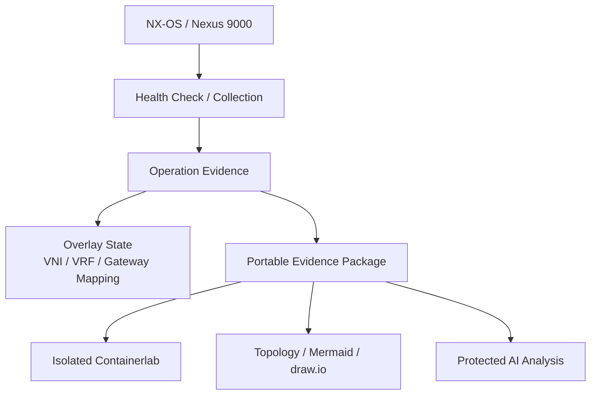
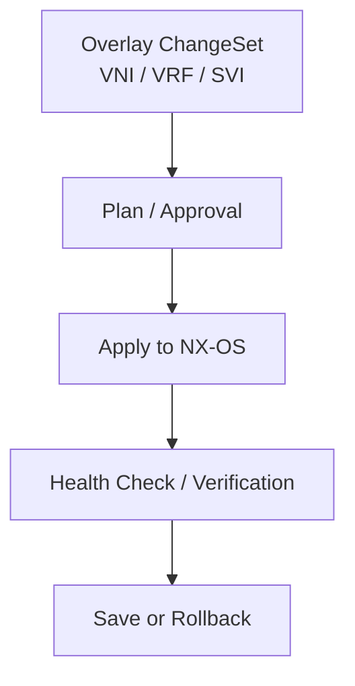
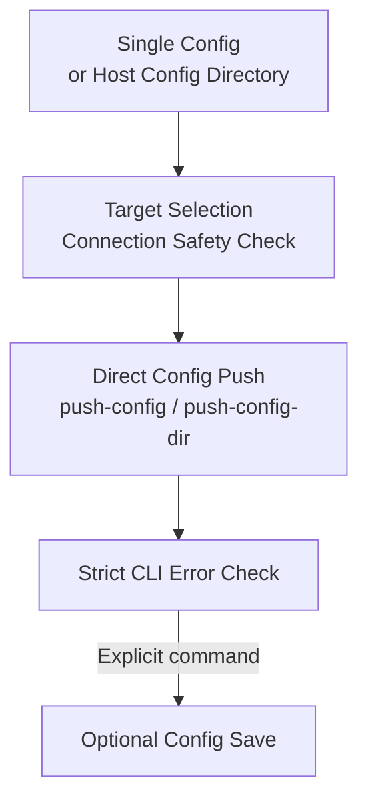

# alred

alred は、ネットワーク環境の情報収集、正常性確認、それらをまとめた Evidence Package によるデータ搬送、
Containerlab 環境の生成、Overlay（VNI）設定、ネットワーク構成図の作成を支援する CLI ツールです。

**alred**: **A**utomated **L**aboratory **R**esource & **E**nvironment **D**eployment

読み方: **オールレッド**

> [!WARNING]
> 現在は alpha 版です。機能や仕様は変更される可能性があります。
> 設定投入機能は、対象機器、Capability、生成 config、rollback 手順を検証したうえで使用してください。

## 全体像

### Observe／Transfer／Reproduce

商用環境などの実機に対して、正常性確認（Health Check）とログ収集（Collection）を実施します。
正常性確認では、Overlay の VNI／VRF／Gateway のリスト化も実施します。
正常性確認とログ収集の結果を Evidence Package にまとめ、別環境へ搬送可能な情報源とします。
その Evidence Package をもとに構成図の作成や AI 解析へ再利用できるようにします。
また、Evidence Package をもとに、隔離 lab 環境で Containerlab を生成します。


```mermaid
flowchart TD
    NXOS["NX-OS / Nexus 9000"]
    HEALTH["Health Check / Collection"]
    OPERATION["Operation Evidence"]
    VNI["Overlay State<br/>VNI / VRF / Gateway Mapping"]
    PACKAGE["Portable Evidence Package"]

    NXOS --> HEALTH
    HEALTH --> OPERATION
    OPERATION --> VNI
    OPERATION --> PACKAGE

    PACKAGE --> LAB["Isolated Containerlab"]
    PACKAGE --> DIAGRAM["Topology / Mermaid / draw.io"]
    PACKAGE --> AI["Protected AI Analysis"]
```

| 目的 | 内容 | 最初に読む手順 |
|---|---|---|
| Observe | 情報収集、Health Check、VNI／VRF／Gateway の状態確認 | [Network Operations Quick Start](./docs/manual/network-ops/01_QUICK_START.md) |
| Transfer／Reproduce | Evidence Package から隔離された Containerlab 環境を生成 | [Containerlab Quick Start](./docs/manual/containerlab/01_QUICK_START.md) |
| Visualize | Evidence Package から Mermaid／`draw.io` 構成図を生成 | [Topology Quick Start](./docs/manual/topology/01_QUICK_START.md) |

### Overlay Configuration

Overlay（VNI）の設定変更を実施します。
ChangeSet の定義後、実機状態との整合性を確認して config を生成し、
機器への投入、正常性確認、rollback までを一連の Operation として管理します。


```mermaid
flowchart TD
    CHANGESET["Overlay ChangeSet<br/>VNI / VRF / SVI"]
    PLAN["Plan / Approval"]
    APPLY["Apply to NX-OS"]
    VERIFY["Health Check / Verification"]
    RESULT["Save or Rollback"]

    CHANGESET --> PLAN
    PLAN --> APPLY
    APPLY --> VERIFY
    VERIFY --> RESULT
```

| 目的 | 内容 | 最初に読む手順 |
|---|---|---|
| Managed Overlay Operation | VNI／VRF／SVI の変更を plan、approval、verification、rollback とともに管理 | [Overlay Configuration Quick Start](./docs/manual/network-ops/11_OVERLAY_CONFIGURATION_QUICK_START.md) |

### Direct Config Push

config をそのまま投入する場合は Direct Config Push を使用します。
機器単位の config list や、初期設定／config backup 由来の config の投入に利用できます。
対象機器への接続性と投入対象を確認してから実行します。


```mermaid
flowchart TD
    CONFIG["Single Config<br/>or Host Config Directory"]
    SAFETY["Target Selection<br/>Connection Safety Check"]
    PUSH["Direct Config Push<br/>push-config / push-config-dir"]
    RESULT["Strict CLI Error Check"]
    SAVE["Optional Config Save"]

    CONFIG --> SAFETY
    SAFETY --> PUSH
    PUSH --> RESULT
    RESULT -->|"Explicit command"| SAVE
```

| 目的 | 内容 | 最初に読む手順 |
|---|---|---|
| Direct Config Push | 単一または host 別 config を直接投入し、確認後に明示的に保存 | [Direct Config Push Quick Start](./docs/manual/network-ops/12_DIRECT_CONFIG_PUSH_QUICK_START.md) |

## 主な成果物

| 成果物 | 主な内容 | 代表 sample／手順 |
|---|---|---|
| Operation Evidence | 収集結果、Health Check、before／after 比較、VNI map、実行 metadata | [NX-OS Overlay sample](./docs/manual/network-ops/examples/nxos-overlay/README.md) |
| Device Summary | Health Check 対象の識別情報、role、license usage、host 別 Health 結果の Markdown／CSV | [Output Guide](./docs/manual/network-ops/04_OUTPUT_GUIDE.md#9-device-summary) |
| Evidence Package | Manifest、hash、開示 policy で固定した Portable Evidence | [Evidence Package 生成手順](./docs/manual/containerlab/02_EXISTING_NETWORK_TO_LAB.md) |
| Containerlab | `topology.clab.yaml`、`hosts.lab.yaml`、変換済み config、変換 Manifest | [Single-site Fabric sample](./docs/manual/containerlab/examples/single-site-fabric/README.md) |
| Network Diagram | Physical、Underlay、EVPN、Overlay Service の Mermaid／`draw.io` | [Network Diagram sample](./docs/manual/topology/examples/single-site-fabric/README.md) |
| Overlay Operation | ChangeSet、forward／rollback config、plan、approval、device 応答、検証結果 | [Overlay ChangeSet sample](./docs/manual/network-ops/examples/overlay-changeset/README.md) |

## 現在の対象プラットフォーム

主要な利用対象は Cisco NX-OS／Nexus 9000 series です。
実機を含む環境での収集、Health Check、VNI 状態確認、Overlay 設定を想定していますが、
設定投入可否は model、NX-OS release、role、Capability の組み合わせごとに判定します。

| 区分 | 対象 | 状態 |
|---|---|---|
| 開発・継続試験の主要対象 | Nexus 9000v／N9K-C9300V | NX-OS 10.5(4) の限定 Capability で apply／save／rollback を検証済み |
| hardware 文書確認対象 | N9K-C9336C-FX2、N9K-C93180YC-FX3、N9K-C9348GC-FX3、N9K-C9364C-H1 | 公式資料と golden config の静的確認。`APPLY_VERIFIED` ではない |
| その他の model／release／role | Cisco NX-OS／Nexus 9000 family | 未登録 Capability を上位 Level として扱わず fail closed |

正確な対応範囲は[NX-OS Capability and Fixture Matrix](./docs/design/network-ops/NXOS_CAPABILITY_AND_FIXTURE_MATRIX.md)を参照してください。

## インストール

通常利用では、GitHub Releases の Linux x86_64／glibc 2.17 binary と checksum を使用します。

```bash
curl -fL -O \
  https://github.com/suzuyu/alred/releases/latest/download/alred-linux-x86_64-glibc217
curl -fL -O \
  https://github.com/suzuyu/alred/releases/latest/download/alred-linux-x86_64-glibc217.sha256
sha256sum -c alred-linux-x86_64-glibc217.sha256
mkdir -p "$HOME/.local/bin"
install -m 0755 alred-linux-x86_64-glibc217 "$HOME/.local/bin/alred"
alred --version
alred --help
```

必要に応じて `$HOME/.local/bin` を `PATH` へ追加してください。
Python package、開発環境、shell completion、エアギャップ環境への持ち込みは
[Installation Guide](./docs/manual/INSTALLATION.md)を参照してください。

## ドキュメント

| 文書 | 内容 |
|---|---|
| [User Manuals](./docs/manual/README.md) | 利用目的別の Quick Start と詳細手順 |
| [Configuration Reference](./CONFIG.md) | 設定値、inventory、補助 file |
| [Architecture Overview](./docs/design/ARCHITECTURE_OVERVIEW.md) | 全体構成、data flow、責務境界 |
| [Design Index](./docs/design/README.md) | 機能仕様の正本 |
| [Implementation Status](./docs/implementation/IMPLEMENTATION_STATUS.md) | 実装済み、部分実装、未実装の状態 |
| [Release Notes](./docs/releases/README.md) | version ごとの変更点と既知制約 |
| [Build Guide](./BUILD.md) | 配布 binary の build 手順 |

## License

[Apache License 2.0](./LICENSE)
