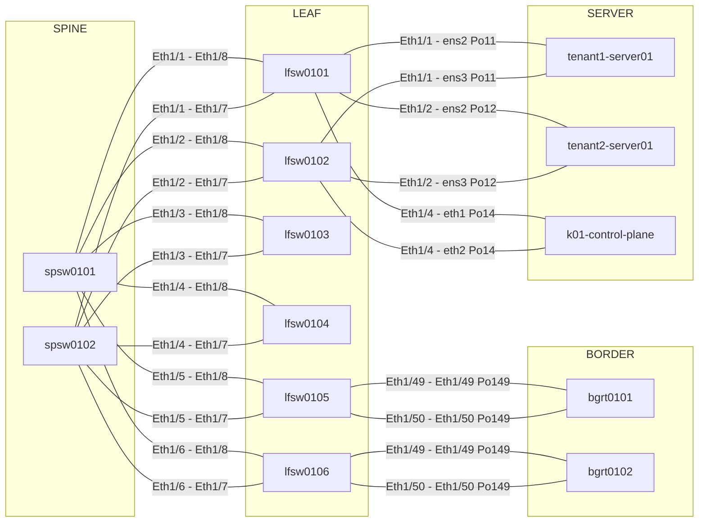

# Network Output Examples

## Example: normalize-links

```csv
local_device,local_interface,peer_device,peer_interface,link_type,port_channel,mode,vlan_or_trunk,description,source
lfsw0101,Ethernet1/1,spine01,Ethernet1/10,physical,,trunk,"10,11,13,20","uplink to spine01","show lldp neighbors; show running-config"
lfsw0101,Ethernet1/31,server01,eth0,physical,,access,100,"tenant1-vpc1-server-seg1","show lldp neighbors; show interface switchport"
lfsw0101,Ethernet1/47,lfsw0102,Ethernet1/47,physical,port-channel10,trunk,"100,200,2001","vpc peer-link member","show running-config; show port-channel summary"
lfsw0101,Port-Channel10,lfsw0102,Port-Channel10,port-channel,port-channel10,trunk,"100,200,2001","vpc peer-link","show running-config; show port-channel summary"
lfsw0101,Ethernet1/20,,,l3,,routed,,"underlay p2p","show running-config; show ip interface brief"
```

ポイント:
- リンク CSV は VNI 表ではない
- peer 不明でも local 側のリンク属性が分かれば出力してよい
- running-config を根拠にしてよい

## Example: generate-vni-map

| l3vni | vrf             | l2vni | gateway_ipv4    | gateway_ipv6     | device   | vlan | vlan_name                     |
|------:|------------------|------:|-----------------|------------------|----------|-----:|-------------------------------|
| 9001  | controller-vpc1  | 100   | 100.64.0.254/24 | fd12:0:0:1::1/64 | lfsw0101 | 2001 | controller-vpc1-seg1          |
| 9001  | controller-vpc1  | 100   | 100.64.0.254/24 | fd12:0:0:1::1/64 | lfsw0102 | 2001 | controller-vpc1-seg1          |
| 19001 | tenant1-vpc1     | 10100 | 172.16.0.254/24 | fd21:0:0:1::1/64 | lfsw0101 | 100  | tenant1-vpc1-server-seg1      |
| 19001 | tenant1-vpc1     | 10101 | 172.16.1.254/24 | fd21:0:0:2::1/64 | lfsw0103 | 11   | tenant1-vpc1-server-seg2      |
| 19001 | tenant1-vpc1     | 10103 | 172.16.3.1/24   | fd21:0:0:3::1/64 | lfsw0101 | 103  | tenant1-vpc1-k01-cluster-seg1 |
| 29001 | tenant2-vpc1     | 20200 | 172.17.0.254/24 | fd22:0:0:1::1/64 | lfsw0101 | 200  | tenant2-vpc1-server-seg1      |

ポイント:
- L2VNI が確認できる行を主対象とする
- L3VNI だけの placeholder 行は出さない
- VLAN 3501 のように L2VNI 根拠がない transit 候補は出さない
- 既に L2VNI の根拠がある行については、vrf, l3vni, gateway を補完してよい
- `device` には `config` のようなファイル種別名を入れず、`lfsw0101` のようなホスト名だけを入れる
- `vrf` 列に数値だけを入れない
- `l3vni`, `l2vni`, `device`, `vlan` の列ずれを起こさない

## Example: generate-mermaid



ポイント:
- 必ず ```mermaid で返す
- コメントは入れない
- 複雑な点線リンクや長いラベルは避ける
- 物理接続だけを描く
- vPC peer-link は省略してよい
- 接続ラベルは `local_if - peer_if` を優先する
- Po番号や VLAN は補助情報として末尾に付ける
