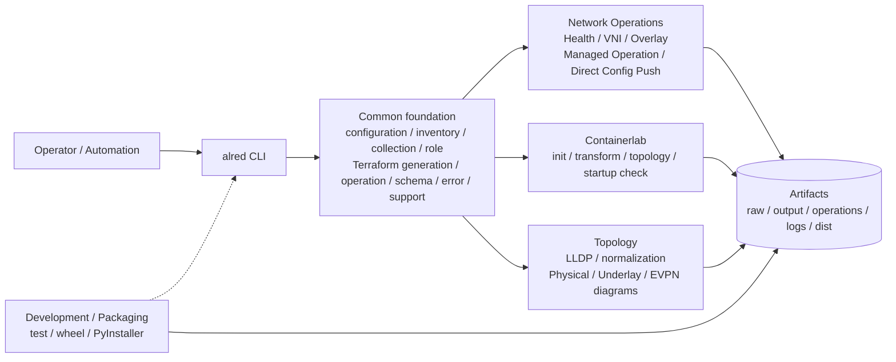
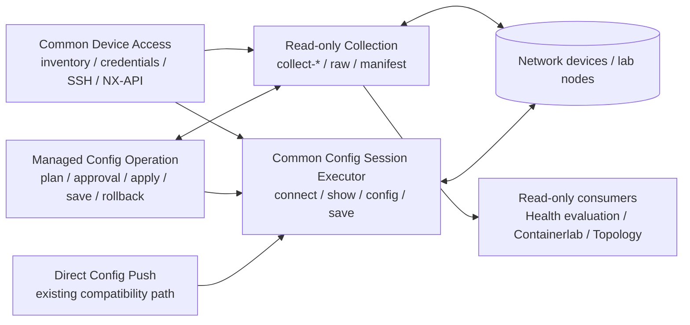
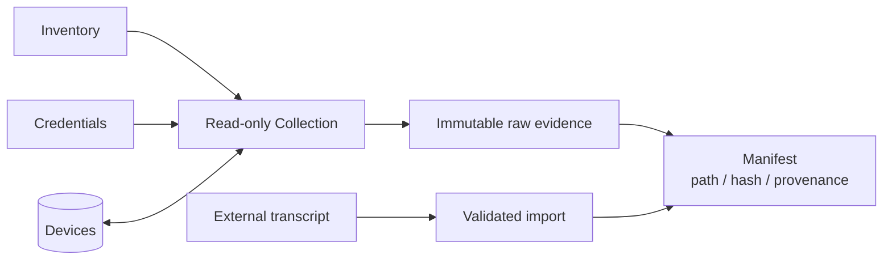
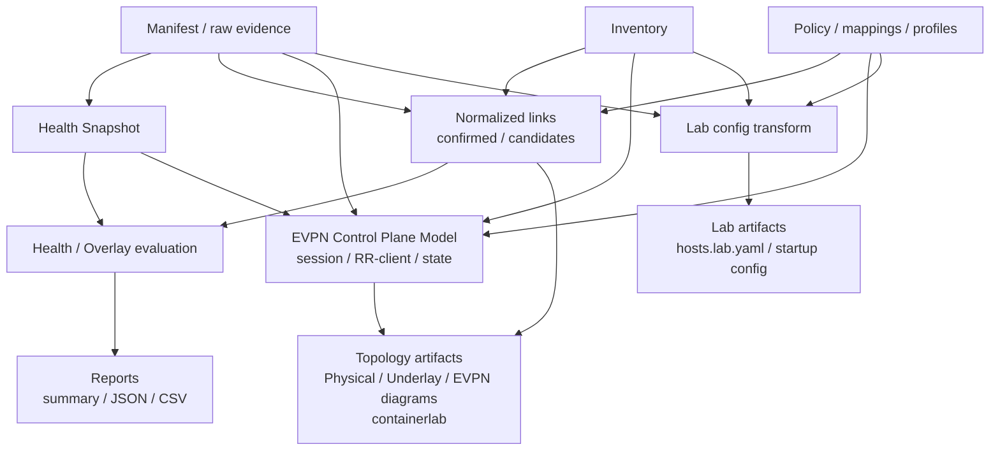
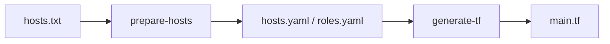
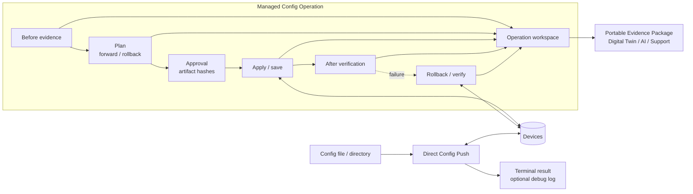
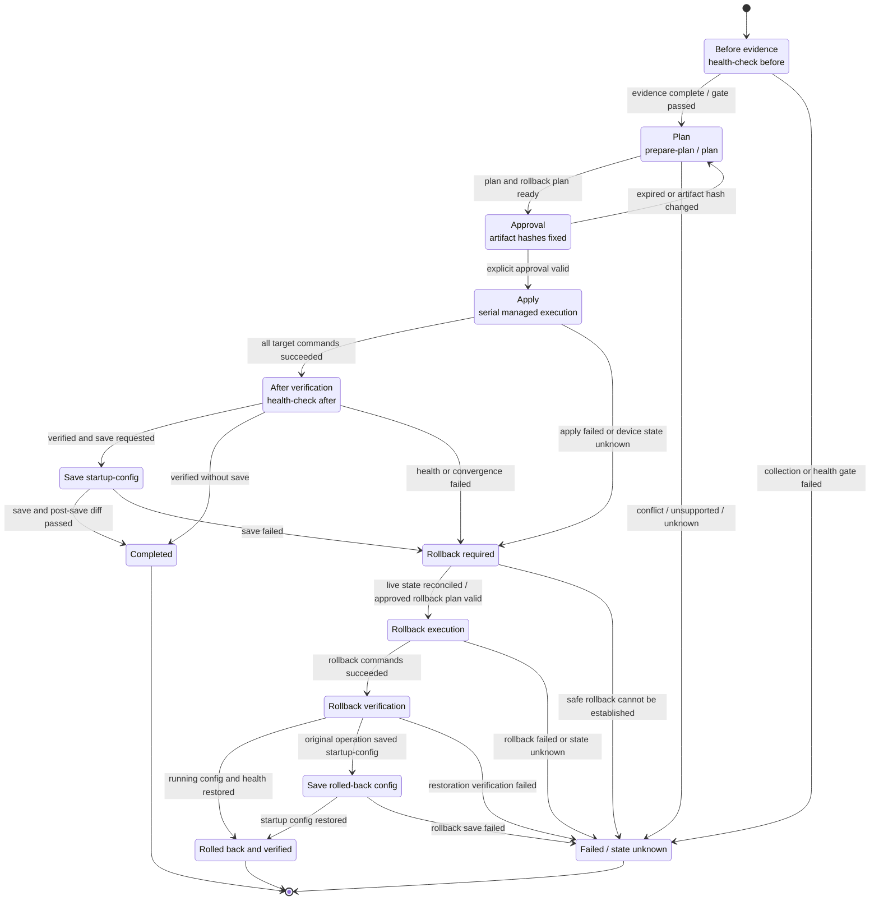

# Alred Architecture Overview

## 1. 文書の目的

本書はalred全体の機能領域、データと成果物の流れ、managed Network Operationの主要な状態遷移を
俯瞰するための入口である。図は責務間の関係を示すもので、個別commandの入力、default、schema、判定、
error、実装状態を再定義しない。詳細仕様は各図の後に示す用途別設計を正本とする。

実装済み・一部実装・未実装の区別は
[Implementation Status](../implementation/IMPLEMENTATION_STATUS.md)、既存実装の解析状況は
[Existing Feature Documentation Status](../implementation/EXISTING_FEATURE_DOCUMENTATION_STATUS.md)を参照する。

## 2. ツール全体の機能構成

上図は用途別の依存関係だけを示す。Common内部のcomponent間接続やdeviceへのread-only／mutation経路は、
次の図で分離して示す。

### 2.1 推奨するDevice access責務境界

- Collectionとdevice間はread-only commandとraw evidenceの往復である。
- Managed Config Operationはbefore／after／rollback evidenceをCollectionから取得し、planとapprovalに基づく
  mutationをCommon Config Session Executorへ要求する。
- apply直前のrunning-config drift確認とsave前後確認は、収集後の状態変化を避けるため、設定送信と同じsessionで
  read-only show commandを実行する。判定policyはManaged Config Operation、session内command実行はCommonが
  所有する。
- Direct Config PushはCommon Config Session Executorを利用するが、operation workspaceを持たない既存互換の
  直接mutationである。Managed Config OperationがDirect Config Pushを下位componentとして呼び出す構造にはしない。
- Containerlabの`collect-clab`とstartup config確認に必要なread-only取得はCollection／Device Accessを
  利用し、Topologyは収集済みrawをofflineで処理する。
- 現行`check-clab-startup-config`は共通credential／connect checkを直接再利用しており、running config取得を
  Collection Manifestへ統合していないため、図の責務境界への移行差分として追跡する。

### 2.2 推奨構成と現行実装の差分

| 責務 | 推奨構成 | 現行実装 | 状態 |
|---|---|---|---|
| before／after／rollback収集 | ManagedがCommon Collectionを利用 | Health Check phaseとcollection adapterを利用 | おおむね一致 |
| config command送信 | ManagedとDirectがCommon Config Session Executorを利用 | 両経路が`execute_config_session()`を共有 | 一致 |
| save command実行 | Common Config Session Executorを利用 | 両経路が`execute_save_session()`を共有 | 一致 |
| connection生成 | Common Device Access／Session Executorが所有 | CLI内の`connect()` closureがcredentialを解決し`connect_to_host()`を直接呼ぶ | 未統合 |
| apply直前drift確認 | Managedがpolicyを所有し、Common sessionでshow commandを実行 | Managed Operationの`precheck` callbackがconnectionへ直接`show running-config`／`diff`を送る | 一部一致 |
| command evidence | Common結果modelをManagedがoperation artifactへ固定 | Managedは固定済み。Directはterminal summary／debug logのみ | Direct側未統合 |
| ManagedとDirectの関係 | 共通executorを利用する兄弟component | 共通送信／save primitiveを共有し、相互には呼び出さない | 一致 |

現行実装は送信とsaveの低レベルprimitiveを共通化済みだが、connection生成、same-session read-only command、
session lifecycleを単一のCommon Config Session Executor APIとしては集約していない。図の`Common Config Session
Executor`はこの責務境界を表し、現時点で単一classまたはmoduleとして完成済みであることを意味しない。

### 2.3 正本文書

| 領域 | 正本 |
|---|---|
| Common foundation | [Common Design](common/README.md) |
| Network Operations | [Network Operations Design](network-ops/README.md) |
| Containerlab | [Containerlab Design](containerlab/README.md) |
| Topology | [Topology Design](topology/README.md) |
| Development / Packaging | [Development Design](development/README.md) |

## 3. データと成果物の流れ

全経路を1枚へ重ねず、共通の取得基盤、読み取り成果物、設定投入の3つに分けて示す。
各図の`Manifest`、`Snapshot`、`Operation workspace`は同じ成果物を指す。

### 3.1 取得と証拠保全

`raw current mirror`の更新前世代は保持する。外部transcriptも検証せずにraw evidenceとして扱わず、
import元とhashをManifestへ記録する。

### 3.2 読み取り成果物の生成

Health判定、Topology生成、Lab変換はraw evidenceを直接書き換えない。入力をManifestで固定し、
canonical modelを介して再生成可能な成果物を作る。LLDP／descriptionから生成するNormalized Link Evidenceは
Health、Topology、Containerlabで共用し、各consumerが独自にendpointを再解釈しない。
EVPN BGP session は物理 link と異なる Canonical EVPN Control Plane Model へ正規化し、running-config、Health Snapshot、
role/function evidence を共有する。Underlay と EVPN view の責務は
[EVPN Control Plane Diagram Design](topology/EVPN_CONTROL_PLANE_DIAGRAM_DESIGN.md) を正本とする。

### 3.3 Terraform inventory生成

Terraform生成はlinkやdiagramから派生せず、inventoryを入力とする独立した生成処理である。詳細は
[Terraform Inventory Generation Design](common/TERRAFORM_INVENTORY_GENERATION_DESIGN.md)を参照する。

### 3.4 設定投入と実行証跡

Managed経路はbefore evidence、plan、approval、実行結果、after／rollback evidenceをOperation workspaceへ
固定する。Direct Config Pushは既存互換経路であり、同等のplan、rollback、attempt証跡を生成しない。

### 3.4 Flow上の不変条件

- raw evidenceはparserやrendererが変更せず、manifestで使用file、hash、provenanceを固定する。
- Snapshot、normalized link、Render Modelは同じ入力から再生成可能なcanonical modelとする。
- candidate linkや証拠不足をconfirmed、`PASS`、投入可能状態へ自動昇格しない。
- Managed Config Operationの設定投入はplan、approval、before evidence、artifact hashを検証する。
- Direct Config Pushは既存互換経路であり、managed operationと同等のplan、rollback、attempt証跡を持たない。
  これらを必要とする作業ではDirect Config Pushを使用しない。
- attemptは成功・失敗を問わず保持し、canonical成果物とcurrent pointerは処理完了後だけ更新する。
- raw、operation workspace、生成startup configには機密情報が含まれ得る。別環境へ移送するときは
  [Portable Evidence Package](common/PORTABLE_EVIDENCE_PACKAGE_DESIGN.md)でsource世代とhashを固定し、
  用途とは独立した開示policy、secret除去、secret scanを適用する。

各成果物のschemaと保存場所は[Schema and Compatibility Policy](common/SCHEMA_AND_COMPATIBILITY_POLICY.md)、
[Collection Design](common/COLLECTION_DESIGN.md)、
[Health Check Output Formats](network-ops/HEALTH_CHECK_OUTPUT_FORMATS.md)、
[Operation State and Approval Design](common/OPERATION_STATE_AND_APPROVAL_DESIGN.md)を正本とする。

## 4. Managed Network Operationライフサイクル

次はalred内でOverlay configを投入する代表的な正常系と失敗時経路を示す。Health Checkだけ、planだけ、
外部・手動投入などでは不要なstateを通らない。machine-readableな完全なstate enumと遷移条件は
[Operation State and Approval Design](common/OPERATION_STATE_AND_APPROVAL_DESIGN.md)を正本とする。

`Failed`は証跡の削除や自動再開を意味しない。retryは新しいattemptを作り、live stateの再収集、reconcile、
再plan、必要な再approvalを行う。rollbackはoperationが所有する変更だけを対象とする。

## 5. CLI責務表

command名を変更せず、主な設計責務へ対応付ける。subcommandと全optionの仕様は各正本文書およびCLI helpを
参照する。

| 分類 | top-level command | 主な正本 |
|---|---|---|
| Common / inventory generation | `prepare-hosts`、`generate-tf`、`generate-sample-config`、`completion` | [CLI, Configuration, and Resource Design](common/CLI_CONFIGURATION_AND_RESOURCES_DESIGN.md)、[Inventory Design](common/INVENTORY_CREDENTIALS_AND_DEVICE_ACCESS_DESIGN.md)、[Terraform Inventory Generation Design](common/TERRAFORM_INVENTORY_GENERATION_DESIGN.md) |
| Collection / read-only check | `collect`、`collect-list`、`collect-run-config`、`collect-run-diff`、`collect-run-diff-cmd`、`collect-all`、`collect-before-work`、`collect-after-work`、`check-logging`、`import-running-config`（設計済み・未実装） | [Collection Design](common/COLLECTION_DESIGN.md)、[External Running Config Import Design](common/EXTERNAL_RUNNING_CONFIG_IMPORT_DESIGN.md) |
| Direct Config Push | `push-config`、`push-config-dir`、`write-memory` | [Direct Config Push and Save Design](network-ops/DIRECT_CONFIG_PUSH_AND_SAVE_DESIGN.md) |
| Network Operations | `operation`、`health-check`、`overlay-check`、`overlay-change`、`support-bundle`、`generate-vni-map`、`generate-vni-config` | [Network Operations Design](network-ops/README.md)、[Operation State and Approval Design](common/OPERATION_STATE_AND_APPROVAL_DESIGN.md) |
| Evidence transfer（一部実装） | `evidence-package create/inspect/verify/import` | [Portable Evidence Package Design](common/PORTABLE_EVIDENCE_PACKAGE_DESIGN.md) |
| Containerlab | `init-clab`、`collect-clab`、`clab-transform-config`、`clab-apply-config`、`check-clab-startup-config`、`clab-set-cmds`、`generate-clab` | [Containerlab Workflow Design](containerlab/CONTAINERLAB_WORKFLOW_DESIGN.md) |
| Topology | `normalize-links`、`generate-network-diagram`、`generate-mermaid`、`generate-graphviz`、`generate-drawio`、`generate-doc`、`csv-to-md` | [Topology Design](topology/README.md) |
| Internal | `__complete` | [CLI, Configuration, and Resource Design](common/CLI_CONFIGURATION_AND_RESOURCES_DESIGN.md) |

## 6. 図の保守規則

- 図は領域、主要model、主要stateの追加・削除時に更新する。個別option追加だけでは原則変更しない。
- 同じ仕様を図内へ詳細に複製せず、正本文書へリンクする。
- MermaidはGitHub Markdownで解釈できる標準の`flowchart`と`stateDiagram-v2`を使用する。
- nodeとedgeは安定した順序で記載し、見た目だけを理由とする大規模な並べ替えを避ける。
- 実装前の構想を追加する場合は、実装済みnodeと区別し、Implementation Statusへ状態を記録する。
- 図が正本文書または実装と不一致の場合は、図を根拠に実装を変更せず、不一致を確認して責務を持つ正本を
  先に更新する。
