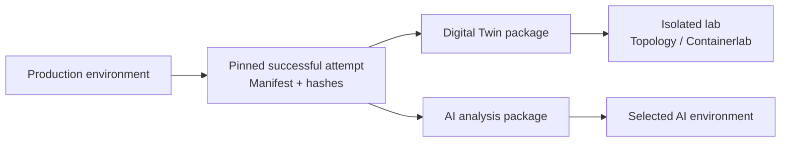

# Portable Evidence Package Design

## 1. 文書の目的

商用環境で確定した収集成果物をtar archiveへ固定し、商用環境へ直接接続できない隔離labでの
Topology／Containerlab生成、またはAI解析へ安全に引き渡す共通仕様を定める。

本仕様は可搬形式と開示制御を定義する。収集元の正本は[Collection Design](COLLECTION_DESIGN.md)、
障害調査用の選択内容とpromptは[Support Bundle Design](SUPPORT_BUNDLE_DESIGN.md)、secret検出は
[Secret Scan Rule Catalog](SECRET_SCAN_RULE_CATALOG.md)を参照する。

## 2. 責務とtrust boundary



- archiveは`raw/`current mirrorやoperation directory全体を直接tar化せず、検証済みManifestから
  到達可能なregular fileだけをallowlistで選択する。
- Digital TwinとAI解析は同じpinned source、package schema、checksum、検査処理を共有する。
- 用途と情報開示levelは別の軸とし、AI用途であることだけを理由にhostnameやIP addressを必ず
  pseudonymizeしない。
- archiveはcredentialを提供しない。lab用credentialは隔離lab側で別途注入する。

## 3. 入力世代の確定

`evidence-package create` の source option を省略した場合は、`--operations-root` 配下の live Operation から、
`health/before/current.json` が指す正常公開済み attempt を候補にする。候補の `completed_at` が最も新しいものを
自動選択し、単なる directory／file 更新時刻、Operation metadata の `current_attempt`、失敗 attempt は使用しない。
最新の `completed_at` が同じ候補が複数ある場合は自動選択せず、`--change-id` による明示選択を要求する。
live index が参照する Operation directory が存在しない場合は、index を再読込して同じ live entry であることを確認後、
その stale index を削除する。自動選択では残りの候補を評価し、`--change-id` で明示した欠損 Operation は index を削除後に
従来どおり error とする。不正な index、unsafe path、directory 以外の実体は削除せず fail closed とする。

legacy flat layout の top-level directory は、`health/before/current.json` が存在する場合だけ自動選択候補として開く。
raw-only copy、途中生成 directory など current pointer がないものはスキップする。current pointer が存在する場合は、
metadata、attempt、Snapshot、Collection Manifest の不整合を候補外として黙って無視せず fail closed とする。
不完全な legacy directory を `--change-id` で明示した場合も error とし、削除、修復、別 source への fallback は行わない。

`--change-id` を指定した場合は、その live Operation の `health/before/current.json` が指す正常公開済み attempt を
選択する。初期実装の Operation source は `before`／`current` に固定し、任意 phase／attempt の選択は将来拡張とする。
archived Operation は透過展開せず `OPERATION_ARCHIVED` とする。

どちらの Operation source も、current pointer、attempt の `result.json`、Collection Manifest の identity と schema、
regular file、source hash を検証する。選択後は attempt directory とその `collection-manifest.yaml` を固定して Package を
作成するため、処理中に別 Operation が完了しても source を切り替えない。

legacy `raw/`を入力にする場合は先にCollection Manifestを作成し、path、SHA-256、size、command、
hostname、収集時刻、transportを固定する。複数世代の混在、stale sidecar、必須command不足が
解消できない場合はpackageを完成扱いにしない。

package作成日時とsource収集日時は別fieldとして保存する。

## 4. 用途profile

| profile | 目的 | 既定の内容 |
|---|---|---|
| `digital-twin` | 隔離 lab で Topology／Containerlab を生成 | inventory、running config、任意 LLDP、必要な show output |
| `ai-analysis` | AIによる正常性・障害・構成解析 | 質問に必要なraw、Snapshot、判定、任意のoperation証跡、prompt |
| `support` | 運用者・開発者への障害引き渡し | Support Bundleのphase別allowlist |

用途profileは何を含めるかを決める。値を保持、仮名化、maskするかは次の開示policyで独立に決める。

`digital-twin`には再生成に使用した`hosts.yaml`、`roles.yaml`、`mappings.yaml`、
`description_rules.yaml`、任意の`sites.yaml`、collection／Health／lab profile、node map、design CSVを、
schema検証、default解決、開示policy適用、secret除去後の固定コピーとして含める。商用環境上の絶対pathや
credential参照は格納せず、論理source ID、source SHA-256、resolved SHA-256、package内相対pathをManifestへ
記録する。

### 4.1 Allowlistの判定単位

allowlistはdirectory名や拡張子だけではなく、次の組み合わせで判定する。

```text
profile
  + artifact typeまたはschema kind
  + command ID
  + source Manifest／execution resultからの参照
  + required／conditional
  + disclosure処理
```

候補fileはすべて、選択したsource attemptまたはlegacy collection root内のregular fileであり、検証済み
Collection Manifest、operation metadata、execution resultのいずれかから相対path、size、SHA-256を解決できる
必要がある。basename、suffix、directory内に存在するという理由だけでは選択しない。Manifest自身やexport時に
生成するresolved copyは、そのsource documentとhashをPackage Manifestへ記録する。

表中の区分は次の意味とする。

- `required`: profile成立に必須。欠落、hash不一致、未対応schemaでは`EVIDENCE_INCOMPLETE`とする。
- `conditional`: sourceで使用または明示選択され、対応するcapabilityがある場合だけ含める。
- `generated`: 検証済みsourceからpackage作成時に生成し、生成元hashとtool versionを記録する。
- `forbidden`: 指定にかかわらず通常のsanitized memberへ含めない。5.5の原文configだけは明示された例外とする。

### 4.2 共通allowlist

| artifact | 区分 | 選択条件 | 開示処理 |
|---|---|---|---|
| `package-manifest.yaml`、`checksums.sha256`、`README.md` | generated | 全profile | 値を含まないpackage metadataとして生成 |
| `collection-manifest.yaml` | required | pinned sourceを表す検証済みManifest | hostname、pathなどをpolicy適用。source hashは保持 |
| operation metadata | conditional | Operation sourceの場合 | credential参照を除外し、identity／addressへpolicy適用 |
| resolved inventory | required | package対象deviceだけ。元inventoryのschemaとhashを検証 | credential fieldと接続用secretを除外後、identity／addressへpolicy適用 |
| disclosure policyのresolved copy | generated | 全profile | secretやpseudonymization mapを含めず、policyとhashを記録 |
| schema／tool／parser version | required | Manifestまたは生成metadataから解決 | preserve |
| import record | package作成時は対象外 | import先でのみ生成 | archiveへ逆輸入しない |

複数commandが同じ統合transcriptを参照する場合は、source file全体のSHA-256を検証した後、各command recordの
`output_start_line`～`output_end_line`だけを切り出す。`raw/sanitized/<device>/<command-id>.txt`は1 fileにつき
1 commandのoutputだけを格納し、同じ統合transcript全体をcommand IDごとに複製しない。Package内のresolved
Collection Manifestはexport fileを直接参照するため元のline rangeを削除し、元file上の`start_line`、`end_line`、
`output_start_line`、`output_end_line`はPackage Manifestの`source_range`へprovenanceとして保持する。片方だけの
output range、範囲外、decode不能は`EVIDENCE_INVALID_SOURCE`としてfail closedとする。

### 4.3 `digital-twin` allowlist

| artifact／command ID | 区分 | 目的・選択条件 | 開示処理 |
|---|---|---|---|
| `running_config` | required | 対象deviceごとにManifestが参照する`show running-config`成功結果を一つ | 5.4のNX-OS変換。5.5指定時もsanitized copyを併載 |
| `lldp_neighbors_detail` | conditional | 収集先に成功結果がある場合は対象 device ごとに一つ。ない場合は description-only で継続 | hostname、interface、management address を一貫変換 |
| `version` | conditional | 成功結果がある場合は platform／release／image compatibility 確認に使用 | hostname、serial、management address へ policy 適用 |
| `inventory`、`module`、`feature` | conditional | sourceで収集済みか、lab profileがcapabilityとして要求 | serial等のhardware identityへpolicy適用 |
| `hosts.resolved.yaml` | required | 対象node、platform、role、siteを解決した固定copy | credential field除外、identity／addressへpolicy適用 |
| `roles.resolved.yaml` | required | 使用したrole定義。未指定時もbuiltin／emptyの解決結果を固定 | rule値へpolicy適用 |
| `mappings.resolved.yaml` | required | hostname／interface mapping。未指定時もemptyの解決結果を固定 | mapping両側を同じpseudonym mapで変換 |
| `description-rules.resolved.yaml` | required | LLDP／description解析規則。未指定時もbuiltin解決結果を固定 | literal identityがあればpolicy適用 |
| `sites.resolved.yaml` | conditional | site定義を使用した場合 | site identityとaddressへpolicy適用 |
| collection／Health／lab profile resolved copy | conditional | 収集、正規化、lab生成で実際に使用したprofile | credential参照除外、その他はpolicy適用 |
| `links_confirmed.csv`／`links_candidates.csv` | required | running config description と任意 raw LLDP、rules から生成した Canonical Link Evidence | endpoint identity／address へ policy 適用 |
| `link-diagnostics.yaml` | optional | Canonical Link Evidence 生成時の LLDP／description 両端照合結果 | 正規化済み endpoint、diagnostic、未評価 claim だけを保持し raw description を含めない |
| `health-snapshot.json` | conditional | package sourceで正常公開済みの場合 | identity／address／log fieldへpolicy適用 |
| node map、cables／design CSV | conditional |生成または変換で実際に使用した場合 | node、interface、addressをrawと同じmapで変換 |
| 原文running config | conditional | 5.5の全条件を満たす場合だけ | `raw/verbatim/`へ原文のまま格納しsensitive packageとして扱う |

`digital-twin`では任意の`collect-list`結果を自動的に含めない。追加show outputが必要なlab profileは、対応する
command ID、content type、利用目的、必須／任意をprofileへ明示し、Collection Manifestが参照する成功結果だけを
`conditional`として選択する。未対応commandをfilenameから推測して追加しない。

### 4.4 `ai-analysis` allowlist

| artifact／command ID | 区分 | 目的・選択条件 | 開示処理 |
|---|---|---|---|
| analysis selectionと`analysis/prompt.md` | generated | 解析目的、対象device／phase、収録／除外artifact IDを固定 | promptへ秘密値を転載せずpolicy適用済みidentityだけを使用 |
| Manifestが参照する成功済みraw collection | conditional | 選択した同一attemptに属する収集結果を原則すべて | command固有または汎用text sanitizerとfield別policyを適用 |
| Health Snapshot、Health Result、checklist、summary | conditional | source attemptで正常公開済みの場合 | identity、address、log messageへpolicy適用 |
| compare、Topology／Overlayのcanonical result | conditional | 選択phaseから参照可能な正常公開済み成果物 | schemaを維持してfield別policy適用 |
| operation plan、execution result、command result | conditional | Operation sourceでexecution resultから到達可能 | config／responseをsanitizeし承認者などのidentityへpolicy適用 |
| generated／rollback config | conditional | Operation sourceでManifestまたはexecution resultから到達可能 | 5.4と同じconfig変換 |
| 原文running config | conditional | 5.5の全条件を満たす場合だけ | `raw/verbatim/`へ格納し、AI promptで機密情報の非転載を指示 |

組み込みsanitizer／parserを適用するbaseline raw command IDは、
`boot`、`version`、`inventory`、`system_resources`、`processes_cpu`、`processes_cpu_history`、
`processes_memory`、`processes_memory_shared`、`environment`、`module`、`feature`、`ntp_status`、
`ntp_peers`、`ntp_peer_status`、`license_usage`、`license_all`、`interface_status`、`interface_brief`、
`interface_errors`、`lldp_neighbors_detail`、`route_ipv4_default`、`route_ipv4_all_vrfs`、
`route_summary_ipv4`、`logging`、`running_config`、`running_config_diff`、`reload_pending`とする。正確なcommandと
対応範囲は[NX-OS Baseline Health Check Commands](../network-ops/NXOS_BASELINE_HEALTH_CHECK_COMMANDS.md)を正本とする。

`ai-analysis`の既定は、選択した同一Collection attemptのManifestに登録され、収集成功、size／SHA-256検証成功と
判定できるraw collectionを、baseline、`collect-list`、site固有commandを含めてすべて収録する。parser未対応でも
原因解析に利用できるraw evidenceとして保持し、再収集や別attemptのrawによる補完は行わない。

組み込みparserがないtext形式には、既知secret、identity、address、home pathを対象とする汎用text sanitizerと
secret scanを適用する。安全に変換できないbinary／未知形式、文字codeを確定できないfileは通常memberへ含めず、
artifact ID、content type、size、除外ruleだけをPackage Manifestと`analysis_limitations`へ記録する。policyで
requiredに指定されたfileを安全に処理できない場合は、除外して続行せず`EVIDENCE_INCOMPLETE`とする。

開示範囲や容量上限のため明示的に減らす場合は、policyの`content.exclude_command_ids`またはartifact ID allow／deny
ruleを使用し、除外理由とpolicy hashを記録する。暗黙のsampling、log切り詰め、古いfileからの削除、容量上限内へ
収めるための自動間引きは行わない。size上限を超える場合は`EVIDENCE_TOO_LARGE`とし、利用者がpolicyまたは収集範囲を
見直して新しいpackageを作成する。

### 4.5 `support` allowlist

`support`は[Support Bundle Designのallowlist](SUPPORT_BUNDLE_DESIGN.md#71-allowlist)を正本とし、phase、device、
operation evidenceの選択条件を重複定義しない。Portable Evidence Package基盤へ移行する場合も、既存
`support-bundle`が選択していないartifactを`support` profileだけで追加しない。5.5の`verbatim`はSupport Bundleで
常に禁止する。

### 4.6 共通常時禁止と選択結果

次は全profileで通常memberへの格納を禁止する。

- `.env`、credential cache、認証用cookie、Git credential、shell／browser history
- SSH／証明書private key、復号鍵、pseudonymization対応表とsalt
- operation／collection root外のfile、symlink、hard link、socket、device file、FIFO
- Manifest未登録file、hash／size不一致file、partial／失敗attemptだけに属するfile
- repository全体、`operations/`全体、`raw/`current mirror全体、temporary／cache directory
- redaction前のinventory、credential参照を含むresolved前の設定file

Package Manifestは候補ごとに`included`、`excluded`、`missing`を記録し、artifact type、command ID、source artifact
ID、source／export SHA-256、選択したprofile rule、除外理由を保持する。値そのものや禁止fileの内容は記録しない。
required artifactが`missing`または`excluded`になったpackageは完成扱いにせず、conditional artifactの欠落は
`analysis_limitations`へ記録する。

## 5. 情報開示policy

### 5.1 Preset

| preset | 想定環境 | hostname／site | IP address | 構成・log |
|---|---|---|---|---|
| `protected-preserve` | 組織が許可した保護AIまたは隔離lab | 保持 | 保持 | secret除去後に保持 |
| `pseudonymized` | identityを隠しつつ関係解析が必要 | 一貫した仮名 | 一貫した仮名 | 必要sectionを保持 |
| `minimal` | 開示を最小化する外部解析 | 仮名 | mask | allowlist sectionだけ |

開示指定を省略した場合の既定は用途別に固定する。`digital-twin`は、Topology と lab config の可読性および
既存機器との対応確認を優先し、`protected-preserve`を使用する。この場合も`config_content`は`sanitized`であり、
hostname、IP address、interface identityなどの非秘密情報は保持する一方、password、secret、community、key、
token、private keyなどは5.3の安全下限に従って除去する。`ai-analysis`は`pseudonymized`を使用する。
明示した`--disclosure-preset`は、この用途別既定を上書きできる。

### 5.2 Field別override

必要な場合はpresetに対してfield class別に開示方法を指定できる。

```yaml
api_version: alred/v1
kind: EvidenceDisclosurePolicy

metadata:
  name: protected-ai

spec:
  preset: protected-preserve
  identities:
    hostname: preserve
    site: preserve
    role: preserve
    vrf: pseudonymize
    tenant: pseudonymize
  addresses:
    management: pseudonymize
    underlay: preserve
    overlay: preserve
  content:
    running_config: preserve
    logging: include
    operation_execution: include
```

許可値はfieldの性質に応じて`preserve`、`pseudonymize`、`mask`、`exclude`とする。同じpackage内では
同一値を同じ仮名へ変換し、before／after、LLDP endpoint、inventory、config、Snapshot間の参照関係を
維持する。変換によりparserやdiffが成立しない場合は`analysis_limitations`へ記録する。

### 5.3 変更できない安全下限

次は通常の`sanitized` configおよびconfig以外のartifactでは、presetやoverrideにかかわらず常に除外または
不可逆に除去する。原文running configに限り、5.5の全条件を満たした`verbatim` modeで例外的に保持できる。

- password、enable secret、API token、SNMP／共有 credential の community 値、private key
- `.env`、credential cache、認証用cookie、shell／browser history
- SSH秘密鍵と証明書秘密鍵
- pseudonymization対応表とsalt
- operation root外のfile、symlink、socket、device file、FIFO

`preserve`は上記秘密情報を含む原文を無加工で許可する意味ではない。`sanitized` configまたはその他の通常memberで
[Secret Scan Rule Catalog](SECRET_SCAN_RULE_CATALOG.md)の高信頼候補が残る場合はfail closedとし、packageを生成しない。

### 5.4 NX-OS running configの変換

通常の`running_config`は、行を単純な正規表現だけで置換せず、NX-OSの階層、command、field classを識別して
から開示policyを適用する。変換後configは解析用artifactであり、NX-OSへ再投入できるconfigとして扱わない。
原文のline numberまたはblock IDと変換理由をManifestへ記録するが、除外した秘密値そのものは記録しない。

各許可値の意味を次で固定する。

| 許可値 | NX-OS configでの動作 | 例 |
|---|---|---|
| `preserve` | 構文と非secret値を保持する。秘密fieldだけは5.3の安全下限に従い除去または型付きplaceholderへ置換する | `hostname leaf01`は保持、`username admin password ...`のpassword値は保持しない |
| `pseudonymize` | 構文、参照関係、address family、prefix長を維持し、identity／addressをpackage内で一貫した仮名へ置換する | `hostname leaf01` → `hostname node-001`、`ip address 10.0.0.1/24` → `ip address 198.18.0.1/24` |
| `mask` | fieldの存在と型だけを示し、元値や同値関係を保持しない。Digital Twinで安全な場合はcommand、block、出現順、安全なoptionを維持した型付きplaceholderを優先する。構文維持が危険またはparserを壊す場合はcomment形式のredaction markerへ置換する | `ntp server 10.0.0.20 prefer use-vrf management` → `ntp server <masked:address> prefer use-vrf management`、構文維持不可なら`! REDACTED ntp-server` |
| `exclude` | 対象commandまたは階層block全体をexport copyから除外する | `snmp-server community ...`行、`key chain ...`blockを出力しない |

NX-OSの主な対象と既定変換は次のとおりとする。表の既定はsite policyがない場合の
`pseudonymized` presetであり、5.3の秘密情報はoverrideできない。

| NX-OS対象 | field class | `preserve` | `pseudonymize` | `mask` | `exclude` | `pseudonymized`既定 |
|---|---|---|---|---|---|---|
| `hostname` | hostname | 原値 | `node-NNN`へ一貫変換 | `<masked-hostname>` | command除外 | pseudonymize |
| interface名、port-channel ID | interface identity | 原値 | 原則保持。policy指定時だけ一貫変換 | interface値をmarker化 | 対象block除外 | preserve |
| `description` | free text／endpoint identity | secret除去後の原文 | 既知hostname、interface、IPを同じmapで変換 | `<masked>` | command除外 | pseudonymize |
| management／underlay／overlay IP、prefix | address class | 原値 | address familyとprefix長を維持して予約済み解析用prefixへ一貫変換 | addressをmarker化 | command除外 | pseudonymize |
| `vrf context`、`vrf member` | VRF identity | 原値 | `vrf-NNN`へ一貫変換 | `<masked-vrf>` | blockまたはcommand除外 | pseudonymize |
| VLAN名、tenant名 | tenant identity | 原値 | IDを維持しnameを一貫変換 | nameをmarker化 | name command除外 | pseudonymize |
| ASN、VLAN ID、VNI、route-target | topology numeric identity | 原値 | 既定は原値。policy指定時は参照整合を保ち一貫変換 | marker化 | command除外 | preserve |
| BGP／OSPF／NTP／logging／AAA server address | address class | 原値 | 同一address mapで一貫変換 | server commandをmarker化 | command除外 | pseudonymize |
| `username`名 | local identity | 原値 | `user-NNN`へ一貫変換 | `<masked-user>` | command除外 | pseudonymize |
| password、secret、credential community、key、token、SNMP auth／priv値 | secret | 許可しない | 許可しない | 値を型付き placeholder へ置換 | command／block除外 | exclude または placeholder |
| certificate／public key | cryptographic material | public部分のみ保持可 | subject identityを変換 | marker化 | block除外 | exclude |
| private key、key material block | secret | 許可しない | 許可しない | 許可しない | block除外 | exclude |
| banner、remark、free-form policy text | free text | secret scan後の原文 | 既知identity／addressを変換 | bodyをmarker化 | block除外 | pseudonymize |

秘密値をplaceholderへ置換する場合は`<redacted:password>`、`<redacted:community>`のように型だけを示す。
元の長さ、hash、先頭・末尾文字、暗号化方式を推測できる断片は出力しない。command全体を除外すると機能の
存在が解析できなくなる場合は、値を含まない`! REDACTED <rule-id>`を出力し、Manifestへ同じrule IDを記録する。

`digital-twin`では、秘密情報以外の置換可能fieldに対して、command種別、親block、同一カテゴリ内の出現順、秘密を
含まない安全なoptionを維持する型付き`mask`を優先する。Package Manifestの変換記録にはartifact ID、rule ID、block ID、
ordinal、`masked`／`redacted-marker`／`excluded`の処理種別を記録し、原値は記録しない。これによりoffline consumerは
元値を復元せず、lab-local parameterを位置対応または完全指定で適用できる。

password、community、key、token、private key等の秘密fieldは、この構造維持規則を理由に値や可逆な対応情報を保持しない。
構文自体がcredentialを有効化する場合はcommandまたはblockを除外し、必要なlab設定はcredential sourceから新規生成する。
`exclude`では元commandの存在、option、位置を再現できるとはみなさず、consumerは明示parameterからの新規生成だけを許可する。
`username <name> password|secret ...`を除去する場合は、同じusernameに従属する
`username <name> passphrase lifetime ...`も同じcredential groupとして除去する。credential commandを失った
passphrase policyをactive commandとして残さない。

上表の credential community は`snmp-server community`など credential として使用される値を指す。
`send-community`、`send-community extended`、`send-community both`、BGP community attribute、
`match community`、`set community`、`set extcommunity`、community list は routing policy／capability であり、
secret field として除去・mask しない。
汎用 text sanitizer は keyword の存在だけで line を変更せず、定義済み secret key の assignment 形式だけを
positive match する。NX-OS CLI は`username ... password`、`snmp-server community ...`、
`neighbor ... password`など、command path と secret field を定義した pattern だけを変更する。
pattern に一致しない command は推測で mask せず保持する。未知構文を高信頼で判定できない場合は、将来の
low-confidence finding として報告する責務と、sanitizer による書換え責務を分離する。

### 5.5 原文configの例外的な`verbatim`収録

障害調査や厳密なDigital Twin再現でbyte単位の原文が必要な場合に限り、`--config-content verbatim`を指定できる。
`verbatim`は「原文どおり」を意味し、改行、空白、command、hostname、IP address、password、communityなどを
変更せず、source running configと同一byte列を`raw/verbatim/<device>-running-config.txt`へ格納する。

`verbatim`は通常の開示許可値とは別の例外modeであり、presetやpolicyから暗黙に選択しない。暗号化はPackage仕様の
必須処理とせず、packageを取得できる主体は原文configを閲覧できる前提とする。このため出力を`sensitive`に分類し、
通常packageと保存、搬送、削除、AI投入先を区別する。

利用条件はすべて満たす必要がある。

- `--profile`は`digital-twin`または`ai-analysis`、開示presetは`protected-preserve`に限定する。
- `--config-content verbatim`と`--acknowledge-sensitive-config`を同時指定する。一方だけ、presetだけ、policyだけでは
  有効にしない。
- 開示先、目的、approval ID、承認者、承認日時、保存期限をDisclosure Policyまたは承認記録へ指定し、そのhashを
  Package Manifestへ固定する。非対話実行では有効な承認記録を必須とする。
- export前に原文へsecret scanを実行する。高信頼候補があっても`verbatim` memberについてだけ作成を継続できるが、
  検出件数とrule IDを値なしで端末、Manifest、監査記録へ表示する。
- `verbatim` package の running config は`raw/verbatim/`だけへ収録し、同じ command の sanitized copy を暗黙に
  二重収録しない。その他の command output は通常どおり sanitized とする。Containerlab 変換は Package Manifest の
  `config_content`を正本とし、原文 artifact を変換元に使用する場合は acknowledgement を再検証する。
- 完成archive名は`<package-id>.sensitive.tar.gz`、外部checksumは対応する`.sha256`とし、archiveはmode `0600`、
  import先package directoryは`0700`、原文configは`0600`で作成する。より緩いpermissionへのfallbackを禁止する。
- `inspect`、`verify`、`import`は`contains_verbatim_config: true`を警告し、`analysis/prompt.md`は原文内のsecretを
  回答、引用、追加promptへ転載しないよう明示する。
- `pseudonymized`、`minimal`、`support`、承認記録なし、保護されていない出力先では拒否する。

この例外は`.env`、credential cache、private key fileなどconfig以外の禁止fileを含める許可にはならない。
原文configの内容をlog、`inspect`結果、Manifestへ転載せず、Git、email、chat、通常Support Bundleへの格納を禁止する。

## 6. Package構造

```text
alred-evidence/
├── README.md
├── package-manifest.yaml
├── collection-manifest.yaml
├── inventory/
│   └── hosts.resolved.yaml
├── context/
│   ├── collection-profile.resolved.yaml
│   └── health-profile.resolved.yaml
├── policy/
│   ├── roles.resolved.yaml
│   ├── mappings.resolved.yaml
│   ├── description-rules.resolved.yaml
│   └── sites.resolved.yaml            # 使用時のみ
├── design/
│   ├── node-map.resolved.csv           # 使用時のみ
│   └── cables.resolved.csv             # 使用時のみ
├── raw/
│   ├── sanitized/
│   └── verbatim/                    # 5.5の明示指定時のみ
├── canonical/
│   ├── links_confirmed.csv
│   ├── links_candidates.csv
│   └── health-snapshot.json            # 対応 profile で使用時
├── operation/               # 選択時のみ
├── analysis/prompt.md       # AI／support profileのみ
└── checksums.sha256
```

Manifestにはsource operation／phase／attemptまたはlegacy collection ID、source hash、export profile、
`config_content`（`sanitized|verbatim|exclude`）、
開示policyとそのhash、fileごとのsource／export hash、統合transcriptを使用した場合のsource line range、除外理由、
secret scan結果、解析制約を記録する。
archive全体のSHA-256をarchive外にも生成する。

`package-manifest.yaml`は`EvidencePackageManifest` schema で検証し、`secret_scan`に catalog version／hash、status、
scan 済み／不能 file 数、high／low 件数、value-free finding を記録する。file entry は`redaction_count`と変換後の
`secret_scan_finding_count`を分ける。sanitizer による除去件数を「変換後にも secret が残った件数」と混同しない。

## 7. 隔離環境での利用・再生成検証仕様

本節は、商用networkへ接続しない隔離環境で、展開済みpackageをTopology／Containerlabがどのように検証して
利用するかを定める。`import`は安全な展開と`import-record.yaml`生成だけを担当し、link解析、config変換、
Topology／Containerlab生成を暗黙に実行しない。

Topology／Containerlabは展開directoryを無条件に走査せず、Package ManifestとCollection Manifestを検証してから
入力artifactを解決する。Digital Twin生成に必要なinventory、LLDP、running config、resolved mappings、
description rules、normalizer versionなどのcapabilityを確認し、不足を推測で補完しない。

同梱する`normalized-links.csv`は商用側で正常完了したcanonical成果物とし、隔離labではrawと固定済み
rulesから`normalize-links`で再生成し、canonical semantic内容とhashを比較する。再生成と比較はimport後の独立stepとし、
詳細は[Link Discovery and Normalization Design](../topology/LINK_DISCOVERY_AND_NORMALIZATION_DESIGN.md#72-evidence-packageの隔離環境再生成検証)
を正本とする。`VERIFIED`になったconfirmed linkだけをContainerlab生成へ渡し、candidate、warning付き、version不一致、
semantic不一致を自動採用しない。

Canonical Link resource の `semantic_version` は semantic hash の比較規則を表す。version 2 の confirmed link は
endpoint の観測方向と `remote_mgmt_ip` を semantic 比較から除外し、物理 endpoint pair、protocol、confidence、
evidence、rule、warning を比較する。field がない既存 Manifest は version 1 として宣言 hash を検証してから
version 2 の比較表現へ変換し、archive の完全性検証と後方互換性を両立する。candidate は片方向 evidence のため
方向を保持する。

新規 package は `link-diagnostics.yaml` を独立した optional resource として格納し、diagnostic と `unevaluated_claims` を含む
document 全体について Canonical Link Evidence とは別の semantic hash を記録する。既存`links_confirmed.csv`／`links_candidates.csv`の`warning`とsemantic hashの意味を
診断model追加だけで変更しない。旧packageにdiagnostic resourceがない場合は完全性検証を失敗させず、consumerは
`diagnostic_coverage: legacy`、`evaluation_status: not-evaluated`として扱う。旧packageからmismatchなしを推測しない。

展開時はpath traversal、absolute path、重複member、symlink、special file、checksum不一致を拒否する。
未対応schema majorは変換を推測せず`SCHEMA_UNSUPPORTED`とする。

## 8. Support Bundleとの関係

Portable Evidence Packageはarchive、Manifest、checksum、開示policy、安全な展開の共通基盤を所有する。
Support Bundleはこの基盤を利用し、障害phaseの選択、operation成果物、AI向けpromptを追加する用途profileとする。
既存Support BundleのCLIと成果物形式はmigrationが合意されるまで維持する。

## 9. CLI

### 9.1 Command構成

Portable Evidence Packageのtop-level commandを次で固定する。

```text
alred evidence-package create
alred evidence-package inspect
alred evidence-package verify
alred evidence-package import
```

`create`は商用環境側のexport、`inspect`と`verify`はarchiveを展開しない確認、`import`は隔離環境側の
検証済み展開を担当する。いずれもdeviceへ接続せず、収集や設定投入を開始しない。

### 9.2 `create`

```text
alred evidence-package create \
  [--operations-root <directory>] \
  [--change-id <id> | \
   --collection-manifest <path> --input <raw-directory>] \
  --profile <digital-twin|ai-analysis|support> \
  [--disclosure-preset <protected-preserve|pseudonymized|minimal> | \
   --disclosure-policy <path>] \
   [--config-content <sanitized|verbatim|exclude>] \
   [--acknowledge-sensitive-config] \
   [--output-dir <directory>] \
   [--keep-latest-packages <count>]
```

- Operation source と legacy collection source は排他的に一つだけ指定する。source option をすべて省略した場合は、
  `--operations-root`（既定 `operations`）にある最新の正常公開済み current before attempt を自動選択する。
- `--change-id` は自動選択を上書きし、指定 Operation の正常公開済み current before attempt を選択する。
  最新完了時刻が同じ候補が複数ある場合、または利用者が収集世代を固定したい場合に使用する。
- legacy sourceは`--collection-manifest`と`--input`を組で指定する。directory走査から収集世代やcommandを
  推測せず、Manifestと実fileのpath、size、SHA-256を照合する。
- `--profile`は必須とする。開示指定を省略した場合、`digital-twin`は`protected-preserve`、
  `ai-analysis`は`pseudonymized`を使用する。`digital-twin`の既定はidentity保持を許可するが、秘密情報の
  原文保持を許可しない。presetとpolicy fileは同時指定できない。
- `--config-content`の既定は`sanitized`とする。`exclude`はconfigを任意とするprofileだけで許可し、
  `digital-twin`では必須capability不足として拒否する。`verbatim`は5.5の条件をすべて満たす場合だけ許可し、
  `--acknowledge-sensitive-config`の不足をvalidation errorとする。
- `--output-dir`の既定は`evidence-packages/`とする。既存fileを上書きせず、staging directoryで選択、
  sanitize、secret scan、Manifest生成、checksum検証を完了してからatomicに公開する。
- `--keep-latest-packages` は作成成功後に同じ output directory の世代を整理する。CLI 指定、
  `ALRED_EVIDENCE_PACKAGE_KEEP_LATEST`、既定値 `3` の順で解決し、`0` は自動削除を無効にする。
  保持数は profile と通常／sensitive package の組ごとに数え、archive と外部 `.sha256` を 1 package とする。
  Manifest の `created_at` が新しい package を保持し、同時刻は package ID で決定的に並べる。
- retention 対象は外部 checksum、archive hash、内部 Manifest、全 member checksum を検証でき、package ID と
  filename が一致する regular file pair だけとする。片方だけの file、symlink、未知 file、検証失敗 package は
  削除せず warning とする。新規 package の公開・検証に失敗した場合は retention を開始しない。削除失敗時は
  新規 package を維持し、retention error として終了する。
- 最新の current before を `digital-twin` の既定値で Package 化する最小 command は
  `alred evidence-package create --profile digital-twin` とする。source、開示 preset、config content、出力先を
  default から変更する場合だけ対応 option を指定する。
- 成功時は通常`<package-id>.tar.gz`、`verbatim`時は`<package-id>.sensitive.tar.gz`とarchive外checksumを生成する。package ID、archive path、
  archive SHA-256、profile、開示policy hash、source IDをmachine-readable resultと標準出力へ返す。
- 必須capability不足、source hash不一致、未完了attempt、開示変換後の高信頼secret候補ではfail closedとし、
partial archiveを公開しない。size超過時も暗黙のfile省略や分割を行わず失敗する。上限はsite policyで
指定し、未指定時は500 MiBとする。

既存 output directory は create と同じ retention 処理を共有する command で整理できる。

```bash
alred evidence-package prune --keep-latest-packages 3 --dry-run
alred evidence-package prune --keep-latest-packages 3
```

`--dry-run` は削除候補、profile、通常／sensitive 区分、解放予定 byte 数を表示するだけで file を変更しない。

### 9.3 `inspect`

```text
alred evidence-package inspect --bundle <archive> [--format <text|json>]
```

archiveを展開せず、schema version、package／source ID、profile、開示policy hash、source収集時刻、device、
capability、file数、size、secret scan結果、`analysis_limitations`を表示する。`--format`の既定は`text`とする。
unsafe memberを検出した場合は内容を信用済みmetadataとして表示せず失敗する。

### 9.4 `verify`

```text
alred evidence-package verify --bundle <archive> [--checksum-file <path>] [--format <text|json>]
```

archive外checksumが指定された場合のarchive hash、package内checksum、Manifest schema、regular file allowlist、
path traversal、absolute path、重複member、symlink、special file、Manifest file entry の export hash、profile必須
capabilityを展開せず検証する。content text member は現在の catalog で独立再 scan し、catalog hash と scan 結果が
Manifest と一致すること、sanitized member に high confidence finding がないことも検証する。
Manifest の catalog hash が現在値と異なる場合は declared result との完全一致を要求せず、checksum 検証後に現在の catalog で
全対象を再 scan する。通過時は現在 catalog の result を返し、catalog 不一致と再 scan 済み hash を import record へ固定する。
これにより旧 package を current rule で fail closed に再評価し、旧 catalog の判定を現在も有効とみなさない。
`--checksum-file` を省略した場合は、archive 名の `<package-id>.tar.gz` または
`<package-id>.sensitive.tar.gz` から、同じ directory の `<package-id>.sha256` を自動検出する。自動検出した
checksum file は明示指定時と同じに検証し、読み取り不能、空、または archive hash 不一致で停止する。
候補が存在しない場合は package 内の整合性検証だけで継続し、`external_checksum_verified: false` を
result へ明示する。搬送中の archive 全体の取り違えまで検出する標準運用では、archive と自動検出可能な
checksum file を同じ directory へ搬送する。checksum file を別名または別 directory に配置する場合だけ
`--checksum-file` を明示する。成功は package 内容が正しいことを示し、開示先の承認を代替しない。

### 9.5 `import`

```text
alred evidence-package import \
  [--bundle <archive>] \
  [--checksum-file <path>] \
  [--output-dir <directory>] \
  [--keep-latest-packages <count>]
```

`--bundle` を省略した場合は `evidence-packages/` 直下の通常 file である `*.tar.gz` と、同じ package ID の
`.sha256` の組を列挙し、外部 checksum、archive 内部、Package Manifest、secret scan を検証する。認識可能な archive が
一つでも検証不能な場合は古い package へ黙って fallback せず `EVIDENCE_INVALID_SOURCE` で停止する。検証済み候補の
Manifest `created_at` が最も新しい package を選び、同時刻は package ID の辞書順で決定する。候補がない場合も
`EVIDENCE_INVALID_SOURCE` とする。symlink、subdirectory、認識しない拡張子は候補にしない。

自動選択では選択した pair の `.sha256` を必ず使用する。したがって `--checksum-file` は `--bundle` と同時に指定する場合だけ
許可する。`--bundle` を明示した従来動作と checksum の隣接推定は維持する。

`verify`と同じ検証をすべて通過した後、`--output-dir`（既定`imported-evidence/`）配下の
`<package-id>/`へ展開する。同名の既存directoryは上書きせず失敗する。展開は同一filesystem上の一時directoryで
行い、全memberのchecksum再検証後にatomic renameする。失敗時は完成directoryを残さない。

import 成功後は `<output-dir>/latest` を、正常公開済みの `<package-id>/` を指す相対 symbolic link として
atomic に更新する。verify、secret scan、展開、`import-record.yaml` の作成、最終 rename のいずれかが失敗した
場合は以前の `latest` を維持する。`latest` は利用者向けの到達経路であり、offline consumer は解決後も
`package-manifest.yaml`、`import-record.yaml`、package ID、archive hash を検証する。同名 package の再利用は
import ではないため `latest` の世代を変更しない。

import 済み Evidence Package を入力にできる次の offline consumer は、source selector と既存 file／直接収集 source を
すべて省略した場合、`imported-evidence/latest` を既定 source として使用する。

- `normalize-links`
- `generate-mermaid`
- `generate-network-diagram`
- `clab-transform-config`
- `clab-set-cmds`

`clab-set-cmds` の `--evidence-package` は未 import archive を意味するため、無指定時は
`--evidence-import imported-evidence/latest` の実効値として扱う。他の command は
`--evidence-package imported-evidence/latest` の実効値として扱う。明示した Package／external import／Operation source は
既定値より優先する。`--input`、`--hosts`、`clab-set-cmds --without-collect` などで既存 file または直接収集 source を
明示した場合も、その source を優先する。

consumer は `latest` を package directory として直接信用せず、相対 symlink、同一 import root 内の通常 directory、
`import-record.yaml`、Package Manifest、member hash を既存 resolver で検証する。欠損、root 外参照、未検証 directory、
profile 不一致では fail closed とする。

import 成功後は、同じ profile・通常／sensitive 区分ごとに import 日時が新しい 3 directory を保持し、
それより古い検証済み directory を削除する。保持数は `--keep-latest-packages`、未指定時は
`ALRED_EVIDENCE_IMPORT_KEEP_LATEST`、環境変数も未指定なら `3` とし、`0` は自動整理を無効にする。
`latest` の参照先は削除しない。削除対象は `package-manifest.yaml`、`import-record.yaml`、Manifest hash、
全展開 member checksum、package ID を再検証できる通常 directory に限定する。不完全な directory、symlink、
不明な手動配置物は削除せず warning とする。import の検証または公開に失敗した場合は retention を開始しない。
削除失敗時は新規 import と `latest` を維持し、retention error として終了する。

既存 import root は同じ処理を共有する command で整理できる。

```text
alred evidence-package prune-imports --keep-latest-packages 3 --dry-run
alred evidence-package prune-imports --keep-latest-packages 3
```

`--output-dir` の既定は `imported-evidence/` である。`--dry-run` は候補と解放予定 byte 数だけを表示する。

`import` は `verify` の全検証を内部で必ず実行するため、単独の `verify` を事前条件としない。標準の受領・展開手順は
archive と `<package-id>.sha256` を同じ directory に配置し、`import --bundle <archive>` とする。単独の `verify` は、
展開せずに受領確認、監査、CI gate、
または operator review を行う場合の任意 command とする。

import 結果として `import-record.yaml` を生成し、package ID、archive SHA-256、検証した外部 checksum の有無、
checksum 選択方法（`explicit`／`inferred`／`not-found`）、
import 日時、tool version、Manifest hash を記録する。import は credential 注入、Topology／Containerlab 生成、
device access を行わない。また、import 時に config を再 sanitization または再解釈せず、create 時に生成され
checksum で固定された member を byte 単位で展開する。import 後に非 secret command が欠落している場合は、import ではなく
create 時の sanitizer rule を修正し、source Collection Manifest から package を再作成する。
将来の offline consumer は import 済み directory を明示入力として受け取り、Manifest に記録された相対 path だけを解決する。

### 9.6 Errorと互換性

optionの不足、排他違反、既存import先など利用者が修正できるvalidationは終了code `2`とする。sourceの
不整合、secret検出、archive生成、integrity、安全な展開の失敗は終了code `6`とし、詳細codeは
[Error Catalog](ERROR_CATALOG.md)に従う。失敗時にPython Tracebackを通常表示しない。

既存の`alred support-bundle create/inspect/verify`は後方互換性のため維持する。
`evidence-package create --profile support`と内部処理を共有しても、既存commandのalias化、既定値変更、
成果物schema変更は別途migrationを合意するまで行わない。

Secret Scan schema 導入前に作成した`EvidencePackageManifest`は、`secret_scan`と`redaction_count`がないことだけを理由に
拒否しない。`inspect`／`verify`／`import`は旧 Manifest の必須 field、member hash、checksumを検証したうえで、現在の
catalogにより全 content textを再 scanする。結果は`secret_scan_declared: false`として表示し、安全な旧 package は利用可能、
sanitized member に high confidence finding がある旧 package は`EVIDENCE_BLOCKED_SECRET`で拒否する。旧 packageへ
scan結果を追記して同じarchiveを更新せず、必要な場合はsource Collection Manifestから現行schemaで再作成する。

`semantic_version` 導入前の Canonical Link resource は version 1 として扱う。旧 `semantic_sha256` と同梱 CSV の
一致を version 1 規則で検証できない package は拒否する。検証後の link 再生成比較だけを現行 version へ正規化し、
旧 package の Manifest や archive は書き換えない。

## 10. 実装状態

`evidence-package create/inspect/verify/import`、Collection Manifest の regular file／hash 検証、`digital-twin` の
既定`protected-preserve`／`sanitized` package、明示指定する`pseudonymized`／`sanitized` package、明示確認付き
`protected-preserve`／`verbatim` package、内部／外部checksum、安全なatomic import、import済みpackageから
`clab-transform-config`へ渡すManifest consumerを実装済みとする。`protected-preserve`／`sanitized`はhostnameと
IP addressを保持し、秘密fieldと秘密を含む行を除去する。
`ai-analysis`は同一Collection Manifestの成功済みcommandをすべて収録し、構造説明とpromptを生成する。

Portable Evidence では共通 Secret Scan Rule Catalog の built-in common rule、NX-OS context rule、catalog hash、
value-free finding、sanitizer 後の独立 scan、`create`／`inspect`／`verify`／`import` gate を実装済みとする。
`verify`／`import` の同一 directory checksum 自動検出と、checksum file がない場合の内部検証継続も実装済みとする。
`sanitized`に high confidence finding が残る場合と scan 不能な text は完成 archive を公開しない。`verbatim`は原文を
scan し、明示 acknowledgement を満たす package だけ`ACKNOWLEDGED_SENSITIVE`として記録する。

最新または `--change-id` で選択する current before Operation source は実装済みとする。任意 phase／attempt の Operation source、
`support` profile、開示policy file、`minimal`、field別override、
resolved roles／mappings／description rules／sites、Canonical Link Evidence の同梱と再生成検証は実装済みである。
追加 Secret Scan rule の user 定義、Support Bundle との scanner 共通化は未実装である。未対応 resource を
暗黙に省略せず fail closed とする。
既存Support Bundleは後方互換経路として維持する。
