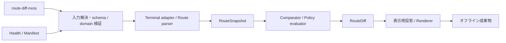

# IPv4 / IPv6 Route Diff 設計案

状態: **入力・Snapshot・比較・policy 判定・オフライン renderer API と standalone CLI を実装。Health 統合を実装**。2026-09-13 更新。合意事項と提案を区別し、
CLI、schema、生成物名の最終確定前に [UI モック](examples/route-diff-review/index.html)でレビューする。
モックは架空の観測値を表示する設計資料であり、任意ログの解析や機器への接続は行わない。
統合収集ログ・HMM・VXLAN・正常空の [修正設計](ROUTE_DIFF_COLLECTION_LOG_FIX_DESIGN.md)を追加した。
修正を実装し、directory 入力と raw 表示範囲の切替も追加した。変更部分は補足正本を参照する。

## 1. 合意事項とレビュー項目

合意事項:

- `health-check` の before / after 比較に統合する。
- 保存済みログを任意の 2 時点で比較する個別 command `route-diff-nxos` を追加する。
- 出力先は `route_diff/`。ホスト別 Markdown は各 AF で 5 種とし、左右比較 HTML、差分のみ HTML、ログ全文 HTML、全体サマリーを生成する。
- IPv4 / IPv6 の prefix、AD、next-hop を段階的に比較する。
- `nexthop-include` は **prefix + AD + next-hop**。interface と参照先 VRF も含む。
- 正規化した左右比較は差分行のみを既定とする。「差分行以外も表示」は既定 OFF とし、ON の場合に共通行を追加する。
- 経過時間、表示順、空白、IPv6 の表記差を無視する。ECMP は順序非依存とする。
- link-local の interface、参照先 VRF、IPv4-mapped IPv6、Null0、prefix と next-hop の AF を保持する。

推奨仕様として採用する設計（段階実装中。現在の API 契約は 15 節、UI の詳細は引き続きレビューする）:

| ID | 項目 | 採用する設計 |
|---|---|---|
| R1 | ホスト別配置 | 単一 host でも `route_diff/hosts/<host>/` に配置する |
| R2 | filename | 元 file の拡張子を残す。例: `before-route.log_after-route.log` |
| R3 | IPv6 | IPv4 と同じ 5 種を `v6` 名で生成する |
| R4 | HTML | 正規化した route/path 行を左右表示し、既定は `route-ad-cost-nexthop` とする。AF、VRF、比較方式を切り替える |
| R5 | サマリー | 5 方式の件数を併記し、JSON / CSV の主差分を `route-ad-cost-nexthop` とする |
| R6 | Cost / protocol / tag | Cost を比較する 2 方式を追加する。protocol / route type は将来の拡張候補、tag は個別 policy 向けとする |
| R7 | 単独 command の終了 | 既定は観測のみ。差分があっても比較完了は exit 0。`--policy` 指定時だけ正常性を判定する |
| R8 | 再実行 | 単独 command は既存出力を上書きせず、別 `--output-dir` を要求する |
| R9 | UI の位置付け | ローカル HTML で出力をレビューする。ログ upload・解析の Web アプリ化は別途検討 |
| R10 | ログ全文の左右比較 | 元ログの全文・行順・行番号を保持し、経路差分 / 文字列差分の着色を切り替える。`route-diff-raw.html` を追加する |

2026-09-13 追加レビュー: 既存 3 方式の意味を保持し、`Prefix + AD + Cost` と
`Prefix + AD + Cost + NextHop` の 2 方式をモックへ追加した。Cost は `[110/20]` の `20`。
推奨仕様での更新依頼に基づき、追加方式と既定表示 / 主差分を Cost 込みとする設計を採用する。

## 2. 現状と責務

現状の IPv4 route count は `common.routes.ipv4_summary` を比較する。
IPv4 / IPv6 の詳細 parser は `profiles.nxos-overlay.vrf_routes` を生成しているが、
同じ prefix の複数 `via` 行で `next_hop` を上書きする。詳細 ECMP diff の入力としては不十分である。
Type-5 の既存 consumer があるため、移行時は互換 adapter と回帰テストを必要とする。

[Baseline 設計 7.7](NXOS_BASELINE_HEALTH_CHECK_COMMANDS.md#77-ipv4-route-tableの扱い)には
詳細 route の常時保存と `required_prefixes` が記載されているが、現在の baseline profile は
IPv4 summary を収集し、汎用の必須 prefix 判定は未実装である。本提案では既存 baseline の
収集負荷を変えず、追加 profile `route-diff-nxos` を明示して有効化する。
この不一致を黙って既存仕様の変更として扱わない。

データフロー:

```text
health-check: 既存 collector / Manifest → 共通 route parser → Health Snapshot
standalone:  保存済みログ / source map → 同じ route parser → Route Snapshot
                                      ↓
                     共通 comparator → RouteDiff → 各 renderer
                                      ↓
                          任意 policy → Health 判定
```

収集、parser、normalizer、comparator、evaluator、report を分離する。
単独 command に SSH executor を追加しない。Health profile と standalone command は同名だが別の入口である。
standalone は active change を参照・更新せず、作業途中の比較で Health の before を置換しない。

## 3. CLI と入力案

standalone CLI は実装済み。相対 path は sample directory からの実行を想定する。Health 統合（3.3）は実装済み。追加 option と保存契約は 17 節を参照する。

### 3.1 単一 host の 2 ログ

```bash
alred route-diff-nxos \
  --before inputs/leaf01/before-route.log \
  --after inputs/leaf01/after-route.log \
  --input-format nxos-transcript \
  --output-dir review-01/route_diff
```

`before` / `after` は左右の比較ラベルである。作業開始前／終了後に限定しない。
before と作業途中、作業途中同士のログも指定できる。mtime や filename から順序を並べ替えない。

| option | 条件・既定値 |
|---|---|
| `--before` / `--after` | 両側 1 file または両側 1 directory。両方必須。`--source-map` と相互排他 |
| `--input-format nxos-transcript\|nxos-route-text` | file / directory 入力では必須。directory は nxos-transcript のみ |
| `--host` | prompt のない `nxos-route-text` では必須。prompt がある場合は一致を検証する |
| `--source-map` | 複数 host、複数 AF file、command / host の明示対応用 YAML |
| `--af ipv4\|ipv6\|both` | 既定 `both`。`both` は両側から発見した AF の和集合を比較する。片側欠落を無視しない |
| `--vrf` | 完全一致、複数指定可。省略時は発見した VRF の和集合 |
| `--policy` | 任意の route 判定 policy。省略時は観測のみ |
| `--before-label` / `--after-label` | 表示用の時点名。既定は `before` / `after`。入力や比較方向を変更しない |
| `--output-dir` | 最終出力 directory。既定 `./route_diff`。非空の既存 directory は拒否 |

`both` で両側に IPv4 しかない場合、IPv6 は「未指定／未観測」と表示し、正常・差分なしとはしない。
`--af ipv6` と明示して IPv6 がない場合は `UNKNOWN` とする。Health では固定 profile の対象 AF に従う。
ログに host を解決できる prompt と command が含まれる場合は共通 route terminal adapter / parser の grammar を再利用する。
`nxos-route-text` は VRF heading を含む 1 AF の command 本文を対象とする。
VRF heading のない prefix list は初期対象外。複数 host の名前を filename から推測しない。
同一 host / command の再出現は、standalone では既定拒否し、採用区間を source map の行範囲で明示する。
Health は既存の transcript duplicate policy を維持し、採用区間を共通 parser に渡す。

### 3.2 複数 host / AF の入力

directory 自動入力は [修正設計 3.5](ROUTE_DIFF_COLLECTION_LOG_FIX_DESIGN.md#35-複数機器ログの-directory-入力)の
仕様に従う。複雑な採用区間は以下の Source Map でも指定できる。

[source-map.example.yaml](examples/route-diff-review/source-map.example.yaml) は提案 schema の具体例。
path は YAML の directory を基準とし、host、before / after の source 群、input format、
command ID、必要時の行範囲を明示する。未知 field、同じ区間の二重割当、AF / command 不一致を拒否する。

```bash
alred route-diff-nxos \
  --source-map source-map.example.yaml \
  --output-dir review-02/route_diff
```

### 3.3 Health 統合

```bash
alred health-check before --collect \
  --profile network-baseline-nxos \
  --profile route-diff-nxos
```

before は route Snapshot を保存し、after / compare は同じ parser version、比較条件、対象を用いる。
Health の existing change ID / profile hash 整合条件を緩和しない。rollback も共通 comparator を利用する。
追加 profile の schema、AF / VRF 選択、必須 prefix 設定位置は 18 節に従う。

## 4. 正規化契約

初期 platform は NX-OS。保存済みログの対象 command は default VRF、指定 VRF、全 VRF の 3 形式とする。
command ID と取得範囲は [14.4](#144-default-vrf指定-vrf-の-command-対応)に定義する。
Health の既定収集 command は引き続き `show ip route vrf all` と `show ipv6 route vrf all`。
初期入力は text。JSON sidecar 内の text body は同じ parser に渡す。
structured JSON の別 schema 対応は未決であり、text と暗黙 merge しない。
対応 release は実装前に sanitized fixture で確定する。UI sample は合成データであり、対応 release の実証ではない。

| anchor / 入力 | 正規化 field / 規則 |
|---|---|
| `IP Route Table for VRF` / `IPv6 Routing Table for VRF` | `vrf`、`family`。VRF 名は大文字小文字を保持 |
| prefix heading、`ubest/mbest` | network address + prefix length、選択 unicast path 数。AF と prefix の整合を検証 |
| `*via` | 選択 unicast path をすべて保持。非選択 path は raw evidence に保持 |
| `[distance/metric]` | `admin_distance` と `metric` を別の非負整数として保持。妥当範囲は release fixture で確認 |
| `via` address / interface / `%VRF` | next-hop kind、AF、address、interface、参照先 VRF を別 field に分離 |
| `via Null0` / direct / local | `discard` / `connected` / `local` を区別。address 不在を未知 IP や 0 にしない |
| protocol / instance / tag | raw と解析値を保持。初期比較方式の identity には含めない |

resource identity は `(device, vrf, family, prefix)`。protocol は identity に含めない。
host は既存 inventory / mapping で解決し、異なる host を自動的に同一視しない。
interface は共通 alias 規則に従い、`Ethernet1/1` と `Eth1/1` を同一化する。
prefix と address は IP 正規化を 1 回だけ行う。IPv6 は圧縮小文字表記とする。
IPv4-mapped IPv6 は `family: ipv6` を維持し、IPv4 address へ潰さない。
link-local scope と参照先 VRF は別 field。`%` だけで意味を推測せず、出力 grammar ごとに解析する。

path は `(kind, next_hop_family, address, interface, next_hop_vrf, next_hop_table_family, admin_distance, metric)` の
対応関係を保持する。AD、Cost、next-hop を別々の集合に分解して、対応の入れ替わりを見落とさない。
順序だけは無視する。重複 path、未知の path 行、AF 不整合、`ubest` と抽出数の不一致は coverage を不完全とする。
同一 source が二重に取り込まれた場合は Manifest identity で排除し、未知の重複を ECMP と推定しない。

## 5. 比較方式と件数

| mode | 比較値 | `MODIFIED` の例 |
|---|---|---|
| `route-only` | prefix の存在 | 発生しない。prefix length 変更は旧 prefix の REMOVED と新 prefix の ADDED |
| `route-ad` | prefix + 選択 path の AD の一意集合 | AD 110 → 200。同じ AD の path 増減はこの方式では無視 |
| `route-ad-cost` | prefix + 選択 path の `(AD, metric)` の一意集合 | `[110/20]` → `[110/30]`。同一 AD / Cost の ECMP 本数変化は無視 |
| `nexthop-include` | prefix + AD と next-hop の tuple 集合 | next-hop 交換、interface / 参照先 VRF 変更、ECMP 減少、AD 変更 |
| `route-ad-cost-nexthop` | prefix + AD / metric / next-hop の tuple 集合 | Cost だけの変更と、各 path の対応を含めた変更 |

UI の表記は `Cost`、JSON の field は既存正規化案に合わせて `metric` とする。
NX-OS の `[x/y]` は `[preference/metric]` の表記である。
[Cisco NX-OS 10.5(x) Unicast Routing Guide](https://www.cisco.com/c/en/us/td/docs/dcn/nx-os/nexus9000/105x/unicast-routing-configuration/cisco-nexus-9000-series-nx-os-unicast-routing-configuration-guide.pdf)
の出力例を参照する。OSPF cost だけに限定した field とせず、各 protocol の RIB 表示 metric を保存する。
この値を全 protocol 共通の距離・帯域・遅延として扱わない。

`route-ad-cost` は AD と Cost の組を保持する。Cost を含む完全方式はその組と next-hop の
対応まで保持する。同じ数値集合であっても対応関係が違えば差分になる。
同一 protocol 内でも Cost 増加を一律に FAIL / regression にせず、観測変更として記録し、
必要なら profile の許容条件で判定する。protocol が変わった場合も数値だけで改善・悪化を推定しない。
欠損 / 未解析の metric を 0 として補わない。Cost 比較の必須 field が欠ければ、その比較は UNKNOWN。
初期版は従来の保守的な scope coverage を維持し、部分的な field だけで正常判定を復旧させない。

### 5.1 今後推奨する比較と表示

| 候補 | 用途 | 推奨する提供方法 |
|---|---|---|
| Prefix + Protocol + Route Type | 同じ prefix / AD / Cost / next-hop でも学習元や経路種別が変わったことを検出 | 次の優先候補。protocol instance と intra / inter / external などの正規化を設計後に追加 |
| Prefix + NextHop（AD / Cost 無視） | 優先度や metric の調整中、選択 path の構成が変化したかに集中 | 任意の追加 preset。AD を含む既存 `nexthop-include` の意味は変更しない |
| ECMP path 数 | 冗長性の減少を素早く見つける | 独立 mode を増やすより、NextHop を含む差分へ `2 → 1` と表示。同数での next-hop 交換も別途検出 |

初期 UI は 5 方式とし、上記の候補は将来の拡張として今回のモックには追加しない。
自由な field 組み合わせや全属性比較は、protocol ごとの未対応値・判定不能条件を整理した後に検討する。

各方式は独立に prefix を `ADDED / REMOVED / MODIFIED / UNCHANGED` へ分類する。
1 prefix に複数 field / path の変化があっても `MODIFIED` は 1 route と数える。
同じ prefix が別 device / VRF に存在する場合は別 route と数える。
正常に比較できた scope では次を満たす:

```text
before_count = REMOVED + MODIFIED + UNCHANGED
after_count  = ADDED   + MODIFIED + UNCHANGED
changed_count = ADDED + REMOVED + MODIFIED
```

全体件数は完全な device / VRF / AF scope の和。比較不能 scope 数を別に表示し、
部分集計をネットワーク全体の正常性として表示しない。
checklist では prefix 増減と、AD / Cost / next-hop を含めた変化を別列にする。
`route-only` が差分なしでも `nexthop-include` の `MODIFIED` があり得ることを明示する。

## 6. 入力品質と判定

coverage は device / VRF / AF ごとに `COMPLETE / UNKNOWN / NOT_APPLICABLE` と理由を保持する。
未選択 AF は `NOT_SELECTED` とし、評価結果の `NOT_APPLICABLE` と混同しない。
command 未実行、unsupported、timeout、CLI error、欠落 heading、途中出力、未知 row は `UNKNOWN`。
coverage が不完全な scope では全方式の確定件数を `null`、`has_diff` を `null` とする。
観測できた route は evidence に残すが、prefix の大量 REMOVED として表示しない。
未知 scope は `diffonly` でも常に表示する。

単なる EOF は「0 route」や完全取得の証明にしない。transcript は command 終端と構文を確認する。
終端 prompt のない手動切り出し本文は、source map の `completeness: asserted` により
利用者の完全取得申告を明示し、`verification: user_asserted` を証跡に残す案とする。
これは機器状態の完全性を保証しない。Health への利用条件は 11.2 に従い、申告だけでは必須 check を PASS にしない。
正常な空テーブルは対応 release の既知 heading / empty marker と取得完了で確認する。
VRF heading の消失だけでは VRF 削除と断定せず、VRF 一覧などの証拠がない場合は `UNKNOWN`。

単独 command の既定は `evaluation: NOT_EVALUATED`。差分は `OBSERVED` とし、期待変更と自動分類しない。
policy 指定時 / Health 統合時の基本判定（期待変更と証跡の条件は 11.1 / 11.2 を併用）:

| 条件 | result / classification |
|---|---|
| 必須 prefix が before から欠落 | FAIL / pre_existing |
| 必須 prefix が after で消失、最小 path 数未達 | FAIL / regression |
| 一般 prefix 消失、next-hop 変更、ECMP 減少 | WARN / regression |
| AD / Cost のみ変更、prefix 追加 | 観測情報。既定では FAIL にしない |
| 必要 evidence を確認できない | UNKNOWN |
| policy の全条件を満たす | PASS |

必須 prefix は完全一致。より短い集約経路や default route で代替しない。
モックは観測のみで、正常性 evaluator の完成を意味しない。
終了 code は [Error Catalog](../common/ERROR_CATALOG.md)を再利用する。
観測完了は 0、policy WARN は 1、入力 validation は 2、collection / parser による比較不能は 3、
policy FAIL は 4。複数結果の優先順位も共通 catalog に従う。

## 7. 保存先と filename

```text
route_diff/
├── checklist.md
├── route-diff.json
├── route-diff.md
├── route-diff.csv
└── hosts/
    └── leaf01/
        ├── route-diff-v4-route-only_before-route.log_after-route.log.md
        ├── route-diff-v4-route-ad_before-route.log_after-route.log.md
        ├── route-diff-v4-nexthop-include_before-route.log_after-route.log.md
        ├── route-diff-v4-route-ad-cost_before-route.log_after-route.log.md
        ├── route-diff-v4-route-ad-cost-nexthop_before-route.log_after-route.log.md
        ├── route-diff-v6-route-only_before-route.log_after-route.log.md
        ├── route-diff-v6-route-ad_before-route.log_after-route.log.md
        ├── route-diff-v6-nexthop-include_before-route.log_after-route.log.md
        ├── route-diff-v6-route-ad-cost_before-route.log_after-route.log.md
        ├── route-diff-v6-route-ad-cost-nexthop_before-route.log_after-route.log.md
        ├── route-diff.html
        ├── route-diff-diffonly.html
        └── route-diff-raw.html
```

元 filename は basename と拡張子を使用し、path separator、制御文字を除去する。
host path も安全な component に変換し、元 host 名を JSON に残す。sanitize 後の衝突は入力 identity の
短い hash を付加して回避する。長い basename は短縮して hash を付け、filename 上限を超えない。
複数 source の統合時は `before-set-<hash>` / `after-set-<hash>` とし、元 path は JSON の source 一覧へ保存する。
同じ file に複数 host がある場合は host directory で区別する。
対象 AF にデータがない場合も明示的な `UNKNOWN` / 未対象の Markdown を生成し、無言で省略しない。

Health は operation resolver で得た `health/report/route_diff/` を互換表示先とする。
比較相手の attempt ID と hash を固定し、attempt 内成果物の完成後だけ公開する。
rollback report と after report を相互に上書きしない。具体的な attempt 配下の配置は 18 節に従う。standalone は `--output-dir` の sibling staging で全生成物を検証し、atomic publish する。
未知 scope を含む比較結果も完全な report として保存する一方、書込途中の file 群は公開しない。
失敗 / 中断 artifact は診断用に保持し、既存成功結果を上書きしない。

## 8. UI と各出力

### 8.1 HTML

表示目的に応じて「左右比較（正規化）」と「ログ全文比較」の 2 view を切り替える。
`route-diff.html` は正規化 view の差分行のみを既定とし、before / after を左右に並べる。
行には prefix、方式に応じた AD / Cost / next-hop を表示する。
変更 prefix は先に identity で対応付け、共通 path は同じ行へ置く。消えた path は左の赤背景、
増えた path は右の緑背景とする。AD 変更は旧 tuple の赤行と新 tuple の緑行で示す。左右の対応は 11.3 に従い、順番だけで path を結び付けない。
色だけに頼らず `− / + / =` と text label を付け、HTML escape した値を表示する。

「差分行以外も表示」は既定 OFF。OFF では一致した prefix と変更 prefix 内の共通 path 行を隠し、
ON では現在の host / VRF / AF / 検索条件に該当する共通行も表示する。件数と UNKNOWN の扱いは変えない。
`index.html`、`route-diff.html`、`route-diff-diffonly.html` は同じ既定値を用いる。
`route-diff-diffonly.html` は同じ UI の差分行のみを既定表示する別 file として維持する。
unchanged prefix と変更 prefix 内の unchanged path 行を隠すが、VRF / prefix の見出し、
mode、集計値、UNKNOWN の説明は残す。方式切替で再分類する。検索・VRF・AF filter は表示だけを変え、
保存済みの全体サマリーを変更しない。元の件数と表示件数を区別する。

`route-diff-raw.html` はログ全文 view を既定表示する追加 file とする案。
3 file とも両 view を持ち、`route-diff.html` と `route-diff-diffonly.html` は正規化差分のみ、
`route-diff-raw.html` はログ全文を既定とする。レビュー入口の `index.html#raw` からも
ログ全文 view を直接開ける。正規化 view の「差分行以外も表示」、検索、AF / VRF filter は
ログ全文 view に引き継がない。表示範囲は raw 専用の selector で選び、省略を明示する。

#### 8.1.1 ログ全文 view

対象 route command 区間へ表示を絞る option と既定値は
[修正設計 6.1](ROUTE_DIFF_COLLECTION_LOG_FIX_DESIGN.md#61-ログ全文比較の表示範囲)に定義する。対象区間が既定で、入力ログ全体に切替可能。

- host と before / after の source pair を選び、command、prompt、VRF heading、prefix、
  path、経過時間、空行を元の行順で左右に表示する。合成 sample は IPv4 / IPv6 の command を同じ file に含む。
- source file の 1 始まりの行番号と元 file へのリンクを併記する。本文の空白や IPv6 の表記を
  正規化済み値に置き換えない。画面は text の行表示であり、改行コードや末尾改行の有無を調べる場合は元 file を参照する。
- ログ全文内の検索は現在の表示範囲内で一致行の枠を強調する。検索によって行は隠さず、範囲と左右合計の一致行数を表示する。
- 左右は独立して横スクロールでき、縦スクロールの同期は既定 ON / 解除可能とする。
  初期案は位置の割合を合わせる。行数が違う場合や route 順序が変わった場合に、同じ高さを
  同一 prefix の対応とはみなさない。両側の元の行順を保持するため、行の並べ替えや補間は行わない。
- 元ログの文字列を HTML escape する。未知行や途中出力も表示から除去せず、比較不能理由を残す。

着色の基準を次から選択する:

| 基準 | 着色 | 件数・判定との関係 |
|---|---|---|
| 経路の差分（既定） | 選択した 5 方式のいずれかに基づく。消失 / 変更前 path は赤 `−`、追加 / 変更後 path は緑 `+`、変更 prefix の見出しは amber `Δ` | 共通 comparator の結果と evidence の行範囲を参照する |
| ログ文字列の差分 | 純粋な行文字列の削除は赤、追加は緑。経過時間、空白、順序、表記の変化も含む | 経路件数や Health 判定へ反映しない。5 方式の selector を無効化し、別基準であることを表示する |

経路差分の着色では、同じ選択 path が残っている場合は赤 / 緑にしない。文字列だけ違う行は
淡い青灰色 `≈` とし、経過時間や表記差、選択方式の比較対象外 field の違いを区別する。
例えば Cost のみ変更した行は `route-ad` では `≈`、`route-ad-cost` では赤 / 緑になる。
経路数は従来どおり prefix 単位。全文 view の着色行数を `MODIFIED` route 数として数えない。
経路着色のために renderer で raw を再解析せず、共通 parser の route / path provenance を使用する。
文字列差分に限って、source の行列を表示専用 comparator に渡す。
coverage が不完全な scope は amber `?` とし、経路消失の赤表示を確定しない。
文字列基準へ切り替えても UNKNOWN の説明を残す。

全 file とも外部 CDN / network / Web server への依存を持たない単独 HTML とする。
大規模経路向けの HTML 分割 / ページングは実装前に予算を決める。JSON / CSV は全件を保持し、
画面の表示上限や省略で比較件数を減らさない。

### 8.2 Markdown / checklist

ホスト別 Markdown は `diff` code block で正規化値の変更だけを表示し、方式、VRF、AF、
before / after route 数、ADDED / REMOVED / MODIFIED、証跡を記載する。
`checklist.md` は device / VRF / AF ごとの比較完了、差分有無、5 方式の件数、比較不能理由を記載する。
checkbox は「比較完了」を意味し、差分なしや Health PASS の意味に使わない。
`route-diff.md` は `route-ad-cost-nexthop` の差分を prefix 単位で表示し、全体サマリーと source 一覧を持つ。

### 8.3 JSON / CSV

[route-diff.json](examples/route-diff-review/route_diff/route-diff.json) を提案 envelope の具体例とする。
`schema_version`、kind、draft marker、source hash、parser / normalizer / comparator version、
比較条件、coverage、5 方式の summary、prefix 単位 entries、変更理由 `reason_codes`、
`field_summary`、UNKNOWN diagnostics を保存する。
正式 API の JSON Schema と domain validation は 15 節に記載する。モックの version は `mock-review-2` とし、
本番 parser version を偽装しない。canonical Snapshot は full route と path を保持し、
本番の RouteDiff entries は既定 mode で変化した prefix だけを保存する。
before / after が不存在なら `null`。UNKNOWN と不存在は coverage で区別する。

CSV は prefix ごとに 1 行。AD と next-hop の変更が同時でも二重計上しない。
配列 / object は JSON 文字列とする。UNKNOWN は prefix を空欄にした scope 診断行を出力する。
header 案:

```csv
device,vrf,family,prefix,mode,change_type,reason_codes,before,after,status,evaluation,expectation_status,expectation_rule_id,evidence_before,evidence_after
```

JSON / CSV / Markdown / HTML は同じ比較 model から生成する。renderer で独立して raw を再解析しない。
証跡には raw file、command ID、1 始まりの行範囲、source SHA-256、取得時刻（不明なら null）、
入力形式、完全性の判断根拠を保持する。生成日時で取得時刻を代用しない。

## 9. レビュー手順と受け入れ条件

1. [レビュー入口](examples/route-diff-review/index.html)で入力案、全体サマリー、左右比較を見る。
2. R1–R10 の採用仕様に沿って表示と入出力をレビューし、修正点を sample と設計書へ反映する。
3. parser fixture、正式 schema、CLI help、error、保存 lifecycle の詳細を確定する。
4. 合意後に実装し、既存 Overlay / Health の回帰を確認する。

最低限の受け入れケース:

- prefix 追加・削除、同数の入れ替わり、prefix length 変更、同一 prefix の VRF / host 別扱い。
- AD だけの変更、Cost だけの変更、AD / Cost / next-hop の対応交換、ECMP 並べ替え・減少、link-local interface 変更。
- IPv6 表記差、IPv4-mapped IPv6、Null0、参照先 VRF、prefix AF と異なる next-hop AF。
- 正常空テーブル、missing AF / VRF、timeout、unknown row、途中出力、重複 block。
- mode ごとの件数公式、diffonly から共通 path が消えること、全形式の件数一致。
- ログ全文の全行・行番号・空白保持、経路着色と文字列着色の区別、検索による非表示なし、スクロール同期の解除。
- 同名入力、長い filename、HTML injection、未知 scope を含む部分集計。
- 任意 2 時点の standalone 比較が active Health operation を変更しないこと。
- retry、途中生成失敗、旧成功結果の保持、旧 Snapshot / Type-5 consumer の互換性。

入力・Snapshot・comparator / evaluator・renderer のテストを実装した。CLI は 17 節の契約で実装した。Health 統合と release 別検証は未実施。現在の詳細は 15–17 節と実装計画を参照する。

## 10. 追加の推奨仕様（合意済み・一部実装）

以下は推奨仕様による更新依頼を受けて採用する。production CLI / parser の実装承認とは区別する。
今回のモックでは変更理由、変更理由 filter、差分移動、サマリーからの移動、
before / after 両方の元ログへのジャンプと復帰を確認する。
P4 の renderer ではページング / 仮想スクロール、CIDR 検索、レビュー記録の保存・復元と policy 結果表示を実装した。
UI から policy を編集・再評価する機能は今回対象外。
policy evaluator の Python API は実装済みであり、15 節と実出力例を参照する。

### 10.1 大規模ログと性能検証

- 正規化 view は既定 100 prefix / page。50 / 100 / 500 を選択できる。filter と差分判定の後にページングし、
  「全対象の件数」「filter 後の件数」「この page の件数」を別に表示する。
- ログ全文 view は仮想スクロールとし、画面内の行と前後 100 行を描画する。画面外の行は元の行番号で参照可能とし、
  行を削除した結果や、表示上限で比較を中断した結果とは扱わない。
- 5 方式分の全 route 行をあらかじめ DOM に展開しない。canonical data は共有し、表示方式の投影を必要時に描画する。
  文字列 diff も選択時に生成する。計算中は進捗を表示し、中止可能にする。
- 集計、JSON / CSV、保存する Markdown は全対象を保持する。UI の page size や仮想スクロールによって
  `ADDED / REMOVED / MODIFIED` の値を変えない。UNKNOWN の説明は page 移動で見失わない位置に表示する。
- host 別の単独 HTML と network 不要の方針を維持し、mode ごとの raw log 重複を避ける。
  さらに file 分割が必要な規模は計測後に決め、無言の切り捨てを行わない。

`0.2.0a13` の性能対象は **before / after 各時点で 1 万 route まで**とする（2026-09-13 合意）。
各時点の全入力に含まれる host / VRF / AF ごとの prefix 件数を合計し、ECMP path 数とは区別する。
1 万 route 超は今回のリリース対象外。CLI へ件数による拒否や切り捨てを追加する仕様ではない。
検証 matrix は IPv4 / IPv6、単一 / 複数 VRF、
1 / 4 path、差分率 0 / 1 / 100%、全文の順序変更を含む。
固定した測定環境（CPU、RAM、OS、Python / browser version）で生成時間、最大 RSS、成果物別 file size、
初回表示時間、filter / mode 切替 / jump の応答時間を記録する。
全件集計の正確性と prefix / evidence の欠落なしは必須。実測値は所要時間・メモリの保証値ではなく、
1 万 route 以下でも ECMP 数・差分率・非 route 本文量・実行環境で変わる。
10 万 / 100 万 route の過去の未完了記録は保持し、将来拡張として扱う。モックを性能検証の代用にしない。

### 10.2 差分移動とサマリーの連携

- 「前の差分」「次の差分」と `3 / 42 件` を表示する。対象は現在の host / VRF / AF / mode /
  検索 / 変更理由 filter に該当する変更 prefix。共通行と UNKNOWN は差分件数に含めない。
- 最初 / 最後では該当 button を無効化し、循環しない。filter が変わったら移動位置を未選択へ戻す。
  ページングをまたいだ移動では該当 page を開き、その prefix を強調する。
- サマリーの ADDED / REMOVED / MODIFIED 件数は、対応する scope / mode / change type に絞って
  正規化 view を開く。0 件は移動 button にしない。UNKNOWN は完全性の説明へ移動する。
- `MODIFIED` は prefix ごとに 1 件。複数の変更理由や path 行を navigation 件数へ重複計上しない。

### 10.3 正規化 view と元ログの往復

- 各 prefix に「元ログの該当位置へ」を付ける。host、mode、before / after の evidence 行範囲を引き継ぎ、
  両方の全文 pane をそれぞれの該当箇所へ移動して強調する。raw の文字列着色が選ばれていた場合は経路着色へ戻す。
- ジャンプ中は比例スクロール同期を一時停止し、異なる位置の証跡を正しく表示する。以後の手動同期は利用者が
  再び ON にできる。「正規化比較へ戻る」で元の filter、選択 prefix、page を復元する。
- 追加 / 消失で片側に該当 route がない場合は、その command / VRF の完全性を確認した section へ移動する。
  「before に存在しないため、確認対象 section を表示」などと明示し、偽の route 行を作らない。
- 該当範囲の source hash が一致しない場合、行番号を信用して移動せず、入力不整合を表示する。
  UNKNOWN の場合は取得 / 解析不能の section を参照し、経路消失の証明として表示しない。

### 10.4 変更理由と field summary

`reason_codes` は安定した識別子の配列とし、ラベルを別に持つ。選択方式で比較対象となる field だけから導出する。

| code | 表示名 | 条件 |
|---|---|---|
| `PREFIX_ADDED` / `PREFIX_REMOVED` | prefix 追加 / 消失 | prefix が片側だけに存在 |
| `AD_CHANGED` | AD 変更 | 比較対象の AD が変化 |
| `METRIC_CHANGED` | Cost 変更 | Cost を比較する方式で metric が変化 |
| `NEXTHOP_CHANGED` | NextHop 変更 | NextHop を比較する方式で address / interface / AF / kind / 参照先 VRF が変化 |
| `PATH_COUNT_DECREASED` / `PATH_COUNT_INCREASED` | ECMP path 減少 / 増加 | NextHop を比較する方式で選択 path 数が変化 |
| `PATH_ASSOCIATION_CHANGED` | path 属性の対応変更 | 個別の値集合が同じでも AD / Cost / NextHop の対応が変化 |

変更理由 filter は現在の mode に有効な理由を対象とする。mode 変更後も既存 filter を勝手に別の意味へ読み替えない。
該当がなくなった場合は 0 件と表示する。UNKNOWN は変更理由で隠さない。
理由は併記可能だが、1 prefix の `MODIFIED` を重複計上しない。

変更 prefix には field summary を付ける。例:

```text
192.0.2.64/26  MODIFIED / Cost 変更
AD        110 → 110
Cost       20 → 30
NextHop   変更なし
path 数     1 → 1
```

選択方式の対象外 field は省略する。before / after の複数値と path の対応は canonical data に残す。
summary の表示用集合を再比較して最終結果を作らない。
JSON は `reason_codes` と `field_summary` を追加し、CSV は `reason_codes` 列を JSON 配列で追加する。
Markdown / HTML は同じ model のラベルを使用する。

### 10.5 比較の完全性と時点

host / VRF / AF ごとに次を before / after 別に表示・保存する:

- 取得状態: complete / incomplete / not collected / user asserted。
- 観測した prefix 数、解析できた prefix / path 数、未解析行数。確認できない件数は `null`。
- 比較可能 / UNKNOWN / NOT_SELECTED、理由、未解析行の source と行範囲。

解析できた部分だけをもって完全取得とはしない。時刻や件数がない値は推測しない。
モックの完全性表示は合成入力から定義した期待値であり、production parser の実行結果ではない。

HTML の長い証跡は初期状態で折りたたむ。取得状態は host / VRF / AF、coverage、
UNKNOWN の対象時点と理由を見出しに残し、詳細な JSON は開いたときに描画する。
scope の診断をその下に全文で重複表示しない。scope に関連付けられない診断も、
host / 時点 / 理由を見出しに残して個別に折りたたむ。
サマリーの UNKNOWN を選ぶと該当 scope だけを展開して移動する。
Sources は入力数を見出しに表示し、展開後も入力ごとの詳細を折りたたむ。
versions / fingerprint / policy hash と Policy 全 rule の詳細も初期状態で閉じ、
Policy は判定別件数を見出しに残す。展開した JSON は高さを制限し、内部スクロールで全文を確認できる。
証跡の省略・削除や判定の変更は行わない。折りたたみは HTML ファイル自体の容量削減を意味しない。

比較 header に before / after の表示ラベル、source basename、取得日時を出す。
単独 command に `--before-label` / `--after-label` を追加し、既定は `before` / `after`。
例えば `作業前` / `作業途中①` と指定できる。表示名を変えても左右の入力や比較方向は入れ替えない。
取得日時不明は「不明」とし、file mtime や report 生成時刻で代用しない。
複数 source は source ごとの取得日時と取得期間を表示し、単一時刻へ偽装しない。

### 10.6 検索と判定対象

| 検索方式 | 動作 |
|---|---|
| 文字列検索（既定） | 正規化表示の host / VRF / prefix に対する部分一致。全文 view は raw 本文に対する部分一致 |
| prefix 完全一致 | 入力を canonical prefix に正規化し、address と prefix length の両方を照合 |
| 指定 CIDR に含まれる経路 | 同一 AF で、route prefix 全体が指定 network 内に含まれるものを表示。例: `192.0.2.0/24` はその `/25` や `/26` を含む |

prefix / CIDR は network address を要求し、host bit が立った入力や不正文字列は入力エラーを表示する。
空の検索は絞り込みなし。より短い包含 route を表示する longest-prefix lookup は今回対象外。
UI の検索 / filter は表示だけを変え、比較・policy 評価から経路を除外しない。

評価対象からの除外は policy の `exclusions` に exact device / VRF / AF / prefix と理由を明示する。
除外経路も観測 diff に残し、`evaluation: EXCLUDED` と理由を付ける。
同じ経路を `required_routes` と `exclusions` の両方へ指定した場合は validation error とする。
必須経路が収集 / 比較 scope の外にある policy も validation error とし、未評価の必須経路を PASS と扱わない。

### 10.7 重要経路 policy の入力

[route-policy.example.yaml](examples/route-diff-review/route-policy.example.yaml) を提案入力例とする。
必須 prefix は exact identity で指定し、`min_paths` は選択 unicast path の最小本数。
期待 NextHop の `match: contains` は列挙 path の全包含、`exact` は path 集合の一致を要求する。
path は kind / AF / address / interface / next_hop_vrf の組とし、順序を無視する。
link-local の interface は必須。省略値を暗黙の wildcard にしない。
AD / Cost は既存の観測 diff に保持し、重要経路 policy の初期例では閾値を設定しない。

必須経路の欠落、期待 NextHop 不一致、最小 path 数未達は FAIL。
before からの違反と after の regression を区別する。判定に必要な coverage が UNKNOWN の場合は
不存在 / path 0 とせず UNKNOWN。policy は解決済み内容と hash を before で固定し、Health と standalone で共通利用する。
入力 schema、未知 field / duplicate identity / 不正 prefix / 非正整数 min_paths の validation は実装時に必須とする。

### 10.8 レビュー記録

[review-record.example.json](examples/route-diff-review/review-record.example.json) を保存形式の案とする。
観測結果とは別の `RouteDiffReview` とし、未確認 `UNREVIEWED` / 確認済み `REVIEWED`、コメント、確認日時を保持する。
REVIEWED は正常・期待どおり・投入承認の意味を持たず、Health result を変更しない。

`comparison_fingerprint` は左右の source hash / 採用区間 / host identity、解決済み scope / policy / 比較方式群、
terminal adapter / parser / normalizer / comparator version から作る。renderer version や表示用ラベルだけでは変更しない。
entry key は resource identity、mode、投影された before / after の hash とする。
入力、比較条件、判定 policy が変わった場合は旧記録をそのまま継承しない。取り込み時に fingerprint を照合し、
不一致は理由を表示して拒否する。自動的な「確認済み」の移行はしない。

ローカル HTML では明示的なレビュー記録の JSON export / import を提供する方針。
ブラウザの一時 state だけを保存済みと表示せず、未保存件数を表示する。CLI は同じ形式を読み書きする。
既存 RouteDiff / raw / attempt をレビュー操作で書き換えない。モックでは入力例のみ。P4 の本番 renderer で保存・復元 UI を実装した。

## 11. 優先項目と端末ログ（合意済み・一部実装）

本節は追加依頼に基づく採用仕様。[追加ケースの UI](examples/route-diff-review/review-cases.html)で
期待変更、Health 用証跡、ECMP の対応、端末ログの入力・出力例をレビューする。
モックの照合結果と端末解析結果は合成した期待値であり、production evaluator / importer の実行結果ではない。

### 11.1 期待変更と正常性の分離

`RouteDiffPolicy.spec.expected_changes` を任意で追加する。新しい CLI option は増やさず、
既存案の `--policy` から利用する。[入力例](examples/route-diff-review/expected-changes.example.yaml)を参照。
各 rule は一意の `id`、理由、exact device / VRF / AF / prefix、期待する before / after を持つ。
初期版は `route-ad-cost-nexthop` の全比較 field を明示した path 集合の完全一致だけを扱う。
順序・経過時間・protocol / tag は既存の比較契約に従う。部分一致、wildcard、数値範囲は初期対象外。
「Cost だけ変更」の指定でも NextHop / AD を省略せず、予定外の同時変更を見逃さない。

- before / after は canonical route（prefix と paths）。不存在は `null`、空 paths は入力エラー。
- rule ごとに実際の before と after の両方を照合する。現在の UI mode によって照合条件を変えない。
- `MATCHED`: 両側が期待値どおり。`MISMATCH`: 対象の変化はあるが片側以上が不一致。
  `NOT_APPLIED`: 実際には変化がなく、期待した変更が未成立。`UNVERIFIABLE`: 必要な証跡不足。
  rule がない route は `NOT_CONFIGURED`。これらは Health result とは別の `expectation_status` とする。
- rule は対象が UNCHANGED でも評価する。main diff entries にない route の結果も
  `policy_results.expected_changes` に保存し、HTML / Markdown の期待変更一覧へ表示する。
- before / after とも同一の rule、両側 `null`、重複 id / resource、対象 scope 外、未知 field、
  不正な path は validation error。同じ resource の `exclusions` との併用も拒否する。
  `required_routes` との併用は許可し、各条件を独立評価する。
- policy は解決後の hash を before で固定する。after に期待値を都合よく更新せず、条件変更は別比較とする。

| 状態 | 正常性への反映（十分な証跡がある場合） |
|---|---|
| MATCHED、必須条件も満たす | その変更に対する一般的な WARN を抑え、`expected_change` とする |
| MISMATCH / NOT_APPLIED | 少なくとも WARN / `unexpected_change`。必須条件違反なら FAIL を維持 |
| MATCHED だが必須 prefix 欠落 / min_paths 未達 | FAIL を維持。予定した削除でも免除しない |
| 証跡不足 | UNKNOWN。期待値の宣言で正常性を補わない |

`ADDED / REMOVED / MODIFIED` と `reason_codes` は期待値によって変えない。期待変更も既定の差分表示に残す。
レビュー済みフラグは期待変更でも正常判定でもない。全体 PASS は他の必須チェックも満たした場合だけ。
複数 check の FAIL / UNKNOWN は個別に残し、代表終了 code は共通 Error Catalog に従う。

出力には rule id、policy hash、expectation_status、期待値、観測値、不一致 field と証跡を持たせる。
未成立 rule を出力するため、main RouteDiff JSON の `policy_results` に全 rule を保存し、
既存 prefix CSV の行数は変えず `expectation_status` / `expectation_rule_id` 列を policy 利用時にも常設する。
policy 未指定は空欄ではなく `NOT_CONFIGURED` / 空 id。rule 一覧 CSV の追加は初期対象外。

### 11.2 手動ログの比較と Health に利用できる証跡

解析可否 `parse_status: COMPLETE / UNKNOWN`、取得証跡 `verification: verified / user_asserted / unknown`、
`health_eligible` を別に保持する。既存 coverage と observation の field 名は正式 schema 化時に統一する。

| 入力 | standalone の観測比較 | 必須 route Health check |
|---|---|---|
| manifest と raw hash が整合し、取得成功・対象・構文・終端を確認 | 比較可能 | 他の profile 条件も満たせば評価可能 |
| 外部 transcript の host / command / 終端が一意で、import confidence が high、構文も完全 | 比較可能 | 同じく評価可能。直接収集であることだけを必須にしない |
| 終端のない本文、source map で完全取得を申告、構文は完全 | `user_asserted` を明示して比較可能 | UNKNOWN、health_eligible = false |
| 申告の有無によらず途中 path / 未知行 / 未解決制御文字あり | UNKNOWN。確定 diff 件数は null | UNKNOWN、health_eligible = false |

利用者申告は「parser error を無視する」option ではない。申告を検出した破損より優先しない。
両側の証跡が必要なチェックでは片側でも不十分なら UNKNOWN とし、対象 scope と理由を残す。
`verified` は取得・解析証跡の条件を満たす意味で、同時点 snapshot や経路収束の保証ではない。
standalone の policy 未指定は申告付き観測完了で exit 0、正常性は NOT_EVALUATED。
`--policy` で必須条件を判定する場合も申告だけでは PASS にせず UNKNOWN / exit 3 とする。
申告のみの結果は Health の必須 gate を通さない。既存 operation の別チェックや承認規則を緩和しない。
UI は「観測比較可能（利用者申告）」と「Health 用証跡不足」を併記する。

### 11.3 ECMP path の表示上の対応

比較は従来どおり集合で行い、左右の対応付けは renderer の表示情報だけとする。

1. 選択 mode で完全一致する投影行を共通行へ対応させる。
2. NextHop を比較する mode では、残った行の `(kind, AF, address, interface, next_hop_vrf, next_hop_table_family)` が同一で、
   左右それぞれ 1 行だけの場合に限り、同じ NextHop の AD / Cost 変更として横に並べる。
3. 残りは左だけの削除群、右だけの追加群とする。別 NextHop 同士は 1 行ずつでも対応を推測しない。
   同じ NextHop に候補が複数ある場合も距離・文字列の類似度で対応を選ばない。
4. NextHop を比較しない mode は共通行を除き削除群・追加群とする。非表示 field を根拠に path 対応を作らない。

「同じ NextHop の属性変更」と「対応未確定の削除 / 追加」を凡例で区別し、後者を UNKNOWN route と混同しない。
source が完全なら MODIFIED は確定でき、一対一の path 対応だけが未確定となる。
削除群・追加群内の並び順は canonical tuple によって安定させる。順序を変えても件数は不変。
同じ規則を Markdown と HTML に用い、raw view の元の行順は維持する。

### 11.4 端末ログの整形と source map

raw bytes → terminal adapter → transcript 区間検出 → route parser の順に処理する。
raw bytes と hash は整形前に固定する。元ログを上書きせず、整形の記録と解析用 text を別に持つ。
初期入力 encoding は UTF-8（先頭 BOM は許可）。decode error を置換文字で隠さず、入力エラーにする。

| 入力 | 初期版の扱い |
|---|---|
| LF / CRLF、末尾改行の有無 | 解析用は LF。末尾改行だけで完全性を判定しない。元 byte と改行種別は保持 |
| 先頭 UTF-8 BOM | 解析用だけ除去し、変換を記録 |
| ANSI SGR の `ESC [` + 数字 / `;` + `m` | 色・装飾指定だけを解析用から除去。操作ごとの元 byte 範囲を記録 |
| tab / 連続空白 | raw の幅を保持。parser は文法上許される区切りとして扱い、address 内へ無条件に適用しない |
| OSC、cursor 移動、消去、backspace、単独 CR、未知の制御文字 | 再描画を推測しない。該当区間を UNKNOWN にして位置と理由を記録 |
| ページャー表示 / 応答キーの混入 | 初期版は未対応として UNKNOWN。`--More--` を単に消して完全取得にしない |
| command / address / path の terminal 幅による折り返し | 初期版は復元しない。曖昧な折り返しは UNKNOWN。既知の正規の複数行 route 構文は release fixture ごとの parser で扱う |

制御文字によって host / command / VRF の帰属まで不明な場合、影響 scope を推測で限定せず、
該当 source から割り当てた全 scope を UNKNOWN とする。未知区間を別 source の成功で隠さない。
ページャー・折り返し対応の拡張は release / 取得方式ごとの sanitized fixture と明示 grammar の追加で行う。

source map は normalized line ごとに元の 1 始まりの行範囲と、0 始まり・終端を含まない byte 範囲を記録する。
元の物理行は LF / CRLF で区切り、単独 CR を行境界と仮定しない。未解決行も記録し、削除しない。
変換種別、terminal adapter version、raw / normalized hash、unresolved diagnostics を保存する。
renderer と evidence jump はこの mapping を使い、整形後の行番号を元ログ行番号として流用しない。

全文 view は制御文字を実行せず `\x1b`、`\r`、`\b` などの可視表記で表示し、
「制御文字を可視化」と明記する。元 bytes は別途参照可能にし、HTML の可視表記を raw の複製と称さない。
raw 検索も可視表記に対して行うことを明示する。
[端末入力・期待出力例](examples/route-diff-review/terminal-cases.example.json)は `raw_text` を JSON escape で保持し、
UTF-8 encode により元 bytes と hash を再現できる。BOM / CRLF / SGR、申告本文、曖昧な折り返し、
ページャー、cursor、backspace、単独 CR を含む。実機対応の認定 fixture ではない。

#### 既存実装との相違と移行

現行 [transcript.py](../../../alred/health/transcript.py) の `_clean_transcript` は ANSI sequence の広い除去、
backspace の前文字削除、`--More--` の除去を行い、読み込みは decode error を置換する。
これは本節の厳格な route 入力契約と異なり、整形後 text だけから消えた証拠を復元できない。
本作業では既存 importer の挙動は変更しない。実装時は共通 importer の raw 入力段階へ version 付き
terminal adapter と mapping を追加し、route profile / standalone で同じ厳格契約を選択する。
従来 profile の互換性は別途回帰検証し、全利用者へ一括適用しない。
旧 Snapshot に十分な raw と mapping がない場合は厳格契約で処理済みとみなさず、
raw を指定して新しい解析 attempt を作る。既存 attempt は変更しない。

### 11.5 追加の受け入れ条件

- 期待 Cost 20 → 30 に対する実際の 20 → 30 / 40 / 20、before 不一致、予定外 NextHop 併発。
- 期待変更に一致する削除でも required prefix は FAIL、期待値があっても証跡不足は UNKNOWN。
- expected rule が UNCHANGED / 存在しない resource を対象にしても結果一覧から消えない。
- 同一 NextHop の Cost 変更、共通 path 付き ECMP 入れ替え、複数対応候補、入力順逆転。
- CRLF / BOM / SGR の整形前後で同じ route を抽出し、source hash と byte / line mapping を検証。
- ページャー / 折り返し / cursor / backspace / 単独 CR / decode error を黙って正常化しない。
- 構文正常な申告ログと破損した申告ログを分け、前者も Health 必須 check を PASS にしない。
- 新しい importer 契約と既存 profile の回帰、途中失敗時の raw / attempt 不変性。

## 12. 初回リリース範囲と共通処理の契約

CLI・オフライン出力を先行リリースし、Web UI は今回の実装・詳細設計から外す。
Web UI は Route Diff 以外の機能も含めてリリース後に検討する。将来 command の想定は
`alred webui --port 12000 --open-browser=false` で一致しているが、port の既定値や個別 option の正式仕様は未確定。
HTTP server、Web API、upload、browser 起動、Web job manager、Web framework dependency を今回追加しない。
判断理由は [ADR-0022](../../adr/0022-release-route-diff-offline-before-webui.md)、作業順と状態は
[Route Diff 実装計画](../../implementation/ROUTE_DIFF_IMPLEMENTATION_PLAN.md)を参照する。

### 12.1 初回に含む範囲

| 領域 | 初回リリースの受け入れ対象 |
|---|---|
| 入口 | `route-diff-nxos` の 2 file / directory / source map 入力、既存 Health の before / after / compare / rollback 比較への追加 profile |
| 正規化 | IPv4 / IPv6、全 VRF、選択 unicast path、5 方式、厳格な terminal adapter、元 bytes / line mapping |
| 正常性 | 観測のみの既定、任意 policy、必須経路、最小 path 数、期待 NextHop、期待変更、評価除外、UNKNOWN の区別 |
| 成果物 | 全体 checklist / JSON / Markdown / CSV、ホスト別 5 方式 × AF の Markdown、正規化 / diffonly / raw HTML |
| オフライン UI | 差分のみ既定、共通行切替、変更理由、scope / mode / 検索、差分移動、raw 往復、ページング / 仮想スクロール |
| レビュー | JSON export / import、未保存表示、比較 fingerprint 照合。正常性判定・投入承認から独立 |
| 再現・終了 | 同じ入力・条件の再生成、進捗、中断、未完成成果物の非公開、成功済み結果の保持 |
| 配布 | source / wheel / 既存の標準 Linux binary。外部 CDN、利用時の Node.js、Web server への依存なし |

この一覧は既存の合意仕様をまとめたもので、全項目の実装済みを意味しない。
新しい比較 preset、protocol / route type 比較、structured JSON の直接解析、連続収束監視、
未確認 terminal grammar の復元は将来拡張とする。初回範囲を縮小する場合は設計と受け入れ条件を明示的に変更する。

### 12.2 共通処理の境界



CLI の argument、stdout、process exit と業務処理を分離する。共通処理へ argparse object を渡さず、
解決済みの入力、条件、保存先を渡す。Health 側は既存 collector / Manifest / operation resolver を使用する。
将来の Web API もこの境界を利用できるが、今回 HTTP endpoint や汎用 Web command executor は作らない。

呼び出し契約（Python の module / class 名は実装時に確定）:

| 処理 | 入力 | 出力・制約 |
|---|---|---|
| resolve | source 群、AF / VRF、policy、時点ラベル | immutable な比較要求。host / command / 区間を一意に確定し、raw hash を固定 |
| normalize / parse | source bytes、採用区間、adapter / parser version | `RouteSnapshot`。観測値・品質・provenance を返し、PASS / FAIL を埋め込まない |
| compare | before / after Snapshot、固定 mode 群 | prefix 単位の差分と各 mode の集計。raw を読み直さない |
| evaluate | Snapshot、RouteDiff、解決済み policy | 全 rule の判定。UNCHANGED の必須経路・期待未成立も対象 |
| project | Snapshot、RouteDiff、mode、表示 filter、page | 表示用行と全件 / filter 後件数。正本の観測結果を変更しない |
| render / publish | 完全な比較結果、表示資材、保存契約 | 全形式を同じ model から生成。検証後にだけ完成済み成果物として公開 |

共通処理は command を subprocess で呼ぶ wrapper として重複実装しない。
既存 Type-5 consumer への互換投影は詳細 Snapshot から行い、1 つの next-hop しかない旧形式を
詳細比較の正本へ逆変換しない。旧 consumer の契約を変更する場合は別途回帰と移行を必須とする。

### 12.3 保存形式と表示データ

- `RouteSnapshot` は時点ごとの全 route / path、source、品質を保持する。差分のない経路も保存する。
- `RouteDiff` は source / Snapshot identity、比較条件、差分 entries、mode ごとの集計、policy result、diagnostics を保持する。
- `RouteDiffReview` は別 file とし、成果物と fingerprint で結び付ける。
- 表示用 page / raw window は上記の投影であり、恒久保存 schema や将来の HTTP response と同一視しない。
- オフライン HTML は表示用データを埋め込み、表示部品は取得方法に依存しない契約にする。
  将来 API を追加しても parser / comparator を browser へ複製しない。

[Schema レビュー資料](examples/route-diff-review/contracts/README.md)に入力・出力の Draft 2020-12 schema と例を置く。
Policy / Source Map / RouteSnapshot / RouteDiff / RouteDiffReview は package registry に登録し、domain validation を実装した。
UI モック用の Snapshot / RouteDiff / Review は別の Draft schema として保持する。
本番 Review の import は入力として未知 field を拒否し、fingerprint と全 entry を検証してから復元する。
IP / AF / kind の整合、link-local interface、canonical network address、重複 identity / path、source hash / 区間、
件数式、policy の scope / 重複 / exclusion 競合は構造検証だけで完了とせず、実装の受け入れ対象にする。

### 12.4 進捗と中断

処理は任意の progress callback と cancellation token を受け取る。Web server の有無に依存しない。
進捗は `stage`、`completed`、不明なら null の `total`、処理単位、現在の host / AF を持つ。
個々の route ごとの大量通知は避け、一定件数または時間ごとに通知する。完了率を取得率や正常性と混同しない。

stage は resolve / normalize / parse / compare / evaluate / render / publish。
CLI は progress を stderr、人間向け最終結果を stdout に出す。SIGINT は中断要求へ変換し、
処理は host / source / route batch / renderer の境界で確認する。SIGINT の終了 code は共通の 130。
強制終了後も staging を完成済み結果とみなさない。publish の atomic な切替中には中間状態を公開しない。
再実行は新しい出力先 / attempt で行い、既存成功結果を上書きしない。

### 12.5 Health との統合と互換性

追加 profile `route-diff-nxos` を明示したときだけ詳細 route 比較を有効にする。
既存 baseline の route count 収集負荷や通常の CLI default は変更しない。
必要な IPv4 / IPv6 command は command ID 単位で既存収集へ統合し、他 profile との重複取得を避ける。
before に比較対象・policy・parser / adapter version を固定し、after / rollback では同じ契約を継承する。

Health Snapshot には version / hash 付きの詳細 RouteSnapshot 参照を加える。物理 path は
既存 phase / attempt resolver で解決する。正式な契約は 18 節に従う。
古い Snapshot は既存チェックで利用可能な状態を維持するが、ECMP / metric / provenance がないものを
完全な RouteSnapshot とみなさない。必要時は保持済み raw から新しい attempt で再解析する。

## 13. 対応対象と fixture の受け入れ

### 13.1 対象範囲

ユーザー指定に従い、対象機種は [トップ README の対象プラットフォーム](../../../README.md#現在の対象プラットフォーム)とする。
下限は NX-OS 10.4(5)M、10.5(4) と 10.6(4)M を重点検証対象に含める。
それ以降・中間の release も対応対象候補とするが、番号が新しいだけで parser 検証を省略しない。
この範囲指定は対応予定であり、Route Diff のリリース済み・検証済み宣言ではない。

| 機種 | 10.4(5)M | 10.5(4) | 10.6(4)M | 検証方法 |
|---|---|---|---|---|
| Nexus 9000v / N9K-C9300V | 対象・詳細 route fixture 待ち | 対象・詳細 route fixture 待ち | 対象・詳細 route fixture 待ち | 開発・継続試験の主要対象。匿名化済み lab 出力と parser 試験 |
| N9K-C9336C-FX2 | 対象・未検証 | 対象・未検証 | 対象・未検証 | 公式資料の model / release 確認、入手できた匿名化済みログの parser 試験 |
| N9K-C93180YC-FX3 | 対象・未検証 | 対象・未検証 | 対象・未検証 | 同上 |
| N9K-C9348GC-FX3 | 対象・未検証 | 対象・未検証 | 対象・未検証 | 同上 |
| N9K-C9364C-H1 | 対象・未検証 | 対象・未検証 | 対象・未検証 | 同上 |

hardware の実機接続試験を本作業の前提にはしない。公式資料だけでは route 出力 parser の実証にならないため、
ログ検証済みと文書確認済みは別状態で残す。その他の Nexus 9000 family は共通 Capability Matrix の扱いに従い、
登録済み model / release への自動同一化を行わない。Route Diff は read-only であり apply capability を変更しない。

10.6(4)M の release 名は [Cisco の Release Notes](https://www.cisco.com/c/en/us/td/docs/dcn/nx-os/nexus9000/106x/release-notes/cisco-nexus-9000-nxos-release-notes-1064M.html)で確認した。
「最新版」を固定の比較条件にせず、実際の release 文字列を保存する。
10.5(4) は既存 lab fixture の表記を保持する。公式資料上の
[10.5(4)M](https://www.cisco.com/c/en/us/td/docs/dcn/nx-os/nexus9000/105x/release-notes/cisco-nexus-9000-nxos-release-notes-1054M.html)
との対応は metadata / show version で確認してから明示 mapping を登録し、末尾の M / F を無条件に除去しない。

### 13.2 必要な入力と状態

各 fixture set に model、raw release 表記、取得方法、command、取得日時、匿名化方法、source hash を記録する。
最低限の入力は `show version`、`show ip route vrf all`、`show ipv6 route vrf all`。
対象 VRF の不存在を評価する場合は VRF 一覧の証拠も必要とする。

| fixture 群 | 必要なケース |
|---|---|
| 正常 | default / user VRF、IPv4 / IPv6、単一 / ECMP、direct / local / static / OSPF / BGP、Null0 |
| NextHop | link-local + interface、参照先 VRF、IPv4-mapped IPv6、prefix と異なる NextHop AF、`%default:IPv4` などの実際の grammar |
| before / after | 追加 / 消失、AD / Cost 単独、属性対応交換、ECMP 減少、共通 path、順序だけ変更 |
| 空 / 品質 | 正常空テーブル、AF / VRF 欠落、CLI error、timeout、途中出力、重複区間 |
| 端末 | BOM / CRLF / SGR、ページャー、折り返し、未知 control、申告本文と破損本文 |

合成 fixture は比較意味や異常系を補うが、release 固有 grammar の対応実証とは分ける。
既存 C9300v 10.5(4) の route summary fixture と UI モックを詳細 route fixture の代用にしない。
未検証の grammar に遭遇したときは UNKNOWN と証跡を残し、空テーブル・全消失へ変換しない。
Health 必須 check の可否は本書 11.2 と既存 platform / profile 条件を両方満たす必要がある。

リリース時は model / release / command ごとに `planned`、`document_checked`、`fixture_verified` を記録する。
`fixture_verified` は parser version と test の証拠を必要とし、未実装 parser の期待値資料だけでは付けない。
対象範囲内でも fixture が不足する組み合わせは「未検証」と公開し、範囲を縮小・延期する判断を無言で行わない。

## 14. 入力処理の実装契約（P1 / P2）

`alred.route_diff` に副作用を持たない Python API を追加した。standalone CLI は P5 で接続した。Health への接続は 18 節に従う。
既存の `health.transcript` / `health.parsers` の挙動は変更しない。

- `validate_policy(document, selected_scopes=...)`: package schema と domain validation を行い、入力を変更せず正規化 copy を返す。
  selected_scopes を渡した場合は対象外 rule を拒否する。完全な比較要求の resolver は必ず解決済み scope を渡す。
- `validate_source_map(document, base_dir=...)`: package schema、重複 host、区間逆転、同じ side / 解決済み file の区間重複を検証する。
  file の読み込み・hash 固定・Manifest 作成は呼び出し側の責務であり、この API は file を書き換えない。
- `normalize_terminal(raw, control=...)`: UTF-8 の raw bytes を保持し、解析用 text、元 line / byte mapping、変換と未解決 control の記録を返す。
- `parse_route_source(raw, source_id=..., device=..., input_format=..., command_id=..., vrf=..., completeness=..., start_line=..., end_line=..., control=...)`:
  明示された 1 host の source を解析する。元 bytes を保持する TerminalText と内部 `RouteSourceParse` document を返す。
  `RouteSourceParse` は Snapshot へ統合する前の内部結果であり、正式な `RouteSnapshot` 保存 schema の代用にはしない。
- `ProcessingControl`: 進捗 callback と取消確認 callback を保持する。開始、256 行の batch 境界、終了で確認し、取消は
  `RouteProcessingCancelled` を送出する。後続 CLI は 130 に変換する。未完成結果を成功として返さない。

### 14.1 解析 grammar の初期実装

明示 host と完全一致する prompt を検証する。Route Diff 専用の command 識別は VRF 名の大文字小文字を保持し、
既存 Health の command ID と挙動を変更しない。取得対象が同じ route command の再出現は入力エラー。
source の採用行範囲を指定すると、その区間だけを解析し元行番号を維持する。
`nxos-route-text` は command ID を必須とし、`completeness: asserted` はこの形式だけで受け付ける。

実装する path は `*via` の選択 unicast、`via` / `**via` の選択 unicast 以外の path 証跡、
`[AD/metric]`、省略可能な経過時間、direct / local / static / OSPF / OSPFv3 / BGP、既知の route type と tag。
未知の suffix / protocol / interface / 折り返しを許容 grammar に自動追加しない。
`ubest` と選択 path 数の不一致、選択 path 0、重複 path / prefix / VRF section は UNKNOWN。
正常空の初期 marker は VRF heading と `No routes`。heading だけや空 source は UNKNOWN。
これらの grammar は合成入力で検証した初期実装であり、対象 release の対応認定ではない。

参考となる route heading / via 形式は
[Cisco の Layer 3 virtualization 資料](https://www.cisco.com/c/en/us/td/docs/dcn/nx-os/nexus9000/104x/unicast-routing-configuration/cisco-nexus-9000-series-nx-os-unicast-routing-configuration-guide/m_configuring_layer_3_virtualization.pdf)
にも記載されているが、本機能の release 検証は別途 fixture によって行う。

### 14.2 AF と参照先テーブル

`next_hop_table_family: ipv4 / ipv6 / null` を追加する。`address` の AF は `next_hop_family` に保持し、
`%default:IPv4` の `IPv4` は参照先テーブルの AF として分離する。未指定は null とし、同じ値と推測しない。
比較・期待値照合の path tuple にもこの field を含める。Policy では任意 field とし、省略時は null へ正規化する。
IPv4-mapped IPv6 は IPv6 のまま圧縮 16 進表記へ固定する。Python の `str(IPv6Address)` のバージョン差に依存しない。
例: `::ffff:192.0.2.1` は `::ffff:c000:201`。VRF / table AF を address へ結合し直さない。

### 14.3 品質と証跡

scope は構文の `parse_status`、取得証跡の `verification`、観測比較の `coverage` と `health_eligible` を分ける。
構文が完全でも終端 prompt / 完全取得申告がなければ coverage は UNKNOWN。
申告本文は構文が完全な場合だけ coverage COMPLETE、health_eligible は false。
この flag は入力証跡の適格性だけであり、platform・profile・policy を含む Health 全体の PASS ではない。

取得終端の有無と未解析理由、観測 prefix 数・解析できた prefix / path 数を残す。未知 scope のこれらは
診断用観測件数であり、確定した diff 集計件数に流用しない。
未知の path でも読めた部分を証跡として保持するが、scope を正常としない。
terminal control による元行の帰属変化を推測しないため、初期実装は採用区間内の control / pager 診断を
その source の全 scope へ保守的に適用する。route grammar の未知行は所属 VRF を確定できる場合に scope 単位で扱う。

### 14.4 default VRF・指定 VRF の command 対応

Route source parser version は現在 `1.2`。`1.1` で追加した command 契約を維持し、次のログを対象にする。指定 VRF 名は完全一致・大文字小文字を保持する。

| command | command ID | 取得範囲 |
|---|---|---|
| `show ip route` | `route_ipv4_default_vrf` | IPv4 の `default` |
| `show ipv6 route` | `route_ipv6_default_vrf` | IPv6 の `default` |
| `show ip route vrf TENANT-A` | `route_ipv4_vrf` + `vrf: TENANT-A` | 指定 VRF の IPv4 |
| `show ipv6 route vrf TENANT-A` | `route_ipv6_vrf` + `vrf: TENANT-A` | 指定 VRF の IPv6 |
| `show ip route vrf all` | `route_ipv4_all_vrfs` | IPv4 の全 VRF 出力 |
| `show ipv6 route vrf all` | `route_ipv6_all_vrfs` | IPv6 の全 VRF 出力 |

`vrf default` も指定 VRF 形式で受け付ける。VRF 名の初期 grammar は英数字・`_`・`.`・`-`。
command keyword は大小文字と連続空白を同一視し、先頭の `terminal length / width N;` と末尾の
`| no-more` は受け付ける。略記、prefix 指定、`summary`、`| include` などの絞り込みを完全な route 表と解釈しない。

transcript は実際の command から取得範囲を記録し、Source Map の `command_id` と `vrf` を指定した場合は
その command 区間を選択する。`nxos-route-text` では command ID を必須とし、`route_ipv4_vrf` /
`route_ipv6_vrf` は `vrf` も必須。他の command ID では `vrf` field を指定しない。
Source Map のこの `vrf` は取得 command の指定値であり、CLI の表示・比較対象を限定する `--vrf` と区別する。
既存の全 VRF command ID と Source Map は変更なしで利用できる。

VRF heading は全形式で必須。command の AF / 指定 VRF と heading が不一致なら
`AF_COMMAND_MISMATCH` / `VRF_COMMAND_MISMATCH` の UNKNOWN とし、heading の値を強制置換しない。
対象 heading がない場合は `VRF_HEADING_MISSING`。正常な空表と欠落を区別する。
内部 `RouteSourceParse.commands` と各 scope の `command_scope` に command ID、family、指定範囲、
元 command 文字列と prompt の証跡を残す。本文形式の元 command / prompt は null とする。

同一 source 内で異なる VRF の command は併存できるが、同じ `(VRF, AF)` を複数 command で取得した場合は
曖昧な二重取り込みとして入力エラーにする。全 VRF と指定 VRF、`show ip route` と `show ip route vrf default`
の重複も自動 merge せず、採用区間を明示する。複数 source 間の重複検証は後続の統合 resolver で行う。

全 VRF と特定 VRF のログを比較する場合、両側に完全な証跡がある同じ VRF は比較可能とする設計。
片側が取得していない他 VRF は削除としない。対象に含めた scope は UNKNOWN、明示的に対象外とした scope は
NOT_SELECTED とする。既定で共通部分だけに対象を縮小しない。指定 VRF の完全取得を全 VRF の完全取得と扱わず、
Health の要求範囲との照合は 18 節に従う。各 command 形式は合成 fixture で検証し、release 認定とは分離する。

## 15. Snapshot・比較・policy 判定の実装契約（P3）

P3 では副作用のない Python API と package schema を実装した。renderer は P4（16 節）で接続し、
CLI は P5（17 節）で接続し、Health operation への接続は後続段階とする。UI モックと設計用 JSON は合成例のまま保持し、本番 API の出力と混同しない。

### 15.1 保存用 Snapshot と検証

`build_snapshot(parsed_sources, side=...)` は共通 parser の結果から `RouteSnapshot` を組み立てる。
`schema_version: 1`、`snapshot_id`、`side`、`versions`、`sources`、`scopes`、`routes` を必須にする。
全 route と選択／非選択 path、parse_status、command の取得範囲、品質、diagnostics を保持する。
UNKNOWN の部分 route は path が空でも保持するが、完全な scope の route は全 path と `ubest` の一致を要求する。
scope の route 配列を top-level `routes` へ移し、resource identity で関連付ける。

source は同じ Snapshot 内で一意の ID、device、side、raw / normalized hash、raw byte 数、元行 mapping、
採用行範囲、command 群、diagnostics を保持する。元 path は呼び出し側が指定し、不明なら null。
入力順に依存しないよう source / scope / route / path を安定順に整列する。
`snapshot_id` は自身の field を除いた canonical JSON の SHA-256 とし、再読み込みで照合する。
hash は改変検出用であり、第三者による再 hash まで防ぐ署名ではない。raw の保管・再読込時の照合は呼び出し側の責務。

`validate_snapshot` は package schema、hash、version、重複、canonical prefix / path、AF、path 数、
scope と source の対応、evidence の line / byte 範囲と元 mapping を検証する。完全性や Health 適格性の
矛盾は拒否する。同一 Snapshot 内の別 source が同じ scope を持つ場合も拒否し、自動 merge しない。
異なる parser / adapter / normalizer version の混在・before / after 間の不一致は拒否する。

### 15.2 比較要求と確定件数

`compare_snapshots(before, after, selected_scopes=None, policy=None, expected_policy_sha256=None, control=None)` は schema・domain 検証済みの
Snapshot を比較する。`selected_scopes` は `(device, vrf, family)` の明示集合で、未指定時は両側の
scope と command で明示された指定 VRF の和集合。空集合を正常比較として扱わず入力エラーとする。
明示したが両側に存在しない scope も UNKNOWN として残す。明示集合外の観測 scope は NOT_SELECTED とする。
CLI の AF / VRF option は P5 でこの集合へ解決する。Health profile の解決は 18 節に従う。

一方の scope がない、coverage が不完全、指定 scope に対応する heading がない場合は、その scope の
全方式の件数と has_diff を null にする。未知 source に VRF を割り当てられない場合は source 診断として
残し、全体を COMPLETE としない。完全な scope のみを部分集計し、全 scope が比較不能なら全体件数も null。
未知 source のない明示的な正常空 scope 同士だけは 0 件の COMPLETE とする。

5 方式は集合比較を共通化し、投影後の重複値は一意集合とする。存在が変わった prefix は ADDED / REMOVED、
両側に存在する場合は投影集合で MODIFIED / UNCHANGED を決定する。理由は 10.4 の規則に従う。
個別 field の値集合が同じで path tuple だけ異なる場合は PATH_ASSOCIATION_CHANGED を付ける。
RouteDiff.entries は既定方式で変化した prefix のみを持ち、各 entry に全方式の分類・理由・field summary を保持する。
他方式で UNCHANGED の投影を省いても、Snapshot の元 route と policy の全 rule は失わない。

### 15.3 policy 結果

policy は canonical 化後に rule / path を安定順に整列して hash を固定し、解決済み内容も RouteDiff に保存する。
固定済み policy hash を呼び出し側から指定した場合は一致を検証する。表示ラベル・filter による再評価は行わない。
一般経路の削除、NextHop 変更、ECMP 減少は WARN、追加や AD / Cost のみの変更は PASS / observed とする。
評価除外は一般判定だけへ適用し、観測差分と入力品質の UNKNOWN は保持する。

必須 route は before / after をそれぞれ評価し、各時点の欠落・最小 path 数未達・期待 NextHop 不一致を記録する。
before からの違反は pre_existing、before 正常で after 違反は regression。after が回復した場合は
`recovered: true` と after の PASS を記録するが、before の FAIL を消さず rule の代表結果にも保持する。
両側の入力証跡が不十分な場合は UNKNOWN。一般的な差分判定や期待変更によって必須条件の FAIL を抑制しない。

期待変更は 11.1 の MATCHED / MISMATCH / NOT_APPLIED / UNVERIFIABLE を適用し、未変更・両側不存在の
観測対象も全 rule 一覧へ保存する。before / after の観測値、既知／不明、期待値、不一致 field、rule ID、証跡を残す。
MATCHED は一般的な WARN だけを抑制し、MISMATCH / NOT_APPLIED は最低 WARN とする。
利用者申告のみの scope は観測比較できても policy 判定は UNKNOWN とする。

`policy_results` は required_routes / expected_changes / exclusions / general_changes を持つ。
RouteDiff の `evaluation` は policy なしで NOT_EVALUATED、指定時は UNKNOWN → FAIL → WARN → PASS の優先順位。
個別 FAIL と UNKNOWN は両方保存する。代表 exit_code も Error Catalog に従い、判定不能 3 を FAIL 4 より優先する。
観測のみは完全比較 0、未知を含む場合 3。これらは CLI 終了の予定値であり、この API 自体は process を終了しない。

### 15.4 再現性・進捗・後続出力

RouteDiff は schema_version、比較元 Snapshot ID、version、比較条件、source、scope、5 方式の summary、
差分 entries、policy と全 rule 結果、diagnostics を package schema で検証する。
fingerprint は左右 Snapshot ID、対象 scope、5 方式、parser / normalizer / adapter / comparator / evaluator version、
policy hash から作る。raw 行順、採用区間、policy の変更を区別し、入力配列・ECMP の順序だけで差分件数を変えない。
比較 API だけの結果では renderer version は null、現在の出力では `1.1` とし、fingerprint に含めない。

比較と判定は route / rule batch ごとに progress と cancellation を確認し、途中結果を成功として返さない。
progress の unit は入力処理の lines に加え、比較・判定では routes / rules / scopes を使用する。
JSON の保存・atomic publish、HTML / Markdown / CSV 投影、レビュー記録、Health の Snapshot 参照は後続段階。

## 16. オフライン renderer API（P4）

`write_route_report(before, after, result, raw_sources, output_dir, control=None)` は検証済み
Snapshot / RouteDiff と `(side, source_id) -> bytes` を受け取る。元 bytes の hash と mapping、
Snapshot から再計算した比較結果の一致を確認してから出力する。取得日時不明は不明のままとする。
CLI の入力解決と standalone の公開は P5（17 節）で接続した。Health の attempt / current 接続は 18 節に従う。
P4 の API は新規出力 directory のみ許可し、既存 directory を上書きしない。途中失敗時は
partial file を保持し、全 file の書き込みと hash 計算が完了した場合だけ `report-manifest.json` を作る。
この manifest は renderer の完了記録であり、operation の current pointer ではない。

HTML は Python の共通 projection による分類と path 対応 index を埋め込み、browser では
表示、検索、ページングだけを行う。canonical route / raw 本文は各 HTML 内で方式ごとに複製しない。
path 対応の NextHop identity は `next_hop_table_family` も含む。レビュー key は resource、
選択 mode、その mode の before / after projection から生成する。UNCHANGED はレビュー対象外。
正式 `RouteDiffReview` schema と domain validation で fingerprint、key、identity、mode、重複、
日時を確認する。browser でも全 entry を検証してから一括復元する。export は browser の download
操作で保存し、自動保存や Health 判定の変更は行わない。

ログ文字列 diff は選択時に、同じ文字列の出現位置を対応させる順序保持の line diff を計算する。
最小編集距離は保証しない。行を削除・補間せず、一致を確定した行以外を削除 / 追加として表示する。
処理を分割し、進捗表示と中止を可能にする。経路着色は parser provenance と projection の一致を使用し、
共通投影に属する本文だけの変化は `≈`、UNKNOWN scope は `?` とする。

元ログへの参照は埋め込んだ検証済み bytes の download と行番号で提供する。元 path の URL を
実行しない。HTML / Markdown の特殊文字は escape し、CSV の文字列先頭が formula と解釈される
文字の場合は apostrophe を付ける。機械処理での元値は JSON を正本とする。
filename は basename の拡張子を保持し、危険文字の変換または長さ制限時に hash を付ける。
同名 source が複数ある側は `before-set-<hash>` / `after-set-<hash>` を用いる。
大規模性能の正式な上限は P7 の計測後に確定する。

## 17. standalone CLI の実装契約（P5）

`route-diff-nxos` は 3 節の入力を共通 API に接続する。2 file 形式では `--input-format` が必須で、
transcript の host は strict terminal adapter と route parser と同じ prompt grammar で一意に解決する。
左右で異なる host、複数 host、解決不能は validation error。`--host` は明示値との一致を検証する。
既存 Health importer の広い制御文字除去をこの処理へ適用しない。

本文形式には `--command-id` を追加し、6 種の command ID から取得範囲を指定する。
指定 VRF の command ID は `--command-vrf` が必須。これは比較 filter の `--vrf` と区別する。
`--completeness asserted` は本文形式だけで使用できる。指定がなければ UNKNOWN を保持する。
左右で取得 command が異なる場合や複数区間は Source Map を使う。
Source Map と `--before` / `--after` / `--input-format` / `--host` / `--command-id` /
`--command-vrf` / `--completeness` は併用しない。YAML は duplicate key と循環 alias を拒否する。
同一実体への path alias / hard link の区間重複も検出し、filename から host を補わない。

`--af` / `--vrf` が明示された場合、各 host の発見済み・command で宣言された scope に適用する。
明示 AF が未取得なら、発見済み VRF（なければ default）に UNKNOWN scope を要求する。
明示 VRF が未取得なら、発見済み AF（なければ IPv4 / IPv6）に UNKNOWN scope を要求する。
両方を明示した場合はその組を要求する。無指定では comparator の和集合と未帰属 source 診断を維持する。

`--review` は任意の RouteDiffReview JSON 入力とする。比較後に fingerprint と全 entry を検証し、
一致する場合だけ HTML の初期確認状態と `route-diff-review.json` に反映する。未指定では空の確認記録を保存する。
表示ラベルとレビュー状態は比較 fingerprint・判定・終了 code を変えない。

出力は `--output-dir`（既定 `./route_diff`）の sibling `.route-diff-stage-<unique>/` で作成する。
各 source の元 bytes、左右 Snapshot、解決済み入力、Source Map / policy の指定時の元 bytes、
5 方式の成果物と確認記録を保存する。`report-manifest.json` は全 file の相対 path / hash を持つ。
完成後に manifest と全 file を検証し、同一 filesystem の directory rename で公開する。
同じ出力先への CLI 実行は sibling lock file の排他的作成で競合を拒否する。既存非空 directory、
symlink、file は拒否する。既存空 directory は公開直前に同一実体・空を再確認して取り除く。
rename は no-replace を使用する。Linux は renameat2（旧 glibc では syscall）、Windows は os.rename、
その他の環境では安全な公開に未対応として失敗する。失敗・SIGINT 時は staging を削除せず表示し、
成功済み出力と Health operation の current を変更しない。強制終了で残った lock は自動解除しない。

progress は stderr に stage / completed / total / unit を制限頻度で表示し、元ログ本文は出さない。
stdout は coverage、evaluation、5 方式の件数、出力先。`--no-progress` で進捗だけを抑止できる。
SIGINT は協調中断として 130。validation 2、比較 UNKNOWN 3、policy WARN 1 / FAIL 4、観測完了 0。
読込不能は `INPUT_NOT_FOUND` / 2、保存・整合性・公開の失敗は `ROUTE_REPORT_FAILED` / 6 とする。
予期しない内部例外は包括捕捉しない。staging の保存は完了・成功判定を意味しない。

## 18. Health 統合契約（P6）

`route-diff-nxos` profile は NX-OS の `route_ipv4_all_vrfs` と
`route_ipv6_all_vrfs` を必須取得し、`route_diff` evaluator を追加する。
他 profile と command ID が同じ取得は既存 resolver が重複排除する。
Health importer の default VRF command ID は `route_ipv4_default_vrf` / `route_ipv6_default_vrf`。
指定 VRF の manifest ID は `route_<family>_vrf_<VRF 名の SHA-256 先頭 16 桁>` とし、
VRF 名の大小文字を混同しない。詳細 RouteSnapshot の command ID は 14.4 節の共通 ID を使う。
全 VRF の既存 command ID は維持する。
`spec.route_diff` は `families`（既定 `[ipv4, ipv6]`）、`vrfs`（既定 `[]`、観測 VRF の和集合）、
`policy`（inline RouteDiffPolicy、既定は空の規則）を持つ。指定 AF / VRF の未取得は UNKNOWN。
policy に記載した resource も選択範囲内であることを検証する。範囲外の policy は設定 error とする。
同じ field は後の profile で置換でき、上書き履歴と effective hash に含める。
これらの条件は before の resolved profile に固定し、after / rollback は継承する。

### 18.1 入力と詳細 Snapshot

既存 CollectionManifest の採用区間から元 bytes を読み、file hash を確認する。
external transcript は元 bytes の prompt、command、終端を厳格な端末 adapter で再確認する。
既存 importer のページャー削除や文字置換を詳細解析へ引き継がない。
collect 出力は `### COMMAND:`、`### STATUS: OK`、取得日時、実 command の prompt と
manifest の取得範囲が一致する場合だけ `alred-collect` provenance として完了を認める。
collector の成功記録は CLI error、未知行、不足 path の解析診断を解除しない。
申告本文を verified に昇格させず、未取得は UNKNOWN とする。既存 manifest の file 不在・hash 不一致など、
取得成果物自体の整合を確認できない場合は既存 Health の validation error として処理を停止する。
元 bytes と物理行・byte 座標は共通 RouteSnapshot に保持する。既存の route consumer は変更しない。

Health Snapshot の optional `route_diff` は `path`（Snapshot と同じ directory の
`route-snapshot.json`）、file `sha256`、`snapshot_id`、`versions`、
`adapter_version`、`config_sha256` を持つ。元 bytes は `route-sources/` に複製し、
RouteSnapshot source の path は Health Snapshot directory からの相対 path とする。
表示用の `display_name` には元 basename を保存する。HTML は保存用 hash 名の代わりに
この名前を表示し、検証済み collect の取得日時も示す。
成果物は phase / attempt directory 内へ先に保存し、その後 Health Snapshot を保存する。
読込側は schema、hash、version、相対 path の逸脱・symlink を検証し、解析済みデータを evaluator に渡す。
evaluator 自身は file I/O や raw の再解析を行わない。詳細参照のない旧 Snapshot は
既存 check に利用できるが、詳細 check は UNKNOWN とする。

### 18.2 判定と公開

単一 Snapshot では取得品質と required route を判定し、expected change は比較時まで保留する。
after 比較は 5 方式の観測差分と固定 policy を共通 comparator で計算する。
rollback 比較は before への復元を確認するため、変更予定の expected change を適用せず、
required route と非除外 prefix の残存差分を判定する。残存差分は Cost / AD だけでも FAIL。
品質不足は詳細 check の UNKNOWN を優先し、個々の FAIL 根拠は保持する。
Health 全体の他 check との集約順序は既存契約を維持する。

HTML / Markdown / JSON / CSV は共通 renderer を使用する。report directory 配下の
`route-diff-attempts/<unique>/` へ生成し、manifest と全 file hash の検証後に
`route_diff` 相対 symlink を atomic に公開する。生成失敗時は partial attempt を残し、
以前の公開先を維持する。HealthResult の artifacts から入口と manifest を参照する。
Health 出力だけに `health-assessment.json` を加え、HTML 冒頭と checklist に詳細 check の
代表判定を表示する。通常の観測差分判定と rollback 復元判定の違いを隠さない。
`route-diff.json` の共通比較 schema と fingerprint は維持する。
rollback の report も既存 rollback attempt resolver が選んだ report directory に配置する。
実機接続試験と機種・release 固有 fixture の適合確認は P7 の未完了事項として扱う。

Health の report 書き込み・manifest 検証失敗は `ROUTE_REPORT_FAILED` を表示し、
既存 Health CLI の operation error と同じ終了 code `2` で停止する。standalone の同 error は `6` のままとする。

## 19. 性能受入の計測契約（P7）

開発用 `scripts/benchmark_route_diff.py` で deterministic な合成 transcript を生成し、
本番 CLI の入力解決から全形式の公開まで計測する。機種・release の適合証拠には使わない。
各時点の prefix 数、host / VRF / AF、ECMP path 数、差分率、順序変更、seed を記録する。
差分には Cost、NextHop、prefix 置換を含め、5 方式の独立した期待件数と実出力を照合する。

各 case は新しい directory と子 process で実行し、入力 hash、実行環境、source tree の hash、
経過時間、API 呼出しの包含時間、最大 RSS、各成果物の size、終了状態を JSON に保存する。
時間・メモリ制限は試験を実行する環境の保護設定であり、製品の保証値とはしない。
上限到達、異常終了、件数不一致は PASS とせず、partial artifact と stderr を保持する。
大規模 tier の成功宣言には別途ブラウザ操作も必要とし、CLI の完了だけで UI を認定しない。
既定では実機接続・外部通信・Release 作成を行わず、既存の結果 directory は上書きしない。

同一処理内で Snapshot / RouteDiff を繰り返し検証する場合、**document 全体から毎回計算する
hash** が検証成功済みのものと一致したときだけ、構造・domain 検証結果を再利用できる。
申告 `snapshot_id` や `comparison_fingerprint` だけでは省略しない。入力変更時は再検証する。
記憶は `ProcessingControl` ごとの最大 8 件に限定し、別実行に持ち越さない。
解析・比較・判定の意味、version、公開時の元 bytes / file hash 検証は変更しない。

## 20. 全体収集ログと directory 入力の修正

[修正設計](ROUTE_DIFF_COLLECTION_LOG_FIX_DESIGN.md)を本機能の補足正本とする。
alred の管理行と command 区間、HMM、VXLAN の転送属性、取得完了に基づく正常空を扱う。
既存 `nxos-transcript` の利用を維持する案で、新しい必須 CLI option は追加しない。
NextHop tuple への VXLAN 属性追加、正常空の認定条件、version / 旧成果物の扱いを実装した。
入出力と折りたたみ表示の [レビュー例](examples/route-diff-input-fix/README.md)を用意した。
