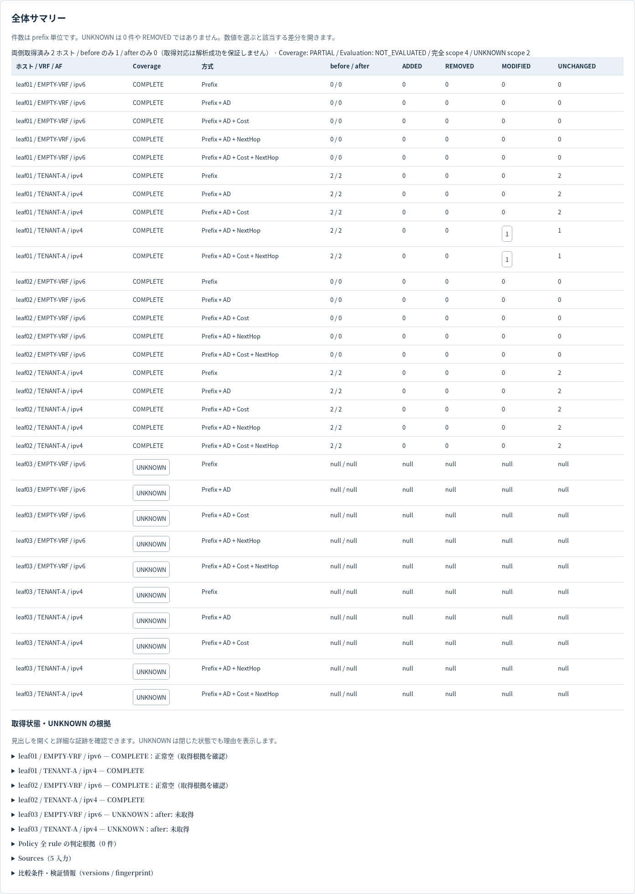
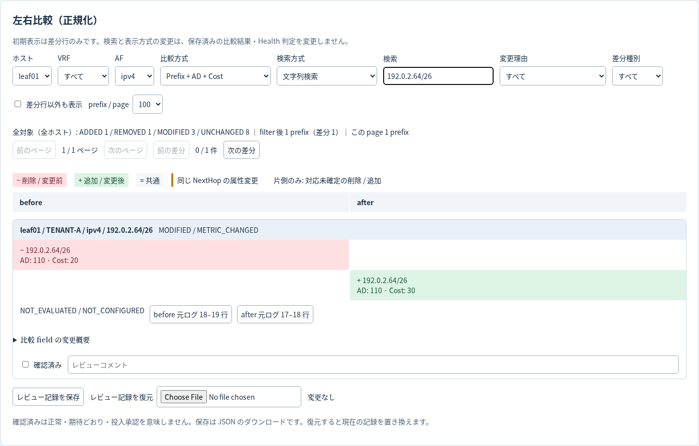
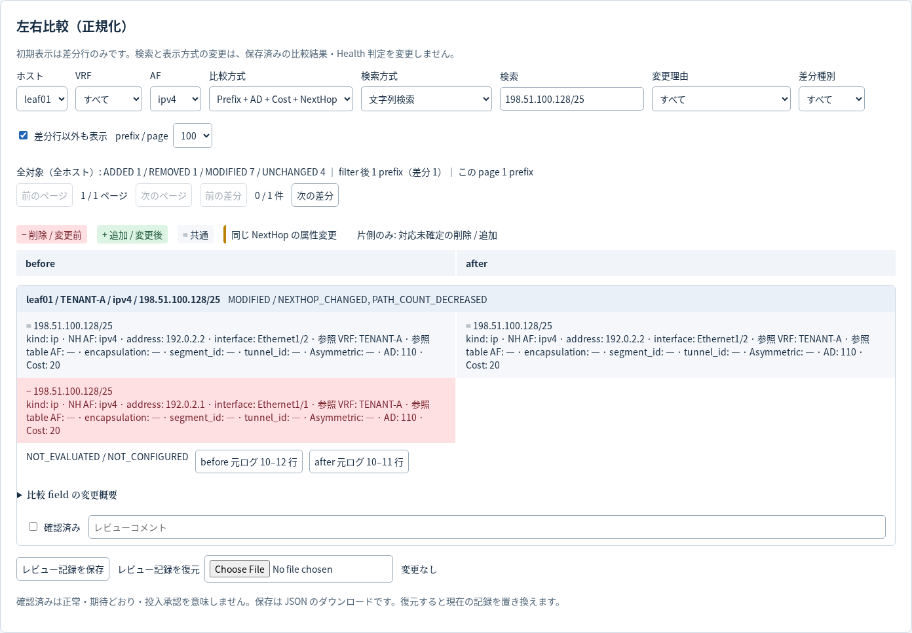
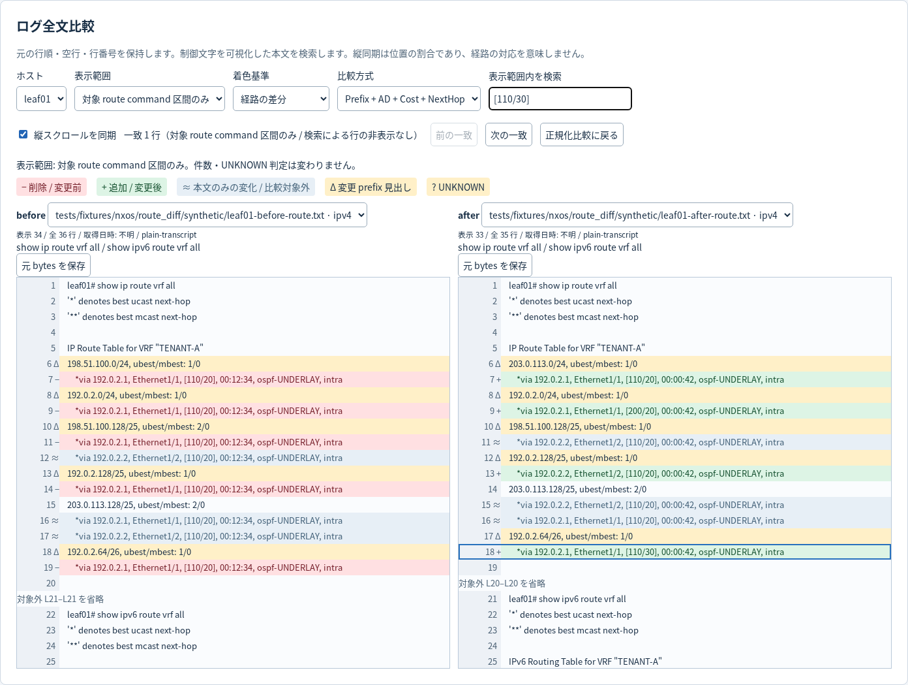
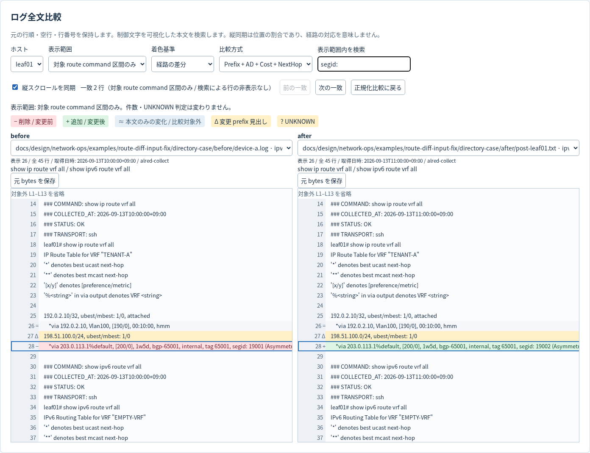
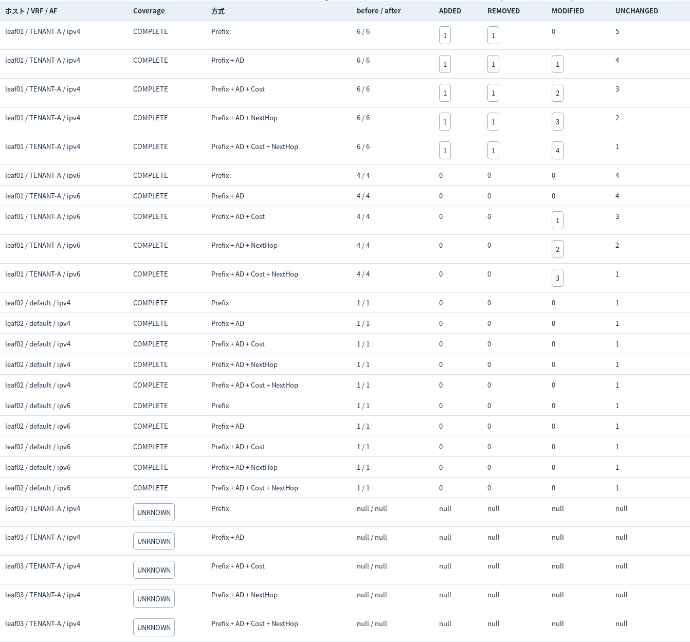
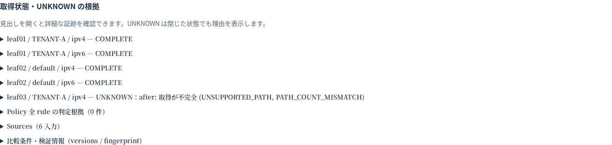
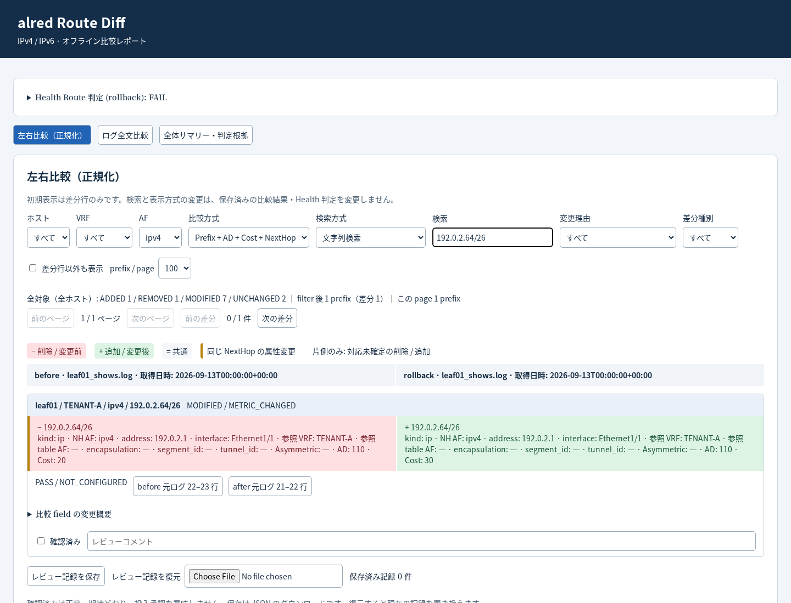

# Route Diff 利用ガイド（ドラフト）

状態: **Route Diff の比較・オフライン出力 API を実装。standalone CLI も実装。Health 統合を実装**。
2026-09-13 更新。現在は入力検証、ログ解析、Snapshot、5 方式の比較、policy 判定、HTML / Markdown / CSV 出力を Python API として実装している。
本書の `route-diff-nxos` 例は実行できる。追加 Health profile も利用できる。

入力から結果確認までの手順を、合成ログによる CLI / ブラウザ試験で確認したマニュアル。
仕様の正本は [Route Diff 設計](../../design/network-ops/ROUTE_DIFF_DESIGN.md)、進捗は
[実装計画](../../implementation/ROUTE_DIFF_IMPLEMENTATION_PLAN.md)と
[実装状況](../../implementation/IMPLEMENTATION_STATUS.md)を参照する。

## 1. 目的と現在確認できること

NX-OS の IPv4／IPv6 経路を、作業前後や作業途中の任意の 2 時点で比較する。
経路の追加・削除に加えて、AD、Cost、NextHop、ECMP の変化を確認する用途を想定する。
初回リリースは CLI とオフライン成果物を対象とし、Web UI はリリース後の別検討とする。

| 現在の状態 | 利用・確認できること |
|---|---|
| 本番 renderer の出力例 | 合成ログを解析・比較して生成した HTML で、左右表示、全文ログ、ページング、レビュー保存・復元を操作できる |
| 比較処理の Python API | 入力検証、端末ログ解析、Snapshot、5 方式、policy 判定を実装。[実出力 JSON](examples/route-diff-core/README.md)で結果を確認できる。standalone CLI からも利用できる |
| Health 統合 | 追加 profile で before／after／rollback の詳細経路と判定を保存する |

今すぐ確認する場合は [実出力 HTML](examples/route-diff-core/route_diff/index.html)を
ブラウザで直接開く。リンクで開けない環境では、checkout 内の HTML をブラウザへドラッグする。
Web server は不要。HTML は保存済みの結果を表示する。新しいログの解析・比較は CLI または Python API で行い、HTML から任意ログを取り込む機能はない。

## 2. 対象機器と入力ログの準備

対応予定の機種は [トップ README の対象プラットフォーム](../../../README.md#現在の対象プラットフォーム)。
NX-OS 10.4(5)M 以降を対象候補とし、10.5(4)、10.6(4)M を重点検証対象とする。
現在の parser 試験は合成ログによるもので、これらの機種・バージョンの詳細 route ログによる検証は未完了。
対応状況の詳細は [設計の対象範囲と fixture](../../design/network-ops/ROUTE_DIFF_DESIGN.md#13-対応対象と-fixture-の受け入れ)を参照する。

比較する 2 時点について、同じホスト・VRF・AF のログを用意する。
対象 command は次のとおり。default VRF・指定 VRF・全 VRF の入力解析に対応する。
`route-diff-nxos` から比較できる。

| 対象 | IPv4 | IPv6 |
|---|---|---|
| default VRF | `show ip route` | `show ipv6 route` |
| 指定 VRF（例: TENANT-A） | `show ip route vrf TENANT-A` | `show ipv6 route vrf TENANT-A` |
| 全 VRF | `show ip route vrf all` | `show ipv6 route vrf all` |

`show ip route vrf default`／`show ipv6 route vrf default` も指定 VRF 形式で扱う。
VRF 名は実際の名前へ置き換え、大文字小文字を一致させる。`[特定vrf]` という括弧付き文字列は入力しない。
`summary`、prefix で絞った出力、`| include` などは完全な経路表の入力として扱わない。
元ファイルを保持し、取得時点、機種、NX-OS バージョンを追跡できるようにする。
ファイルの更新日時を取得日時とみなさず、どちらを before／after に置くかを利用者が指定する。

| 入力形式 | 用意する内容 |
|---|---|
| `nxos-transcript` | ホストを識別できる prompt、実行 command、VRF heading、route 本文、完了を示す次の prompt |
| `nxos-route-text` | VRF heading を含む 1 AF の command 本文。Source Map でホストと command ID を明示する |

prefix だけの一覧、structured JSON の直接入力、画面幅で折り返された未知形式は初期対象外。
文字コードは UTF-8。BOM、CRLF、色・装飾用 SGR は正規化するが、元 bytes と行位置は保持する。
ページャー、backspace、cursor 移動、単独 CR を含むログを、推測で完全な出力へ復元しない。
入力品質の詳細は [端末ログの設計](../../design/network-ops/ROUTE_DIFF_DESIGN.md#114-端末ログの整形と-source-map)を参照する。

alred の統合 `_shows.log` も `nxos-transcript` として指定できる。管理行と command 区間を検証し、
HMM、1 行形式の VXLAN 属性、取得完了を確認できる marker なし空 VRF に対応する。
`segid:` / `segid` の両表記と、IPv4-mapped IPv6 next-hop の参照 VRF / table AF を保持する。
空のように見えても command の終端が確認できなければ UNKNOWN。
未対応の複数行 VTEP 形式などの詳細は [修正設計](../../design/network-ops/ROUTE_DIFF_COLLECTION_LOG_FIX_DESIGN.md)を参照する。

同じ command を繰り返したログでは、採用する区間を Source Map の `start_line`／`end_line` で指定する。
行番号は元ファイルの 1 始まりで、開始・終了行を含む。必要な heading と終端まで含める。
「最後の出力」を自動採用する前提では利用しない。

本文だけで終端 prompt がない場合、`completeness: asserted` による完全取得の申告を利用する設計。
これは構文不明や欠損を解消する指定ではなく、申告だけでは必須 Health check の PASS に利用できない。

## 3. 保存済みログを比較する手順

### 3.1 単一ホストの 2 時点

リポジトリのルートから、既存の合成ログで次の command を実行できる。source checkout では `alred` を `python alred.py` に置き換える。

```bash
alred route-diff-nxos \
  --before docs/design/network-ops/examples/route-diff-review/inputs/leaf01/before-route.log \
  --after docs/design/network-ops/examples/route-diff-review/inputs/leaf01/after-route.log \
  --input-format nxos-transcript \
  --output-dir review-01/route_diff
```

before に作業開始前、after に作業途中のログを指定してもよい。
比較方向は引数どおりとし、ファイル名や更新日時で入れ替えない。
IPv4 だけを明示的に対象にする場合は `--af ipv4`、VRF を限定する場合は `--vrf TENANT-A` を指定する。
AF の既定 `both` は両側で観測した AF の和集合を対象とする。両側にない IPv6 を正常と扱わない。
片側のログ欠落を、その AF の全経路削除とみなさない。

### 3.2 複数ホスト・AF 別ファイル・繰り返しログ

明示対応には以下の Source Map、自動対応には 3.4 の directory 入力を使用する。

[Source Map の例](../../design/network-ops/examples/route-diff-review/source-map.example.yaml)に
ホスト、before／after のファイル、入力形式、必要な command ID と行区間を記載する。
相対パスは Source Map ファイルのあるディレクトリを基準にする。

次の例は 3 host を比較する。leaf03 の途中出力を UNKNOWN として保存するため、終了 code は `3` となる。

```bash
alred route-diff-nxos \
  --source-map docs/design/network-ops/examples/route-diff-review/source-map.example.yaml \
  --output-dir review-02/route_diff
```

`--source-map` と `--before`／`--after` は併用しない。
本文形式では取得した command に合わせて次の指定を使用する。全形式で VRF heading は必須。

| 取得範囲 | IPv4 の command ID | IPv6 の command ID | Source Map の `vrf` |
|---|---|---|---|
| default VRF | `route_ipv4_default_vrf` | `route_ipv6_default_vrf` | 指定しない |
| 指定 VRF | `route_ipv4_vrf` | `route_ipv6_vrf` | 実際の VRF 名を必ず指定 |
| 全 VRF | `route_ipv4_all_vrfs` | `route_ipv6_all_vrfs` | 指定しない |

指定 VRF の本文入力では、Source Map 内の 1 source を例えば次のように記載する。
相対パスのファイルは利用者が用意する。`completeness` は実際に全出力を保持した場合だけ申告する。

```yaml
path: before-tenant-a-v4.log
input_format: nxos-route-text
command_id: route_ipv4_vrf
vrf: TENANT-A
completeness: asserted
```

prompt と command を含む transcript では取得範囲を command から読み取るため、この明示指定は任意。
複数の VRF command は同じファイルに含められるが、同じ VRF／AF を重複取得した区間は選別する。
`vrf all` と指定 VRF が重複する場合も、自動で最新を採用・統合しない。
全 VRF の before と指定 VRF の after を比較する予定の場合は、`--vrf TENANT-A` などで比較対象を明示する。
取得されていない他 VRF を経路削除とせず、対象に残した場合は UNKNOWN とする。
ファイル名からホストや AF を推測する入力は避け、対応を明示する。
全 option の条件は [CLI と入力の設計](../../design/network-ops/ROUTE_DIFF_DESIGN.md#3-cli-と入力案)を参照する。

### 3.3 本文形式・表示ラベル・レビュー記録

2 file の本文形式では `--host` と `--command-id` を指定する。指定 VRF の command には
`--command-vrf TENANT-A` を追加する。比較対象を絞る `--vrf` とは別の指定である。
全出力を保持したことを申告する場合は `--completeness asserted` を追加する。申告だけでは Health PASS にならない。

`--before-label 作業前 --after-label 作業途中` で画面の時点名を変更できる。
`--review route-diff-review.json` で同じ比較の確認記録を復元して出力できる。
入力・policy・比較対象を変更した場合、旧レビューは fingerprint 不一致として拒否される。

### 3.4 複数機器のログを directory で指定する

```bash
alred route-diff-nxos \
  --before logs/before \
  --after logs/after \
  --input-format nxos-transcript \
  --output-dir review-directory/route_diff
```

既定は直下の `.log` / `.txt`（拡張子は大小文字を区別しない）。子 directory も読む場合は `--recursive` を追加する。
隠し file / directory、symlink は探索しない。採用・除外結果は `evidence/directory-discovery.json` へ保存する。
出力先は入力 directory の外側に指定する。

- ホストはログ内の prompt で完全一致させる。before / after の file 名や分割数は一致しなくてもよい。
- 同じホストの IPv4 / IPv6 別ログや、重ならない VRF のログをまとめて比較する。
- 片側しかないホスト・AF は UNKNOWN とし、他ホストの比較は継続する。
- 同じ経路表の重複取得、ホスト不明、1 file 内の複数ホストは自動選択しない。Source Map で採用区間を指定する。
- file / directory の混在、directory 入力と `--host` / `--command-id` / `--source-map` の併用はできない。

[複数ホストの実出力 HTML](examples/route-diff-collection/route_diff/index.html)では、
全体サマリーの取得対応と UNKNOWN、ホスト別の元ログを確認できる。
「両側取得済み」は解析成功を意味しないため、coverage も確認する。



## 4. 比較方式の選び方

以下の 5 方式は比較 API と本番 renderer に実装済み。
通常は既定の **Prefix + AD + Cost + NextHop** から確認し、知りたい項目に応じて切り替える。
NX-OS 表示の `[110/20]` では AD が `110`、Cost が `20`。Cost は JSON では `metric` と表記する。

| 方式 | 確認する変化 | 使用例 |
|---|---|---|
| `route-only` | prefix と prefix length の追加・削除 | 経路が存在し続けているか確認する |
| `route-ad` | prefix と AD | AD の変化を確認する |
| `route-ad-cost` | prefix と AD／Cost の組 | Cost 20 → 30 を確認する |
| `nexthop-include` | prefix と AD／NextHop の組。Cost は比較しない | 転送先の交換や ECMP の減少を確認する |
| `route-ad-cost-nexthop` | prefix と AD／Cost／NextHop の対応 | Cost と転送先を含めて確認する。既定方式 |

NextHop を含む方式では interface、参照先 VRF、参照先テーブルの AF も区別する。
IPv6 link-local は address が同じでも interface が違えば別の転送先となる。
IPv4-mapped IPv6、Null0、接続経路もそれぞれの意味を保持する。

経過時間、空白、IPv6 の表記、経路や ECMP の表示順だけの違いは経路差分に含めない。
AD だけの方式では同じ AD の ECMP 本数変化を、AD／Cost の方式では同じ AD／Cost の本数変化を検出しない。
冗長性を確認する場合は NextHop を含む方式を使用する。

## 5. 出力を確認する順序

以下は **CLI / renderer API で生成できる成果物と確認手順**。
[実出力例](examples/route-diff-core/README.md)から開ける。

1. `route_diff/checklist.md` で、比較できないホスト／VRF／AF と理由を先に確認する。
2. prefix 増減と、AD／Cost／NextHop を含む変更件数を確認する。
3. `route_diff/hosts/<host>/route-diff.html` で変更された経路を左右比較する。
4. 必要に応じて「差分行以外も表示」を ON にし、変更経路内の共通 ECMP path も確認する。
5. 元ログの該当位置へ移動し、取得内容を確認する。全文確認には `route-diff-raw.html` を使用する。

| 成果物 | 用途 |
|---|---|
| `checklist.md` | scope ごとの比較完了、差分有無、5 方式の件数、比較不能理由 |
| `route-diff.md` | 全体サマリーと既定方式の prefix 別差分 |
| `route-diff.json` | 比較条件、品質、件数、変更理由、入力証跡を機械処理する |
| `route-diff.csv` | 既定方式の差分を表計算で確認する。UNKNOWN は scope の診断行 |
| ホスト別 Markdown | IPv4／IPv6 ごとに 5 方式の差分を確認する |
| `route-diff.html`／`route-diff-diffonly.html` | 正規化した左右比較。両方とも差分行のみが既定 |
| `route-diff-raw.html` | 元の行順・行番号を保ったログ全文の左右比較 |

単一ホストでもホスト別出力は `route_diff/hosts/<host>/` に配置する。
Markdown 名の例は `route-diff-v4-route-ad-cost_before-route.log_after-route.log.md`。
拡張子は残す。AF、方式、複数ファイル入力時の命名規則は
[保存先と filename](../../design/network-ops/ROUTE_DIFF_DESIGN.md#7-保存先と-filename)を参照する。

左右比較では削除・変更前を赤 `−`、追加・変更後を緑 `+` で確認する。
「差分行以外も表示」は既定 OFF。検索や表示方式を変えても保存済みの全体件数は変わらない。
ログ全文の着色は「経路の差分」と「ログ文字列の差分」を切り替える。
文字列基準では経過時間や空白も着色されるが、経路件数や Health 判定には反映しない。
全文のスクロール同期は位置の割合を合わせるため、左右の同じ高さが同じ prefix とは限らない。

`ADDED`／`REMOVED`／`MODIFIED` は prefix 単位の件数であり、着色行数ではない。
同じ prefix の AD と NextHop が同時に変わっても `MODIFIED` は 1 件。
prefix length の変更は旧 prefix の削除と新 prefix の追加になる。
`route-only` の `MODIFIED` は 0 でも、他方式では変更がある場合がある。

`UNKNOWN` の scope は確定件数へ加算せず、差分なしとも扱わない。
Checklist のチェックは「比較完了」を表し、正常性 PASS や差分なしを表すものではない。

### 5.1 画像で確認する: Cost の変更を見つける

以下の 4 枚は **合成ログを本番 parser・比較 API・renderer で処理した HTML を操作して撮影した画像**。
API から再生成した出力であり、実機検証結果ではない。画像を拡大すると各操作項目と値を確認できる。
撮影元・再生成方法は [画面画像の説明](images/route-diff/README.md)を参照する。

1. [実出力 HTML](examples/route-diff-core/route_diff/index.html)の「左右比較（正規化）」を開く。
2. ホストを `leaf01`、AF を `ipv4`、比較方式を `Prefix + AD + Cost` にする。
3. 「検索」に `192.0.2.64/26` を入力する。
4. 左の変更前 Cost `20` と右の変更後 Cost `30` を確認する。「差分行以外も表示」は OFF のまま。



「全対象（全ホスト）」は全体の件数であり、検索後の 1 prefix の件数ではない。
Cost を比較しない `Prefix + AD` に変更すると、この prefix は差分行のみの表示から消える。

### 5.2 画像で確認する: 共通の ECMP path も表示する

1. 比較方式を `Prefix + AD + Cost + NextHop` に戻す。
2. 検索文字列を `198.51.100.128/25` に変える。
3. 「差分行以外も表示」を ON にする。
4. 赤い削除 path に加え、左右に残った `=` の共通 path が見えることを確認する。



ON／OFF は表示の切り替えであり、ECMP の変化や集計結果を変更しない。
元の取得内容を確認する場合は「before 元ログ」または「after 元ログ」を押す。両側の証跡を同時に表示し、縦同期を解除する。

### 5.3 画像で確認する: ログ全文から確認する

1. 「ログ全文比較」タブを開き、ホストを `leaf01` にする。
2. 「表示範囲」は「対象 route command 区間のみ」が既定。全体ログが必要なら「入力ログ全体」へ切り替える。
3. 「表示範囲内を検索」に `[110/30]` を入力する。検索は一致行を強調し、行を非表示にはしない。
4. 着色の基準を「経路の差分」から「ログ文字列の差分」へ切り替えると、経過時間などの違いも確認できる。



画像は経路差分の着色を使用している。全文ペインはスクロールして残りの行を確認する。
対象区間内は共通行・未知行・空行も表示する。元行番号と省略した行範囲を保持する。
対象外 command の終端証拠へ移動した場合は、通知付きで入力ログ全体へ切り替える。
正規化比較の「差分行以外も表示」とは独立した設定である。


文字列差分で着色された行数を、変更 route 数として数えない。

### 5.4 画像で確認する: 全体サマリーと UNKNOWN

1. 「全体サマリー・判定根拠」タブを開く。
2. 各方式の ADDED／REMOVED／MODIFIEDを確認する。
3. 件数のリンクを押すと、該当するホスト・方式・変更種別の左右比較へ移動する。
4. `leaf03` の `UNKNOWN` を押すと、完全性の説明へ移動する。件数の `null` は 0 件ではない。



同じ出力 directory にある `checklist.md`、`route-diff.md`、`route-diff.json`、`route-diff.csv` も確認する。

「取得状態・UNKNOWN の根拠」は、ホスト・VRF・AF・状態と UNKNOWN の対象時点・理由を表示する。
長い証跡は初期状態で折りたたむ。例えば leaf03 は `UNKNOWN：after: 取得が不完全` と表示し、
見出しをクリックすると詳細を開く。表の `UNKNOWN` ボタンからも該当する詳細だけを開ける。



`Sources` を開くとホスト・before / after・入力名が並ぶ。さらに必要な入力を開いて詳細を確認する。
version と完全な fingerprint は「比較条件・検証情報」を開く。Policy の詳細も判定別件数の見出しから開ける。
長い JSON は枠内をスクロールして全文を確認する。閉じても証跡や判定は変わらない。

### 5.5 レビュー記録を保存・復元する

1. 変更 prefix の「確認済み」とコメント欄に確認結果を記入する。未保存の変更件数が表示される。
2. 「レビュー記録を保存」で `route-diff-review.json` をダウンロードする。
3. 再度同じ HTML を開いたら「レビュー記録を復元」で保存した JSON を選ぶ。
4. 入力ログ・比較条件が異なる記録や、不正な entry は取り込まれず、現在の記録を保持する。

レビューは方式ごとに保存する。確認済みは Health の PASS や設定投入の承認ではない。
復元は現在の記録を一括で置き換えるため、残したい変更は先に保存する。

### 5.6 長い経路表を確認する

正規化比較は既定 100 prefix / page。「prefix / page」で 50 / 100 / 500 を選ぶ。
「前の差分」「次の差分」は現在の絞り込みに該当する変更 prefix をページをまたいで移動する。
検索は文字列、prefix 完全一致、指定 CIDR に含まれる経路を選択できる。CIDR は network address を入力する。
ログ全文は仮想スクロールで全行へ到達できる。「次の一致」で検索行へ移動し、
「元 bytes を保存」で入力と同じ bytes を保存できる。文字列 diff の計算中は中止可能。

## 6. 観測結果と正常性判定

単独コマンドは既定で観測のみとし、`evaluation: NOT_EVALUATED` を表示する。
差分があるだけで異常とせず、差分がないだけでネットワーク全体を正常としない。
正常性を判定する場合は `--policy` で必須経路、最小 path 数、期待する変更などを指定する。
[重要経路の例](../../design/network-ops/examples/route-diff-review/route-policy.example.yaml)と
[期待変更の例](../../design/network-ops/examples/route-diff-review/expected-changes.example.yaml)を参照する。

Cost の増加を一律に FAIL とせず、意図した変更と policy の条件で判断する。
必須 prefix は完全一致で確認し、集約経路や default route では代替しない。
期待変更の一致や手動レビューによって、入力不足の UNKNOWN や必須経路の FAIL を消さない。

比較 API の [実出力例](examples/route-diff-core/README.md)で、差分の JSON と policy の全 rule 結果を確認できる。
期待変更が未成立の場合は、差分 entries に表示されない経路でも `policy_results.expected_changes` に残る。
必須経路は before／after の判定を個別に記録する。before の違反が after で回復した場合は
`recovered: true` と after の PASS を記録するが、before の FAIL は比較結果に保持する。

### 6.1 Health の before／after で利用する

詳細比較は追加 profile `route-diff-nxos` を指定して有効にする。既定の baseline も確認する場合は
両方の `--profile` を指定する。追加 profile だけを指定すると baseline の代わりになる。
既存 collector で IPv4 / IPv6 の全 VRF 経路を取得し、Overlay profile と同じ command は重複取得しない。

```bash
alred health-check before --collect --hosts hosts.yaml \
  --change-id CHG-ROUTE \
  --profile network-baseline-nxos --profile route-diff-nxos

alred health-check after --collect --change-id CHG-ROUTE
```

after は before の inventory・profile・比較範囲・policy を継承し、自動比較する。
端末の `Route Diff:` が示す `health/report/route_diff/index.html` をブラウザで開く。
左右比較、共通行の表示、全文ログの操作は 5 節の画像と同じ。画面冒頭の「Health Route 判定」を
開くと、scope の取得品質、必須経路、予定変更、rollback 復元判定の根拠を確認できる。
これは詳細 Route check の判定であり、Health 全体は `health-result.json` / `summary.md` で確認する。

比較だけを再構成する入口は既存の `health-check compare --before <snapshot.json> --after <snapshot.json>`。
同一 operation の固定 Snapshot を使用し、完了済み compare は上書きしない。
作業途中の任意ログ比較には standalone `route-diff-nxos` を使い、Health の before を保持する。

### 6.2 比較範囲と必須経路を追加する

以下を `route-health-policy.yaml` に保存し、before の最後に
`--profile route-health-policy.yaml` を追加する。policy は inline で固定される。
`families` / `vrfs` は比較範囲を指定する。既定の取得 command は両 AF の全 VRF のままとなる。
未指定の `vrfs: []` は before / after で観測した VRF の和集合を比較する。

```yaml
api_version: alred/v1
kind: HealthCheckProfile
metadata:
  name: site-route-policy
  version: "1.0"
spec:
  platforms: [nxos]
  route_diff:
    families: [ipv4, ipv6]
    vrfs: [default, TENANT-A]
    policy:
      api_version: alred/v1
      kind: RouteDiffPolicy
      metadata:
        name: site-routes
      spec:
        required_routes:
          - device: leaf01
            vrf: TENANT-A
            family: ipv4
            prefix: 192.0.2.0/24
            min_paths: 1
```

予定変更は同じ `policy.spec.expected_changes` に指定する。形式は 6 節の standalone policy と共通。
範囲外の AF / VRF / host を policy に指定すると validation error になる。
単一 Snapshot では取得品質と必須経路を確認し、予定変更は before／after 比較まで保留する。

### 6.3 rollback と保存物

既存の rollback workflow の `health-check rollback` でも固定 profile を継承する。
rollback の詳細比較は before への復元を確認し、予定変更を再適用しない。
非除外経路に残る差分は Cost / AD だけでも FAIL。取得不足は UNKNOWN とし、
個々の失敗根拠も保持する。rollback の設定復元・承認・検証手順は既存 workflow に従う。

以下は Cost が 20 に戻らず 30 のまま残った例。行の通常差分評価が PASS でも、
画面上部の Health Route 判定は復元失敗の FAIL を示す。上部の判定をクリックすると
`rollback_residual_entries` と元行の根拠を展開できる。



| 保存物 | 用途 |
|---|---|
| phase / attempt の `route-snapshot.json` | ECMP・Cost・元行の証拠を持つ詳細 Snapshot |
| 同じ directory の `route-sources/` | hash 検証付きの元 bytes |
| Health Snapshot の `route_diff` | 詳細 Snapshot の相対 path、hash、version、固定設定の hash |
| report の `route_diff/` | 完成済みの HTML / Markdown / JSON / CSV への相対 symlink |
| `route_diff/health-assessment.json` | 詳細 Health check と rollback の復元漏れ |
| report の `route-diff-attempts/` | 不変の出力。途中失敗も保持し、完了 manifest がない出力は使わない |

before / rollback は既存 attempt と current の管理に従い、after は既存 phase の保存方式に従う。
report の生成失敗では以前の公開先を維持する。古い Snapshot に詳細参照がない場合、
既存 check は使えるが詳細 Route check は UNKNOWN になる。schema / hash / version の不一致を無視せず、
元ログを保ったまま新しい attempt で再生成する。

## 7. 入力エラー・UNKNOWN の対処

| 症状 | 確認・対処 |
|---|---|
| CLI に `route-diff-nxos` がない | 古い配布物の可能性がある。現在の source checkout またはこの変更を含む配布物で確認する |
| Source Map／Policy の入力エラー | field 名、ホストと command、AF と prefix、重複区間・ルールの競合を確認する |
| 終端がなく UNKNOWN | 元 transcript の完了 prompt まで含める。本文形式の申告は取得証跡がある場合だけ使用する |
| ページャー・折り返し・制御文字で UNKNOWN | 取得方法を見直して完全なログを用意する。都合の悪い行だけ削除して正常に見せない |
| 未知の path や `ubest` 不一致 | 未解析理由と元行を確認する。未対応 grammar の可能性を残し、空経路とみなさない |
| 片側の AF／VRF が見つからない | 対象 command、採用区間、取得結果を確認する。欠落だけで全経路削除と断定しない |
| 差分行が見えない | host／VRF／AF／比較方式と検索条件を確認する。UNKNOWN の表示も確認する |

## 8. 終了状態と再実行

終了 code は次のとおり。複数の状態がある場合の優先順位は
[Error Catalog](../../design/common/ERROR_CATALOG.md)に従う。

| code | 意味 |
|---|---|
| `0` | 観測比較完了、または policy による PASS。観測のみでは差分があっても `0` |
| `1` | policy による WARN |
| `2` | 入力 validation エラー |
| `3` | 取得・解析不足による比較不能 |
| `4` | policy による FAIL |
| `6` | 保存・hash 検証・公開の失敗 |
| `130` | SIGINT による中断 |

端末では進捗を stderr、最終結果を stdout に出す。`--no-progress` で進捗だけを抑止できる。進捗率は正常性を表さない。
parser `1.2` / normalizer `1.1` への更新後は、旧 Snapshot と混在させず before / after 両側の元ログから再解析する。
旧レビューは fingerprint が変わるため自動継承しない。
非空の出力ディレクトリは上書きせず、再実行時は新しい `--output-dir` を指定する。
中断・失敗後の `.route-diff-stage-*` は完成済みレポートではない。元 bytes、解析済み Snapshot、
生成途中の file が残る。成功した出力は変更されず、新しい出力先で再実行できる。
成功時は `report-manifest.json` に全 file の hash を保存し、`evidence/` に元 bytes、Snapshot、
解決済み入力と指定された Source Map / policy の元ファイルを保存する。
同じ出力先の競合は lock で拒否する。強制終了で lock が残った場合は、該当プロセスの終了を確認してから
エラーに表示された lock file だけを取り除く。

atomic publish は Linux で検証済み。Windows は no-replace rename を使用する実装だが未検証。
その他の OS では安全な公開に未対応として終了 code `6` となる。

## 9. 大きいログを比較するとき

`0.2.0a13` の性能対象は **before / after 各時点で 1 万 route まで**。全入力の host / VRF / IPv4 / IPv6 ごとの
prefix 件数を合計する。ECMP path 数や両時点の合計ではない。1 万 route 超は今回の対象外。
CLI にこの件数で拒否・切り捨てる機能はなく、表示 filter で対象規模を減らすこともできない。

1 万 route（before / after それぞれ、IPv4 / IPv6、2 host × 2 VRF）の合成ログで、
次の全出力生成と HTML 操作を確認した。共有開発環境での実測値であり、保証上限ではない。

| path / 変更率 | CLI の生成時間 | 最大 RSS | 全出力の合計 | 全体 index HTML |
|---|---:|---:|---:|---:|
| 1 path / 1% | 約 67 秒 | 約 476 MiB | 約 227 MiB | 約 46 MiB |
| 4 path / 0% | 約 175 秒 | 約 986 MiB | 約 549 MiB | 約 110 MiB |
| 4 path / 100% | 約 337 秒 | 約 2,209 MiB | 約 940 MiB | 約 130 MiB |

「差分行のみ」は初期表示の件数を抑えるが、全文確認用データや全成果物の容量は減らさない。
差分がなくても ECMP path が多ければ出力は大きくなる。出力先の空き容量と実行環境のメモリを確保する。
ローカル Chromium の初回表示は追加試験を含めて約 2–7 秒だった。操作はページングと
仮想スクロールを使い、各ケースで検索・元行への移動・文字列 diff 完了・レビュー保存と復元を確認した。

10 万 / 100 万 route は今回の 180 秒の測定上限に達し、全出力の完成まで確認できていない。
この上限は開発用 runner の設定で、`route-diff-nxos` の既定 timeout ではない。
大きいログは本番作業前に同じ環境で所要時間を確認する。比較範囲を小さくする場合は、
before / after の両方で同じ特定 VRF の command を取得し、そのログを入力する。
画面 filter だけでは入力解析量や出力サイズは減らない。
測定環境・全件数・未完了ケースは [性能検証記録](../../implementation/ROUTE_DIFF_PERFORMANCE_REPORT.md)を参照する。

## 10. ドラフトの確認と正式版への更新

[実出力 HTML](examples/route-diff-core/route_diff/index.html)で、Cost の変更、ECMP の減少、IPv6 の interface 変更、UNKNOWN を確認できる。
ページング、全文の仮想スクロール、レビュー記録の保存・復元はローカル Chromium で検証した。
1 万 route までを今回の性能対象とし、代表ケースを検証した。10 万 / 100 万 route は将来拡張とする。
全組み合わせの性能保証や、機種・release 固有の未確認 grammar の対応保証を意味しない。

比較処理・policy 判定・出力生成は API と合成ログの実出力で確認した。standalone CLI も接続し、掲載 command の生成物と終了 code を照合した。
Health 統合は source / wheel / glibc 2.17 binary で合成ログによる offline 試験を確認済み。
機種・release 固有ログと大規模入力の検証を継続する。
リリース前に機種・バージョン別検証結果、実出力例、性能上限を反映して、ドラフト表記を解除する。
