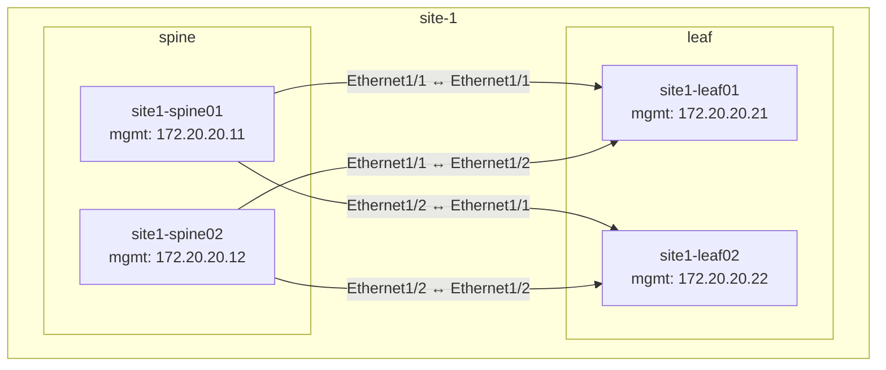

# Network Topology

```mermaid
graph TD
  subgraph site_site_1[site-1]
    subgraph site_1_spine[spine]
    site1_spine01["site1-spine01<br/>mgmt: 172.20.20.11"]
    site1_spine02["site1-spine02<br/>mgmt: 172.20.20.12"]
    end
    subgraph site_1_leaf[leaf]
    site1_leaf01["site1-leaf01<br/>mgmt: 172.20.20.21"]
    site1_leaf02["site1-leaf02<br/>mgmt: 172.20.20.22"]
    end
  end

  site1_spine01 -->|"Ethernet1/1 ↔ Ethernet1/1"| site1_leaf01
  site1_spine01 -->|"Ethernet1/2 ↔ Ethernet1/1"| site1_leaf02
  site1_spine02 -->|"Ethernet1/1 ↔ Ethernet1/2"| site1_leaf01
  site1_spine02 -->|"Ethernet1/2 ↔ Ethernet1/2"| site1_leaf02
```
