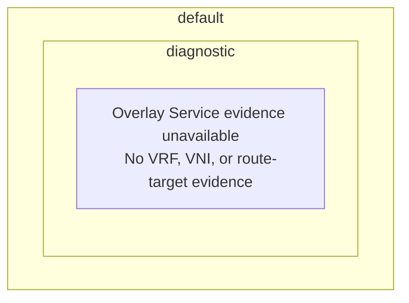

# Network Topology (OVERLAY SERVICE)

```mermaid
graph TD
  subgraph site_default[default]
    subgraph default_diagnostic[diagnostic]
    Overlay_Service_evidence_unavailable["Overlay Service evidence unavailable<br/>No VRF, VNI, or route-target evidence"]
    end
  end

```
