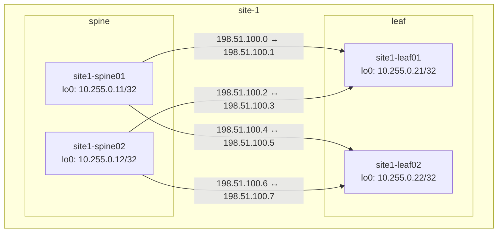

# Network Topology (UNDERLAY)

```mermaid
graph TD
  subgraph site_site_1[site-1]
    subgraph site_1_spine[spine]
    site1_spine01["site1-spine01<br/>lo0: 10.255.0.11/32"]
    site1_spine02["site1-spine02<br/>lo0: 10.255.0.12/32"]
    end
    subgraph site_1_leaf[leaf]
    site1_leaf01["site1-leaf01<br/>lo0: 10.255.0.21/32"]
    site1_leaf02["site1-leaf02<br/>lo0: 10.255.0.22/32"]
    end
  end

  site1_spine01 -->|"198.51.100.0 ↔ 198.51.100.1"| site1_leaf01
  site1_spine01 -->|"198.51.100.4 ↔ 198.51.100.5"| site1_leaf02
  site1_spine02 -->|"198.51.100.2 ↔ 198.51.100.3"| site1_leaf01
  site1_spine02 -->|"198.51.100.6 ↔ 198.51.100.7"| site1_leaf02
```
