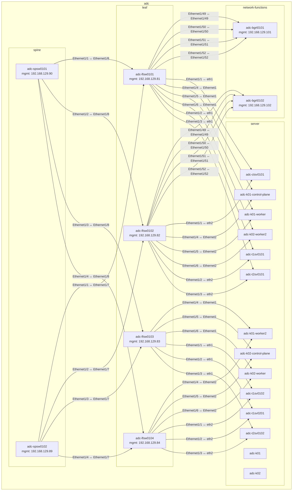

# Network Topology

```mermaid
graph TD
  subgraph site_adc[adc]
    subgraph adc_spine[spine]
    adc_spsw0101["adc-spsw0101<br/>mgmt: 192.168.129.90"]
    adc_spsw0102["adc-spsw0102<br/>mgmt: 192.168.129.89"]
    end
    subgraph adc_leaf[leaf]
    adc_lfsw0101["adc-lfsw0101<br/>mgmt: 192.168.129.81"]
    adc_lfsw0102["adc-lfsw0102<br/>mgmt: 192.168.129.82"]
    adc_lfsw0103["adc-lfsw0103<br/>mgmt: 192.168.129.83"]
    adc_lfsw0104["adc-lfsw0104<br/>mgmt: 192.168.129.84"]
    end
    subgraph adc_network_functions[network-functions]
    adc_bgrt0101["adc-bgrt0101<br/>mgmt: 192.168.129.101"]
    adc_bgrt0102["adc-bgrt0102<br/>mgmt: 192.168.129.102"]
    end
    subgraph adc_server[server]
    adc_ctsv0101["adc-ctsv0101"]
    adc_k01["adc-k01"]
    adc_k01_control_plane["adc-k01-control-plane"]
    adc_k01_worker["adc-k01-worker"]
    adc_k01_worker2["adc-k01-worker2"]
    adc_k02["adc-k02"]
    adc_k02_control_plane["adc-k02-control-plane"]
    adc_k02_worker["adc-k02-worker"]
    adc_k02_worker2["adc-k02-worker2"]
    adc_t1sv0101["adc-t1sv0101"]
    adc_t1sv0102["adc-t1sv0102"]
    adc_t1sv0201["adc-t1sv0201"]
    adc_t2sv0101["adc-t2sv0101"]
    adc_t2sv0102["adc-t2sv0102"]
    end
  end

  adc_spsw0101 -->|"Ethernet1/1 ↔ Ethernet1/8"| adc_lfsw0101
  adc_spsw0101 -->|"Ethernet1/2 ↔ Ethernet1/8"| adc_lfsw0102
  adc_spsw0101 -->|"Ethernet1/3 ↔ Ethernet1/8"| adc_lfsw0103
  adc_spsw0101 -->|"Ethernet1/4 ↔ Ethernet1/8"| adc_lfsw0104
  adc_spsw0102 -->|"Ethernet1/1 ↔ Ethernet1/7"| adc_lfsw0101
  adc_spsw0102 -->|"Ethernet1/2 ↔ Ethernet1/7"| adc_lfsw0102
  adc_spsw0102 -->|"Ethernet1/3 ↔ Ethernet1/7"| adc_lfsw0103
  adc_spsw0102 -->|"Ethernet1/4 ↔ Ethernet1/7"| adc_lfsw0104
  adc_lfsw0101 -->|"Ethernet1/49 ↔ Ethernet1/49"| adc_bgrt0101
  adc_lfsw0101 -->|"Ethernet1/50 ↔ Ethernet1/50"| adc_bgrt0101
  adc_lfsw0101 -->|"Ethernet1/51 ↔ Ethernet1/51"| adc_bgrt0101
  adc_lfsw0101 -->|"Ethernet1/52 ↔ Ethernet1/52"| adc_bgrt0101
  adc_lfsw0101 -->|"Ethernet1/1 ↔ eth1"| adc_ctsv0101
  adc_lfsw0101 -->|"Ethernet1/4 ↔ Ethernet1"| adc_k01_control_plane
  adc_lfsw0101 -->|"Ethernet1/5 ↔ Ethernet1"| adc_k01_worker
  adc_lfsw0101 -->|"Ethernet1/6 ↔ Ethernet1"| adc_k02_worker2
  adc_lfsw0101 -->|"Ethernet1/2 ↔ eth1"| adc_t1sv0101
  adc_lfsw0101 -->|"Ethernet1/3 ↔ eth1"| adc_t2sv0101
  adc_lfsw0102 -->|"Ethernet1/49 ↔ Ethernet1/49"| adc_bgrt0102
  adc_lfsw0102 -->|"Ethernet1/50 ↔ Ethernet1/50"| adc_bgrt0102
  adc_lfsw0102 -->|"Ethernet1/51 ↔ Ethernet1/51"| adc_bgrt0102
  adc_lfsw0102 -->|"Ethernet1/52 ↔ Ethernet1/52"| adc_bgrt0102
  adc_lfsw0102 -->|"Ethernet1/1 ↔ eth2"| adc_ctsv0101
  adc_lfsw0102 -->|"Ethernet1/4 ↔ Ethernet2"| adc_k01_control_plane
  adc_lfsw0102 -->|"Ethernet1/5 ↔ Ethernet2"| adc_k01_worker
  adc_lfsw0102 -->|"Ethernet1/6 ↔ Ethernet2"| adc_k02_worker2
  adc_lfsw0102 -->|"Ethernet1/2 ↔ eth2"| adc_t1sv0101
  adc_lfsw0102 -->|"Ethernet1/3 ↔ eth2"| adc_t2sv0101
  adc_lfsw0103 -->|"Ethernet1/4 ↔ Ethernet1"| adc_k01_worker2
  adc_lfsw0103 -->|"Ethernet1/5 ↔ Ethernet1"| adc_k02_control_plane
  adc_lfsw0103 -->|"Ethernet1/6 ↔ Ethernet1"| adc_k02_worker
  adc_lfsw0103 -->|"Ethernet1/1 ↔ eth1"| adc_t1sv0102
  adc_lfsw0103 -->|"Ethernet1/2 ↔ eth1"| adc_t1sv0201
  adc_lfsw0103 -->|"Ethernet1/3 ↔ eth1"| adc_t2sv0102
  adc_lfsw0104 -->|"Ethernet1/4 ↔ Ethernet2"| adc_k01_worker2
  adc_lfsw0104 -->|"Ethernet1/5 ↔ Ethernet2"| adc_k02_control_plane
  adc_lfsw0104 -->|"Ethernet1/6 ↔ Ethernet2"| adc_k02_worker
  adc_lfsw0104 -->|"Ethernet1/1 ↔ eth2"| adc_t1sv0102
  adc_lfsw0104 -->|"Ethernet1/2 ↔ eth2"| adc_t1sv0201
  adc_lfsw0104 -->|"Ethernet1/3 ↔ eth2"| adc_t2sv0102
```
