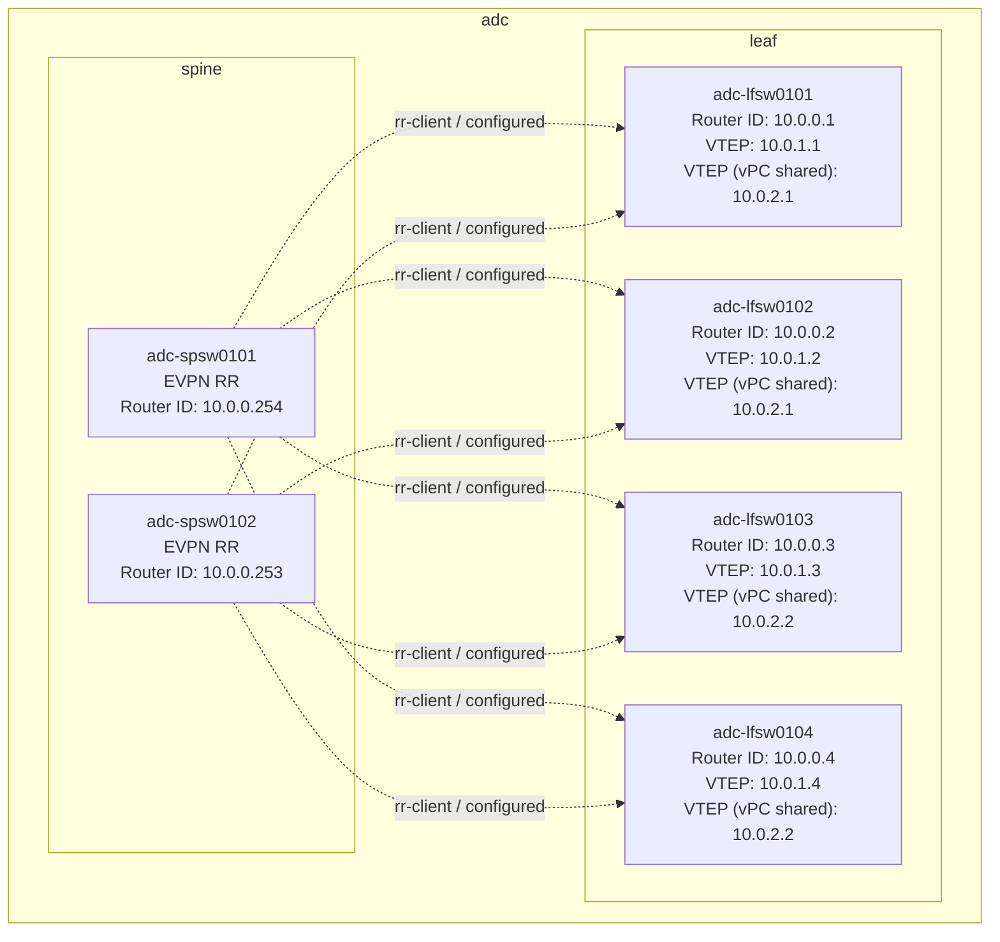

# Network Topology (EVPN CONTROL PLANE)

```mermaid
graph TD
  subgraph site_adc[adc]
    subgraph adc_spine[spine]
    adc_spsw0101["adc-spsw0101<br/>EVPN RR<br/>Router ID: 10.0.0.254"]
    adc_spsw0102["adc-spsw0102<br/>EVPN RR<br/>Router ID: 10.0.0.253"]
    end
    subgraph adc_leaf[leaf]
    adc_lfsw0101["adc-lfsw0101<br/>Router ID: 10.0.0.1<br/>VTEP: 10.0.1.1<br/>VTEP (vPC shared): 10.0.2.1"]
    adc_lfsw0102["adc-lfsw0102<br/>Router ID: 10.0.0.2<br/>VTEP: 10.0.1.2<br/>VTEP (vPC shared): 10.0.2.1"]
    adc_lfsw0103["adc-lfsw0103<br/>Router ID: 10.0.0.3<br/>VTEP: 10.0.1.3<br/>VTEP (vPC shared): 10.0.2.2"]
    adc_lfsw0104["adc-lfsw0104<br/>Router ID: 10.0.0.4<br/>VTEP: 10.0.1.4<br/>VTEP (vPC shared): 10.0.2.2"]
    end
  end


  %% candidate links
  adc_spsw0101 -.->|"rr-client / configured"| adc_lfsw0101
  adc_spsw0101 -.->|"rr-client / configured"| adc_lfsw0102
  adc_spsw0101 -.->|"rr-client / configured"| adc_lfsw0103
  adc_spsw0101 -.->|"rr-client / configured"| adc_lfsw0104
  adc_spsw0102 -.->|"rr-client / configured"| adc_lfsw0101
  adc_spsw0102 -.->|"rr-client / configured"| adc_lfsw0102
  adc_spsw0102 -.->|"rr-client / configured"| adc_lfsw0103
  adc_spsw0102 -.->|"rr-client / configured"| adc_lfsw0104
```
