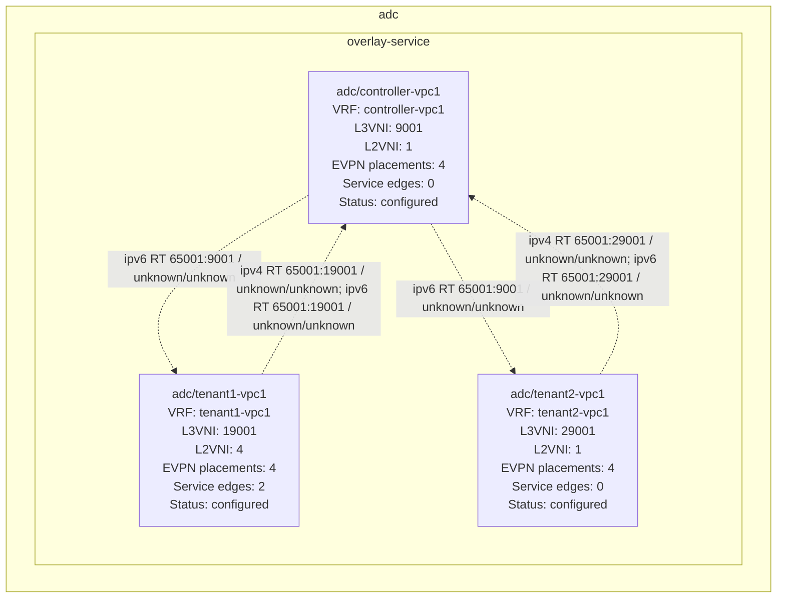

# Network Topology (OVERLAY SERVICE)

```mermaid
graph TD
  subgraph site_adc[adc]
    subgraph adc_overlay_service[overlay-service]
    adc_controller_vpc1["adc/controller-vpc1<br/>VRF: controller-vpc1<br/>L3VNI: 9001<br/>L2VNI: 1<br/>EVPN placements: 4<br/>Service edges: 0<br/>Status: configured"]
    adc_tenant1_vpc1["adc/tenant1-vpc1<br/>VRF: tenant1-vpc1<br/>L3VNI: 19001<br/>L2VNI: 4<br/>EVPN placements: 4<br/>Service edges: 2<br/>Status: configured"]
    adc_tenant2_vpc1["adc/tenant2-vpc1<br/>VRF: tenant2-vpc1<br/>L3VNI: 29001<br/>L2VNI: 1<br/>EVPN placements: 4<br/>Service edges: 0<br/>Status: configured"]
    end
  end


  %% candidate links
  adc_controller_vpc1 -.->|"ipv6 RT 65001:9001 / unknown/unknown"| adc_tenant1_vpc1
  adc_controller_vpc1 -.->|"ipv6 RT 65001:9001 / unknown/unknown"| adc_tenant2_vpc1
  adc_tenant1_vpc1 -.->|"ipv4 RT 65001:19001 / unknown/unknown; ipv6 RT 65001:19001 / unknown/unknown"| adc_controller_vpc1
  adc_tenant2_vpc1 -.->|"ipv4 RT 65001:29001 / unknown/unknown; ipv6 RT 65001:29001 / unknown/unknown"| adc_controller_vpc1
```
