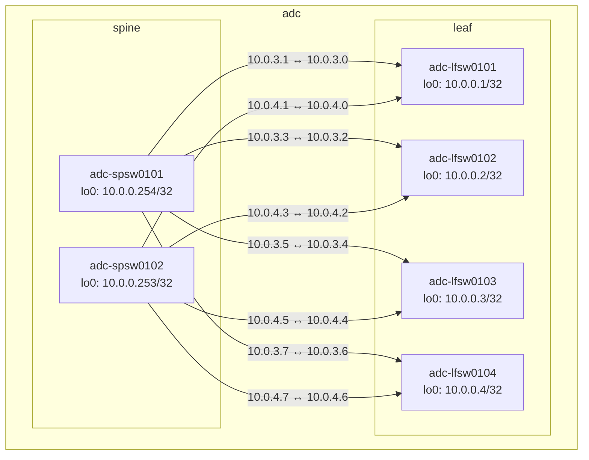

# Network Topology (UNDERLAY)

```mermaid
graph TD
  subgraph site_adc[adc]
    subgraph adc_spine[spine]
    adc_spsw0101["adc-spsw0101<br/>lo0: 10.0.0.254/32"]
    adc_spsw0102["adc-spsw0102<br/>lo0: 10.0.0.253/32"]
    end
    subgraph adc_leaf[leaf]
    adc_lfsw0101["adc-lfsw0101<br/>lo0: 10.0.0.1/32"]
    adc_lfsw0102["adc-lfsw0102<br/>lo0: 10.0.0.2/32"]
    adc_lfsw0103["adc-lfsw0103<br/>lo0: 10.0.0.3/32"]
    adc_lfsw0104["adc-lfsw0104<br/>lo0: 10.0.0.4/32"]
    end
  end

  adc_spsw0101 -->|"10.0.3.1 ↔ 10.0.3.0"| adc_lfsw0101
  adc_spsw0101 -->|"10.0.3.3 ↔ 10.0.3.2"| adc_lfsw0102
  adc_spsw0101 -->|"10.0.3.5 ↔ 10.0.3.4"| adc_lfsw0103
  adc_spsw0101 -->|"10.0.3.7 ↔ 10.0.3.6"| adc_lfsw0104
  adc_spsw0102 -->|"10.0.4.1 ↔ 10.0.4.0"| adc_lfsw0101
  adc_spsw0102 -->|"10.0.4.3 ↔ 10.0.4.2"| adc_lfsw0102
  adc_spsw0102 -->|"10.0.4.5 ↔ 10.0.4.4"| adc_lfsw0103
  adc_spsw0102 -->|"10.0.4.7 ↔ 10.0.4.6"| adc_lfsw0104
```
